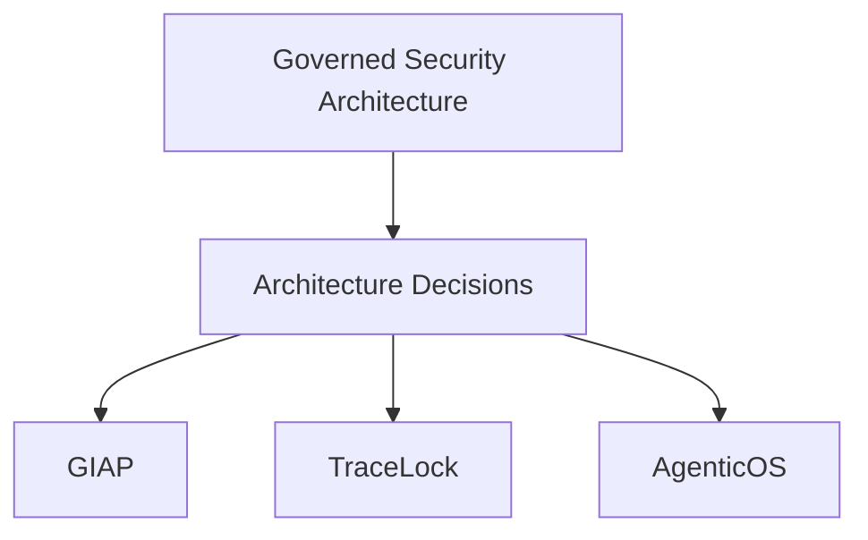

---
description: "ADR-style architecture decision records for governance automation, detection engineering, and agent orchestration — traceable design choices over time."
---

# Architecture Decisions

## Why Architecture Decisions Matter

Security systems fail when governance, detection, automation, and decision workflows evolve independently. Architecture decisions make those tradeoffs explicit, traceable, and reviewable over time.

This portfolio includes selected ADR-style artifacts to show how system design choices are made with security, governance, and operational coherence in mind.
These ADR summaries represent selected architecture decisions across governance automation, detection engineering, and agent orchestration systems in this portfolio.

## ADR Thinking in Practice

An Architecture Decision Record (ADR) captures:
- context that required a design choice
- the decision made
- why that decision was selected over alternatives

Disciplined decision logging reduces architectural drift, improves reproducibility, and keeps security systems aligned as they scale.

## Architecture Relationship at a Glance

## Curated Architecture Decision Summaries

### ADR-001 — Detection Architecture Approach

**Context**  
Detection work often fragments into isolated tools, creating blind spots and weak correlation across signal types.

**Decision**  
Design detection as an integrated architecture with multi-domain telemetry, structured outputs, and explicit correlation logic.

**Why it matters**  
This moves detection from ad hoc tool usage to a designed security capability. It aligns with TraceLock and detection engineering artifacts where evidence quality and defensibility are design requirements.

### ADR-002 — Governance Automation Model

**Context**  
Governance programs degrade when control mapping, intake, and evidence workflows are manual and inconsistent.

**Decision**  
Implement governance as an operational system with structured intake, control mapping, workflow orchestration, and audit-oriented evidence handling.

**Why it matters**  
This creates repeatable governance operations rather than documentation-only compliance activity. It aligns with GIAP™ and related GRC architecture artifacts.

### ADR-003 — AgenticOS Orchestration Design

**Context**  
AI-assisted workflows can become non-reproducible and difficult to audit when orchestration is uncontrolled.

**Decision**  
Use deterministic routing, structured logging, and governed execution boundaries for agent workflows.

**Why it matters**  
This keeps automation accountable and architecture-safe. It aligns with AgenticOS and governed stack artifacts emphasizing traceability and controlled execution.

### ADR-004 — Governed Security Architecture

**Context**  
Security programs fragment when governance, detection, and automation evolve independently.

**Decision**  
Adopt a governed security architecture model that intentionally aligns governance systems, architecture decisions, detection systems, and automation layers.

**Why it matters**  
This prevents drift across the security program and reinforces a coherent operating model across GIAP™, TraceLock™, AgenticOS, and related architecture artifacts.

## Closing

These decision summaries reflect a broader architecture philosophy: governed, decision-driven security design where governance, detection, and automation are integrated into one coherent system.

## Related Architecture Pages

- [Governed Security Architecture](governed-security-architecture.md)
- [Security Telemetry → Governance → Decision Architecture](security-telemetry-decision-architecture.md)
- [Security Decision Architecture (SDA)](security-decision-architecture.md)
- [Governed Agentic Security Stack](../stack/index.md)
- [GIAP™ — Governed Intake and Analysis Platform](../cybersecurity/giap.md)
- [TraceLock™ — Multi-Domain RF Threat Detection Platform](../cybersecurity/tracelock.md)
- [AgenticOS — Deterministic AI Agent Orchestration](../innovation/agenticos.md)
- [Detection Engineering](../cybersecurity/detection-engineering.md)
