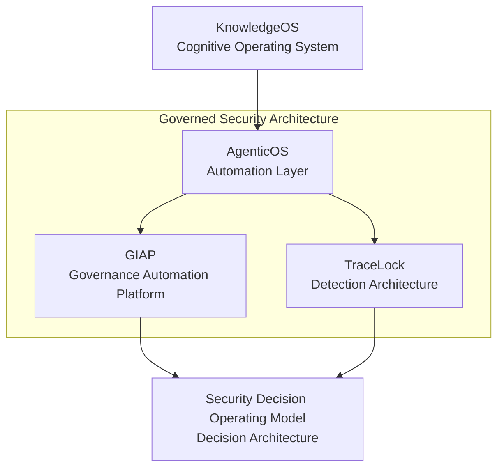

# Governed Security Architecture

This page shows how the portfolio's core systems connect into a single security architecture model. The goal is to make governance, detection, automation, and decision layers visible as one integrated design.

## Architecture Model

## Why This Architecture Exists

Traditional cybersecurity programs are often fragmented across separate governance, monitoring, and operations workflows. That fragmentation creates handoff gaps between policy, detection activity, and decision quality.

This architecture connects those domains into one governed system:

- **KnowledgeOS** is the thinking layer where models, assumptions, and operating logic are developed.
- **AgenticOS** is the automation layer that operationalizes repeatable workflows.
- **GIAP** is the governance automation layer for intake, control mapping, risk translation, and compliance workflow execution.
- **TraceLock** is the detection architecture layer for multi-domain signal collection and defensible evidence generation.
- **SDOM** is the decision architecture layer where governance and detection outputs become structured security decisions.

## Integrated System Narrative

The architecture is designed so governance and detection do not operate as isolated tracks.

- Knowledge models drive automation behavior through AgenticOS.
- AgenticOS runs both governance automation (GIAP) and detection workflows (TraceLock).
- GIAP and TraceLock feed SDOM with structured inputs for decision quality, prioritization, and defensibility.

This produces a governed security architecture where controls, detection, and decisions stay aligned.

## Portfolio Evidence Links

- [Governed Agentic Security Stack](../stack/index.md)
- [Architecture Decisions](architecture-decisions.md)
- [GIAP™ — GRC Integrated Automation Platform](../cybersecurity/giap.md)
- [TraceLock™ — Multi-Domain RF Threat Detection Platform](../cybersecurity/tracelock.md)

## Closing

This model represents architecture-first security engineering: governance and detection are integrated into a decision-driven system rather than managed as disconnected tool chains.
