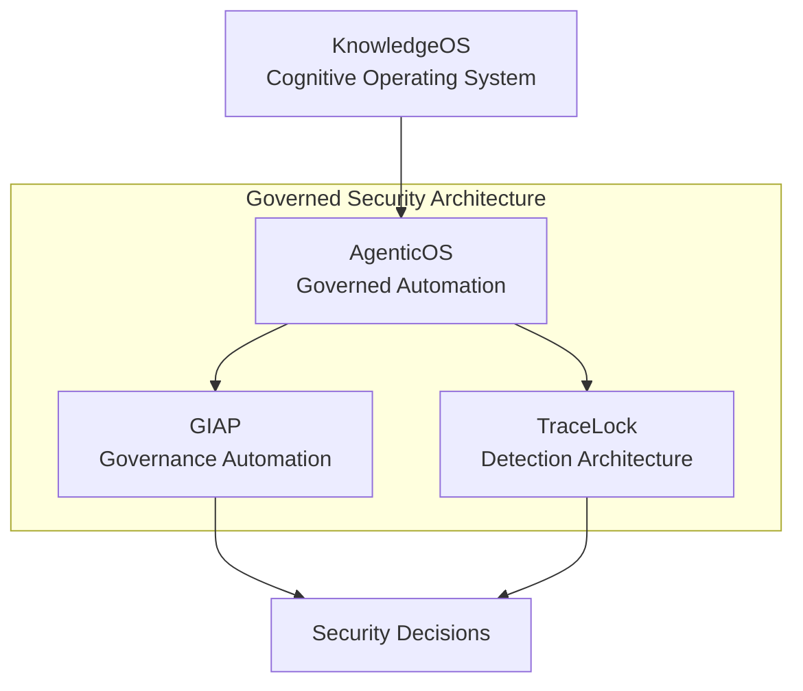

# Governed Security Architecture

This page shows how the portfolio's core systems connect into a single security architecture model. The goal is to make governance, detection, automation, and decision layers visible as one integrated design — and to explain why that integration matters for security program quality.

## Architecture model

*Governed security architecture model: KnowledgeOS drives AgenticOS, which orchestrates both governance automation (GIAP™) and detection architecture (TraceLock™). Both feed structured inputs into the security decision process.*

## Why this architecture exists

Traditional cybersecurity programs are often fragmented across separate governance, monitoring, and operations workflows. That fragmentation creates handoff gaps between policy, detection activity, and decision quality. Common failure patterns include:

- **Governance isolation.** Compliance teams maintain control matrices disconnected from operational detection findings. Controls are documented but not validated against real telemetry.
- **Detection isolation.** SOC teams author detections without visibility into which governance controls those detections support or invalidate.
- **Decision opacity.** Security priorities are set without structured inputs from either governance or detection, making decisions difficult to defend during audits or executive review.

This architecture connects those domains into one governed system where each layer has a defined role and explicit integration points.

## System layers

### KnowledgeOS — cognitive layer

The thinking layer where models, assumptions, and operating logic are developed. KnowledgeOS maintains the knowledge base that informs how automation behaves, what governance frameworks apply, and which detection priorities matter. It provides the context that prevents automation from becoming disconnected from organizational intent.

### AgenticOS — governed automation layer

The orchestration layer that operationalizes repeatable workflows with deterministic routing, structured logging, and audit-grade execution. AgenticOS ensures that automation between detection and governance layers remains explainable and traceable. Every routing decision is logged; no silent mutations occur.

[View AgenticOS →](../innovation/agenticos.md)

### GIAP™ — governance automation layer

The governance engine for structured intake, cross-framework control mapping (100+ frameworks via CISO Assistant), evidence pipeline management, and POA&M generation. GIAP™ translates detection findings and architecture decisions into compliance-aligned artifacts with audit-ready evidence chains.

[View GIAP →](../cybersecurity/giap.md)

### TraceLock™ — detection architecture layer

The multi-domain detection platform for signal collection and correlation across six wireless domains (Wi-Fi, Bluetooth/BLE, SDR/RF, GPS, ADS-B, LoRa). TraceLock™ produces evidence-grade telemetry data that feeds both governance evaluation and security decision processes.

[View TraceLock →](../cybersecurity/tracelock.md)

### Security decision layer

The decision layer is where governance and detection outputs converge into structured security decisions. This ensures that security priorities, risk acceptances, and remediation plans are traceable to the telemetry and governance evidence that produced them.

## Integrated system narrative

The architecture is designed so governance and detection do not operate as isolated tracks.

- Knowledge models drive automation behavior through AgenticOS.
- AgenticOS runs both governance automation (GIAP™) and detection workflows (TraceLock™).
- GIAP™ and TraceLock™ feed the decision layer with structured inputs for decision quality, prioritization, and defensibility.
- Architecture decisions (ADRs) govern how each layer evolves, preventing drift between systems.

This produces a governed security architecture where controls, detection, and decisions stay aligned — and where that alignment is demonstrable during audits or architecture review.

For a detailed view of the telemetry-to-decision pipeline, see [Security Telemetry → Governance → Decision Architecture](security-telemetry-decision-architecture.md).
For the dedicated technical implementation layer, see [Security Decision Architecture (SDA)](security-decision-architecture.md).

## Portfolio evidence links

- [Security Telemetry → Governance → Decision Architecture](security-telemetry-decision-architecture.md) — capstone architecture flow from signals to decisions
- [Security Decision Architecture (SDA)](security-decision-architecture.md) — technical implementation pipeline
- [Governed Agentic Security Stack](../stack/index.md) — stack layers with portfolio evidence
- [Architecture Decisions](architecture-decisions.md) — ADR summaries for detection, governance, and automation
- [GIAP™ — Governed Intake and Analysis Platform](../cybersecurity/giap.md)
- [TraceLock™ — Multi-Domain RF Threat Detection Platform](../cybersecurity/tracelock.md)
- [AgenticOS — Deterministic AI Agent Orchestration](../innovation/agenticos.md)
- [Detection Engineering](../cybersecurity/detection-engineering.md)
- [GRC & Compliance Engineering](../grc/index.md)

## Closing

This model represents architecture-first security engineering: governance and detection are integrated into a decision-driven system rather than managed as disconnected tool chains. The architecture is not theoretical — each layer maps to a portfolio artifact with implementation evidence.
