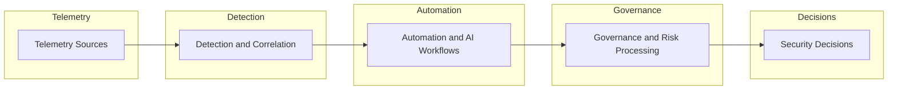

# Security Decision Architecture (SDA)

Security programs generate enormous volumes of telemetry, alerts, and compliance data. The objective is not alert volume; it is defensible security decisions.

Security Decision Architecture (SDA) defines the technical implementation layer that transforms heterogeneous telemetry into structured analysis, governance inputs, and actionable security decisions. SDA is not a competing framework to SDOM; it is the architecture pipeline SDOM depends on.

This model connects telemetry systems, detection engineering, governed automation workflows, and governance processes into one decision pipeline.

## The problem with traditional security architectures

Many security programs are organized around tools rather than decisions. Common failure modes include:

- **Alert-centric operations.** Teams optimize for detection volume rather than decision quality.
- **Fragmented tooling.** Telemetry systems, automation workflows, and governance processes operate in silos.
- **Compliance disconnected from operations.** Governance frameworks are applied after operations rather than integrated into them.

These gaps create environments where organizations collect large amounts of security data but still struggle to determine what action should be taken.

Security Decision Architecture addresses this by structuring the flow from telemetry to decisions.

## Security decision architecture pipeline

SDA organizes security systems into a layered decision pipeline.



*Security Decision Architecture pipeline: layered model showing how telemetry, detection engineering, automation workflows, governance processes, and decision logic combine to produce defensible security decisions.*

Each layer plays a distinct role in transforming raw security signals into structured decision inputs.

## Architecture layers

### Telemetry systems

Security telemetry provides the raw signals used by detection systems.

Examples include:

- wireless telemetry and RF monitoring
- network telemetry
- system logs and endpoint signals
- environmental and sensor inputs

Within this portfolio, TraceLock demonstrates telemetry fusion across multiple RF domains.

[View TraceLock →](../cybersecurity/tracelock.md)

### Detection engineering

Detection engineering transforms raw telemetry into correlated signals and threat indicators.

This layer includes:

- detection rules
- correlation logic
- anomaly detection
- signal prioritization

Detection engineering converts telemetry into structured observations that feed downstream workflows.

[View Detection Engineering →](../cybersecurity/detection-engineering.md)

### Automation and AI workflows

Automation platforms orchestrate the analysis and routing of security signals.

Examples include:

- automated enrichment workflows
- incident response automation
- AI-assisted signal classification
- operational orchestration

Within this portfolio, AgenticOS demonstrates governance-aware automation of operational workflows.

[View AgenticOS →](../innovation/agenticos.md)

### Governance and risk processing

Security governance systems transform operational outputs into structured risk inputs.

This includes:

- compliance frameworks
- risk scoring
- governance workflows
- audit evidence collection

Within this portfolio, GIAP demonstrates automation of governance and risk workflows.

[View GIAP →](../cybersecurity/giap.md)

### Security decisions

The final layer converts governance outputs and operational intelligence into actionable decisions.

Examples include:

- risk prioritization
- control investment decisions
- architecture changes
- operational response

Within this portfolio, these decisions are documented through architecture decision records.

[View Architecture Decisions →](architecture-decisions.md)

## Relationship to the Security Decision Operating Model (SDOM)

SDA is the technical implementation layer under SDOM.

Conceptually:

```text
Security Decision Operating Model (SDOM)
Decision framework and governance logic
            ↓
Security Decision Architecture (SDA)
Technical systems that produce decision inputs
```

SDOM defines decision logic and governance structure. SDA implements the telemetry, detection, automation, and governance pipeline that produces those decision inputs.

## Capability signals demonstrated in this portfolio

This architecture model reflects capability domains demonstrated by portfolio artifacts:

- Security telemetry fusion
- Detection engineering and signal correlation
- Automation and AI-assisted workflows
- Governance and compliance automation
- Architecture-driven security decision processes

These capabilities support decision-driven security operations rather than tool-centric security programs.

## Related architecture artifacts

- [Governed Security Architecture](governed-security-architecture.md)
- [Security Telemetry → Governance → Decision Architecture](security-telemetry-decision-architecture.md)
- [Architecture Decisions](architecture-decisions.md)
- [TraceLock™ — Multi-Domain RF Threat Detection Platform](../cybersecurity/tracelock.md)
- [GIAP™ — GRC Integrated Automation Platform](../cybersecurity/giap.md)
- [Detection Engineering](../cybersecurity/detection-engineering.md)
- [AgenticOS — Deterministic AI Agent Orchestration](../innovation/agenticos.md)
