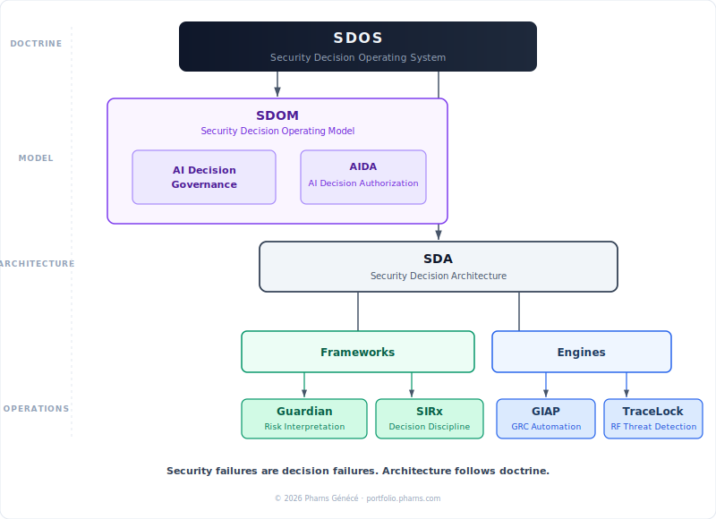

# Security Decision Architecture (SDA)

Security programs generate enormous volumes of telemetry, alerts, and compliance data. The objective is not alert volume; it is defensible security decisions.

Security Decision Architecture (SDA) is the architectural layer of the Security Decision Operating System (SDOS), a doctrine for disciplined cybersecurity decision-making. SDA defines the technical implementation layer that transforms heterogeneous telemetry into structured analysis, governance inputs, and actionable security decisions.

Security Decision Architecture (SDA) operationalizes disciplined cybersecurity decisions by structuring how frameworks and operational systems are implemented.

This model connects telemetry systems, detection engineering, governed automation workflows, and governance processes into one decision pipeline.

## SDA within the Security Decision Operating System



*SDOS shows how disciplined security decisions flow from doctrine to operating model, architecture, frameworks, and engines.*

SDOS is the governing doctrine for disciplined security decision-making. SDOM defines how security decisions are made, prioritized, and authorized. SDA defines how those decisions are implemented through structure, connecting frameworks and engines into an operating architecture.

Within this model:

- Guardian and SIRx function as frameworks that shape risk interpretation and decision discipline.
- GIAP and TraceLock function as engines that operationalize approved workflows and capabilities.

Security failures are often decision failures, not just tooling failures. SDA exists to ensure that architecture, automation, and telemetry pipelines remain aligned to disciplined decisions rather than tool-driven reactions.

```text
SDOS
├── SDOM
│   ├── AI Decision Governance
│   └── AIDA
├── SDA
├── Frameworks
│   ├── Guardian
│   └── SIRx
└── Engines
    ├── GIAP
    └── TraceLock
```

## The problem with traditional security architectures

Many security programs are organized around tools rather than decisions. Common failure modes include:

- **Alert-centric operations.** Teams optimize for detection volume rather than decision quality.
- **Fragmented tooling.** Telemetry systems, automation workflows, and governance processes operate in silos.
- **Compliance disconnected from operations.** Governance frameworks are applied after operations rather than integrated into them.

These gaps create environments where organizations collect large amounts of security data but still struggle to determine what action should be taken.

Security Decision Architecture addresses this by structuring the flow from telemetry to decisions.

## Security decision architecture pipeline

SDA organizes security systems into a layered decision pipeline with a governance feedback loop. Within SDOS, this is the implementation view: security decisions feed back into detection tuning, automation policy, and governance refinement, creating a closed-loop architecture rather than a one-way data flow.


*Security Decision Architecture pipeline: telemetry flows through detection, automation, and governance into defensible security decisions. Within SDOS, SDOM governs how those decisions are made, while SDA structures how they are implemented through frameworks and engines. The governance feedback loop ensures decisions refine upstream detection tuning, automation policy, and governance controls. Portfolio systems are mapped to their corresponding architecture layers.*

Each layer plays a distinct role in transforming raw security signals into structured decision inputs.

??? note "Mermaid source (simplified pipeline view)"

    ```mermaid
    flowchart TD
        SDOS["SDOS<br/>Security Decision Operating System"]
        SDOM["SDOM<br/>Security Decision Operating Model"]
        AIG["AI Decision Governance"]
        AIDA["AIDA<br/>AI Decision Authorization"]
        SDA["SDA<br/>Security Decision Architecture"]
        F["Frameworks"]
        G["Guardian"]
        S["SIRx"]
        E["Engines"]
        GIAP["GIAP"]
        TL["TraceLock"]

        SDOS --> SDOM
        SDOS --> SDA
        SDOS --> F
        SDOS --> E

        SDOM --> AIG
        SDOM --> AIDA

        F --> G
        F --> S

        E --> GIAP
        E --> TL
    ```

## Architecture layers

### Telemetry systems

Security telemetry provides the raw signals used by detection systems.

Examples include:

- wireless telemetry and RF monitoring
- network telemetry
- system logs and endpoint signals
- environmental and sensor inputs

Within this portfolio, TraceLock demonstrates telemetry fusion across multiple RF domains.

[View TraceLock →](../cybersecurity/tracelock.md)

### Detection engineering

Detection engineering transforms raw telemetry into correlated signals and threat indicators.

This layer includes:

- detection rules
- correlation logic
- anomaly detection
- signal prioritization

Detection engineering converts telemetry into structured observations that feed downstream workflows.

[View Detection Engineering →](../cybersecurity/detection-engineering.md)

### Automation and AI workflows

Automation platforms orchestrate the analysis and routing of security signals.

Examples include:

- automated enrichment workflows
- incident response automation
- AI-assisted signal classification
- operational orchestration

Within this portfolio, AgenticOS demonstrates governance-aware automation of operational workflows.

[View AgenticOS →](../innovation/agenticos.md)

### Governance and risk processing

Security governance systems transform operational outputs into structured risk inputs.

This includes:

- compliance frameworks
- risk scoring
- governance workflows
- audit evidence collection

Within this portfolio, GIAP demonstrates automation of governance and risk workflows.

[View GIAP →](../cybersecurity/giap.md)

### Security decisions

The final layer converts governance outputs and operational intelligence into actionable decisions.

Examples include:

- risk prioritization
- control investment decisions
- architecture changes
- operational response

Within this portfolio, these decisions are documented through architecture decision records.

[View Architecture Decisions →](architecture-decisions.md)

## Relationship to the Security Decision Operating System (SDOS)

SDA is the architectural implementation layer within SDOS.

Conceptually:

```text
Security Decision Operating System (SDOS)
Governing doctrine for disciplined security decisions
            ↓
Security Decision Operating Model (SDOM)
Decision logic, prioritization, and authorization
            ↓
Security Decision Architecture (SDA)
Technical systems, frameworks, and engines that operationalize decisions
```

SDOM defines how decisions are made and governed. SDA structures the telemetry, detection, automation, and governance pipeline that operationalizes those decisions through architecture. This keeps the page focused on SDA while making its position inside SDOS explicit.

## Why this matters

Decision discipline improves security investment quality, risk alignment, and implementation coherence. By treating SDA as the architecture layer of SDOS, the model shows how security systems should be structured to support defensible decisions rather than disconnected tooling.

## Capability signals demonstrated in this portfolio

This architecture model reflects capability domains demonstrated by portfolio artifacts:

- Security telemetry fusion
- Detection engineering and signal correlation
- Automation and AI-assisted workflows
- Governance and compliance automation
- Architecture-driven security decision processes

These capabilities support decision-driven security operations rather than tool-centric security programs.

SDA is one layer inside a broader evolving architecture model, but it remains the core implementation view for how disciplined security decisions become operational systems.

## Related architecture artifacts

- [Governed Security Architecture](governed-security-architecture.md)
- [Security Telemetry → Governance → Decision Architecture](security-telemetry-decision-architecture.md)
- [Architecture Decisions](architecture-decisions.md)
- [TraceLock™ — Multi-Domain RF Threat Detection Platform](../cybersecurity/tracelock.md)
- [GIAP™ — GRC Integrated Automation Platform](../cybersecurity/giap.md)
- [Detection Engineering](../cybersecurity/detection-engineering.md)
- [AgenticOS — Deterministic AI Agent Orchestration](../innovation/agenticos.md)
