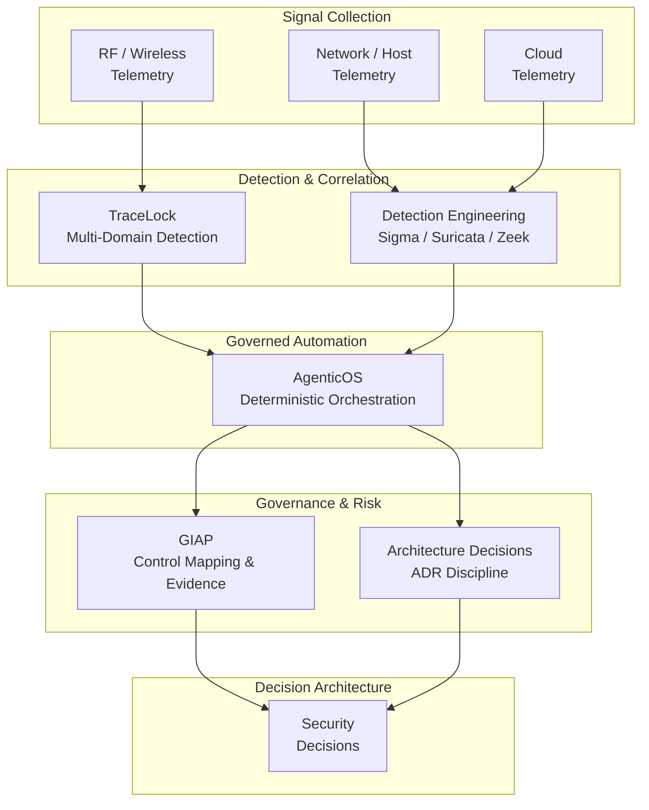

# Security Telemetry → Governance → Decision Architecture

This capstone artifact maps the full architecture path from raw signal collection through governance evaluation to structured security decisions. It shows how portfolio systems connect into one integrated security architecture rather than operating as independent tools.

## Executive overview

Security programs generate telemetry, detection alerts, compliance artifacts, and risk assessments — but these outputs rarely feed a unified decision process. This architecture makes that integration explicit. Each portfolio system occupies a defined role in a pipeline that converts raw signals into defensible, governance-aligned security decisions.

The result is a security architecture where detection findings inform governance priorities, governance outputs shape operational automation, and decision quality is traceable back to the evidence that produced it.
This capstone view is operationalized by [Security Decision Architecture (SDA)](security-decision-architecture.md), which defines the technical implementation pipeline.

## Why this architecture matters

Fragmented security programs create three recurring failure modes:

1. **Detection without governance context.** Alerts fire, but there is no structured process to evaluate whether existing controls address the threat or whether a gap requires remediation.
2. **Governance without operational evidence.** Compliance frameworks are mapped on paper, but control effectiveness is not validated against real telemetry or detection outcomes.
3. **Decisions without traceability.** Security priorities shift based on intuition or urgency rather than structured inputs from detection and governance systems.

This architecture addresses all three by designing an explicit flow from telemetry collection through governance evaluation to decision outputs.

## Architecture flow

*Architecture flow: telemetry from RF, network, host, and cloud sources feeds detection systems (TraceLock™, Sigma/Suricata/Zeek), which pass structured findings through governed automation (AgenticOS) into governance evaluation (GIAP™, ADR discipline), producing traceable security decisions.*

## Component roles

### TraceLock™ — multi-domain telemetry and detection

TraceLock™ collects and correlates signals across six wireless domains (Wi-Fi, Bluetooth/BLE, SDR/RF, GPS, ADS-B, LoRa). It provides the raw telemetry layer and first-stage detection for RF and wireless threats. Its outputs feed the broader detection pipeline with evidence-grade signal data.

**Architecture role:** Signal collection and multi-domain detection. Produces structured telemetry that downstream systems can correlate and act on.

[View TraceLock project →](../cybersecurity/tracelock.md)

### Detection Engineering — rule authoring and alert tuning

The detection engineering practice produces Sigma-style rules, Suricata signatures, and Zeek log correlation across network and host telemetry. Iterative tuning reduces false positives and maps detections to MITRE ATT&CK techniques.

**Architecture role:** Alert generation and correlation. Converts raw telemetry into actionable detection events with context and confidence levels.

[View detection engineering →](../cybersecurity/detection-engineering.md)

### AgenticOS — governed automation

AgenticOS provides deterministic, auditable orchestration for AI-assisted workflows. Every routing decision is logged, every execution is traceable, and no silent mutations occur. It connects detection outputs to governance workflows without introducing non-reproducible behavior.

**Architecture role:** Workflow orchestration. Ensures automation between detection and governance layers remains deterministic, logged, and audit-safe.

[View AgenticOS project →](../innovation/agenticos.md)

### GIAP™ — governance automation

GIAP™ automates GRC lifecycle operations: structured intake, cross-framework control mapping (100+ frameworks), evidence pipeline management, and POA&M generation. It translates detection findings and architecture decisions into governance-aligned artifacts.

**Architecture role:** Governance evaluation. Maps detection outputs and architecture decisions to compliance frameworks, producing audit-ready evidence and remediation plans.

[View GIAP project →](../cybersecurity/giap.md)

### Architecture Decisions — ADR discipline

Architecture Decision Records capture the context, rationale, and tradeoffs behind system design choices. They provide the governance backbone that keeps detection, automation, and compliance systems architecturally coherent as they evolve.

**Architecture role:** Design governance. Prevents architectural drift by making system design tradeoffs explicit and reviewable.

[View architecture decisions →](architecture-decisions.md)

## Portfolio capability signals

This architecture demonstrates integrated competency across:

- **Security telemetry fusion** — multi-domain signal collection and correlation
- **Detection engineering** — rule authoring, tuning, and MITRE ATT&CK mapping
- **Governance automation** — compliance workflow orchestration and evidence pipelines
- **Security decision architecture** — structured, traceable decision processes
- **AI-augmented security workflows** — deterministic automation with audit-grade logging
- **Architecture discipline** — ADR practices preventing system drift

## Related architecture artifacts

- [Governed Security Architecture](governed-security-architecture.md) — system-of-systems view of KnowledgeOS, AgenticOS, GIAP™, and TraceLock™
- [Architecture Decisions](architecture-decisions.md) — ADR summaries for detection, governance, and automation design choices
- [Security Decision Architecture (SDA)](security-decision-architecture.md) — technical implementation layer for telemetry-to-decision processing
- [Governed Agentic Security Stack](../stack/index.md) — stack layers with portfolio evidence links
- [TraceLock™ — Multi-Domain RF Threat Detection](../cybersecurity/tracelock.md)
- [Detection Engineering](../cybersecurity/detection-engineering.md)
- [GIAP™ — Governed Intake and Analysis Platform](../cybersecurity/giap.md)
- [AgenticOS — Deterministic AI Agent Orchestration](../innovation/agenticos.md)
- [GRC & Compliance Engineering](../grc/index.md)

## Closing

This architecture is the integrating layer across the portfolio. Individual projects demonstrate depth in detection, governance, or automation — this artifact shows how those capabilities connect into one coherent, decision-driven security system.
