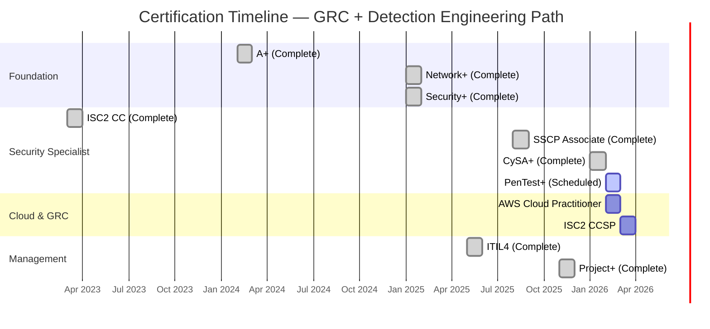

# Certifications & Education

!!! success "For Hiring Managers"
    **11 active certifications** aligned with GRC Engineering, Cloud Security, and Detection Engineering roles. CySA+ earned February 2026; PenTest+ scheduled to complete offensive/defensive hybrid positioning.

    [Verify on Credly](https://www.credly.com/users/pharns){ .md-button }

---

## Certification Roadmap

*Figure: Gantt chart showing certification timeline from 2024-2026, organized by Foundation, Security Specialist, Cloud & GRC, and Management tracks. Completed certifications in green (including CySA+ Feb 2026), scheduled in blue, planned in gray.*

---

## In Progress — February 2026

**CompTIA PenTest+ (PT0-002)**
Penetration testing, vulnerability assessment, exploitation techniques. Validates offensive security fundamentals.
Offensive Pentest Red Team
**Status:** Exam scheduled February 2026

**Why this certification matters:**

- **PenTest+** → Understanding offensive techniques improves defensive control design
- **Purple team perspective** → With CySA+ complete, PenTest+ adds the offensive capability to complement defensive detection skills

---

## Active Certifications

### Security & Risk

| Credential | Issued | Validates | Target Roles |
|------------|--------|-----------|--------------|
| **CompTIA CySA+** | Feb 2026 | Threat detection, security analytics, incident response | Detection Engineer, SOC Analyst |
| **CompTIA Security+ ce** | Jan 2025 | Core security concepts, risk management, compliance | All security roles |
| **ISC² SSCP (Associate)** | Aug 2025 | Security operations, access controls, incident response | SOC, Security Ops |
| **ISC² CC** | Mar 2023 | Foundational security principles | Entry-level validation |
| **CompTIA CSIS** | Jan 2025 | Infrastructure security (Security+ + Network+ + A+) | Security Engineering |

### Networking & Infrastructure

| Credential | Issued | Validates | Target Roles |
|------------|--------|-----------|--------------|
| **CompTIA Network+ ce** | Jan 2025 | Network architecture, troubleshooting, security | Infrastructure Security |
| **CompTIA A+** | Feb 2024 | Hardware, OS, troubleshooting fundamentals | Foundation |
| **CompTIA CIOS** | Jan 2025 | IT operations (Network+ + A+) | Operations |
| **Linux Professional Institute (LPI)** | Sep 2025 | Linux administration, command line, system management | Cloud/DevSecOps |

### Management & Process

| Credential | Issued | Validates | Target Roles |
|------------|--------|-----------|--------------|
| **ITIL 4 Foundation** | May 2025 | Service management, change control, incident management | GRC, Security Ops |
| **CompTIA Project+** | Nov 2025 | Project management, stakeholder communication | Team Lead, GRC |

---

## Planned — Q1 2026

| Credential | Target | Why This Matters |
|------------|--------|------------------|
| **AWS Cloud Practitioner (CLF-C02)** | Feb 2026 | Validates cloud fundamentals for AWS security work |
| **ISC² CCSP** | Mar 2026 | Cloud security architecture, validates senior cloud security positioning |

**Cloud roadmap rationale:** AWS Control Pack portfolio project demonstrates hands-on cloud security. Certifications validate the underlying knowledge for hiring managers who require formal credentials.

---

## Education

### B.S. Cybersecurity & Information Assurance
**Western Governors University** | Expected: **February 2026**

**Capstone:** TraceLock™ — Multi-domain RF threat detection platform (patent pending)

**Program coverage:**
- Security frameworks (NIST, ISO 27001, PCI-DSS)
- Network security and architecture
- Penetration testing and ethical hacking
- Security operations and incident response
- Cloud security fundamentals
- Governance, risk, and compliance

**Accelerated completion:** Competency-based program allows certification stacking — 10 industry certifications earned during degree.

---

## Licenses

| License | Issued | Purpose |
|---------|--------|---------|
| **FAA Part 107 Remote Pilot** | Active | Legal commercial drone operations — validates AAM/UAS credibility |
| **HAM Radio License** | Active | RF experimentation and emergency communications |
| **GMRS License** | Active | Extended-range radio communications |

---

## Role Alignment

| Target Role | Key Certifications | Status |
|-------------|-------------------|--------|
| **GRC Engineer** | Security+, SSCP, ITIL4, Project+ | ✅ Ready |
| **Cloud Security Engineer** | Security+, Network+, AWS CP (planned), CCSP (planned) | 🔄 In Progress |
| **Detection Engineer** | Security+, SSCP, CySA+, PenTest+ (Feb 2026) | ✅ Ready |
| **Security Analyst** | Security+, CySA+, Network+ | ✅ Ready |

---

## Verification

All certifications verified via official channels:

- **CompTIA:** [Credly profile](https://www.credly.com/users/pharns)
- **ISC²:** Member ID verifiable upon request
- **FAA:** Certificate available upon request

---

[View GRC Projects](grc/index.md){ .md-button .md-button--primary } [Contact](contact.md){ .md-button }
