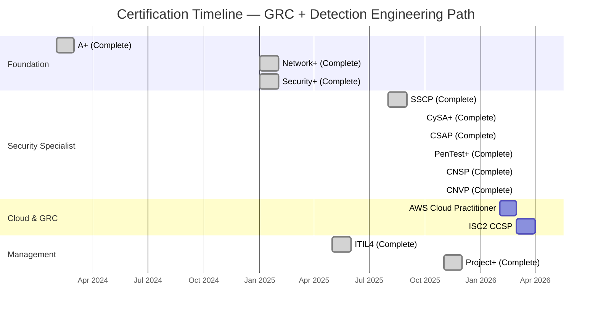

# Certifications & Education

!!! success "For Hiring Managers"
    **14 active certifications** aligned with GRC Engineering, Cloud Security, and Detection Engineering roles. PenTest+, CNSP, CNVP, CySA+, and CSAP earned 2026 — full purple team positioning complete.

    [Verify on Credly](https://www.credly.com/users/pharns){ .md-button }

---

## Certification Roadmap

```mermaid
gantt
    title Certification Timeline — GRC + Detection Engineering Path
    dateFormat YYYY-MM
    axisFormat %b %Y

    section Foundation
    A+ (Complete)           :done, 2024-02, 2024-03
    Network+ (Complete)     :done, 2025-01, 2025-02
    Security+ (Complete)    :done, 2025-01, 2025-02

    section Security Specialist
    SSCP (Complete)         :done, 2025-08, 2025-09
    CySA+ (Complete)        :done, 2026-02, 2026-02
    CSAP (Complete)         :done, 2026-02, 2026-02
    PenTest+ (Complete)     :done, 2026-03, 2026-03
    CNSP (Complete)         :done, 2026-03, 2026-03
    CNVP (Complete)         :done, 2026-03, 2026-03

    section Cloud & GRC
    AWS Cloud Practitioner  :2026-02, 2026-03
    ISC2 CCSP              :2026-03, 2026-04

    section Management
    ITIL4 (Complete)        :done, 2025-05, 2025-06
    Project+ (Complete)     :done, 2025-11, 2025-12
```

*Figure: Gantt chart showing certification timeline from 2024-2026, organized by Foundation, Security Specialist, Cloud & GRC, and Management tracks. Completed certifications in green, planned in gray.*

---

## Recently Earned — 2026

**CompTIA PenTest+ (PT0-002)** ✅
Penetration testing, vulnerability assessment, and offensive security. Completes purple team positioning alongside CySA+.
Offensive PenTest Purple Team
**Earned:** March 2026

**CNSP — Certified Network Security Practitioner** ✅
Network security architecture, defense strategies, and secure infrastructure design. Validates hands-on network defense capability.
Network Security Defense Infrastructure
**Earned:** March 2026

**CNVP — Certified Network Vulnerability Practitioner** ✅
Vulnerability assessment, network scanning, and remediation strategies. Validates offensive network analysis skills.
Vulnerability Assessment Network
**Earned:** March 2026

**CompTIA CySA+ (CS0-004)** ✅
Threat detection, security analytics, incident response. Validates SOC analyst and detection engineering skills.
Detection SIEM IR
**Earned:** February 2026

**CompTIA Security Analytics Professional (CSAP)** ✅
Advanced analytics and detection specialization built on Security+ and CySA+. Validates purple team capability.
Analytics Detection Stackable
**Earned:** February 2026

**Why these certifications matter:**

- **PenTest+** → Offensive security fundamentals complete purple team positioning
- **CNSP/CNVP** → Network security and vulnerability assessment from The SecOps Group
- **CySA+** → Detection engineering roles require demonstrated threat analysis capability
- **CSAP** → Advanced analytics and detection specialization built on Security+ and CySA+

---

## Active Certifications

### Security & Risk

| Credential | Issued | Validates | Target Roles |
|------------|--------|-----------|--------------|
| **CompTIA PenTest+ (PT0-002)** | Mar 2026 | Penetration testing, vulnerability assessment, offensive security | Penetration Tester, Purple Team |
| **CompTIA CySA+ (CS0-004)** | Feb 2026 | Threat detection, security analytics, incident response | Detection Engineer, SOC |
| **CompTIA CSAP (Stackable)** | Feb 2026 | Advanced analytics and detection (Security+ + CySA+) | Detection Engineer, Security Engineer |
| **CompTIA Security+ ce** | Jan 2025 | Core security concepts, risk management, compliance | All security roles |
| **CNSP (SecOps Group)** | Mar 2026 | Network security architecture, defense strategies, secure infrastructure | Network Security, Purple Team |
| **CNVP (SecOps Group)** | Mar 2026 | Vulnerability assessment, network scanning, remediation | Vulnerability Management, PenTest |
| **ISC² SSCP** | Aug 2025 | Security operations, access controls, incident response | SOC, Security Ops |
| **CompTIA CSIS** | Jan 2025 | Infrastructure security (Security+ + Network+ + A+) | Security Engineering |

### Networking & Infrastructure

| Credential | Issued | Validates | Target Roles |
|------------|--------|-----------|--------------|
| **CompTIA Network+ ce** | Jan 2025 | Network architecture, troubleshooting, security | Infrastructure Security |
| **CompTIA A+** | Feb 2024 | Hardware, OS, troubleshooting fundamentals | Foundation |
| **CompTIA CIOS** | Jan 2025 | IT operations (Network+ + A+) | Operations |
| **Linux Professional Institute (LPI)** | Sep 2025 | Linux administration, command line, system management | Cloud/DevSecOps |

### Management & Process

| Credential | Issued | Validates | Target Roles |
|------------|--------|-----------|--------------|
| **ITIL 4 Foundation** | May 2025 | Service management, change control, incident management | GRC, Security Ops |
| **CompTIA Project+** | Nov 2025 | Project management, stakeholder communication | Team Lead, GRC |

---

## Planned — 2026

| Credential | Target | Why This Matters |
|------------|--------|------------------|
| **AWS Cloud Practitioner (CLF-C02)** | Q1 2026 | Validates cloud fundamentals for AWS security work |
| **ISC² CCSP** | Q2 2026 | Cloud security architecture, validates senior cloud security positioning |

**Cloud roadmap rationale:** AWS Control Pack portfolio project demonstrates hands-on cloud security. Certifications validate the underlying knowledge for hiring managers who require formal credentials.

---

## Education

### B.S. Cybersecurity & Information Assurance
**Western Governors University** | **March 2026**

**Capstone:** TraceLock™ — Multi-domain RF threat detection platform (patent pending)

**Program coverage:**
- Security frameworks (NIST, ISO 27001, PCI-DSS)
- Network security and architecture
- Penetration testing and ethical hacking
- Security operations and incident response
- Cloud security fundamentals
- Governance, risk, and compliance

**Accelerated completion:** Competency-based program allows certification stacking — 14 industry certifications earned during degree.

---

## Licenses

| License | Issued | Purpose |
|---------|--------|---------|
| **FAA Part 107 Remote Pilot** | Active | Legal commercial drone operations — validates AAM/UAS credibility |
| **HAM Radio License** | Active | RF experimentation and emergency communications |
| **GMRS License** | Active | Extended-range radio communications |

---

## Role Alignment

| Target Role | Key Certifications | Status |
|-------------|-------------------|--------|
| **GRC Engineer** | Security+, SSCP, ITIL4, Project+ | ✅ Ready |
| **Cloud Security Engineer** | Security+, Network+, AWS CP (planned), CCSP (planned) | 🔄 In Progress |
| **Detection Engineer** | Security+, SSCP, CySA+, CSAP | ✅ Ready |
| **Security Analyst** | Security+, CySA+, Network+ | ✅ Ready |
| **Penetration Tester** | PenTest+, CNSP, CNVP, Security+, Network+ | ✅ Ready |

---

## Verification

All certifications verified via official channels:

- **CompTIA:** [Credly profile](https://www.credly.com/users/pharns)
- **ISC²:** Member ID verifiable upon request
- **FAA:** Certificate available upon request

---

[View GRC Projects](grc/index.md){ .md-button .md-button--primary } [Contact](contact.md){ .md-button }
