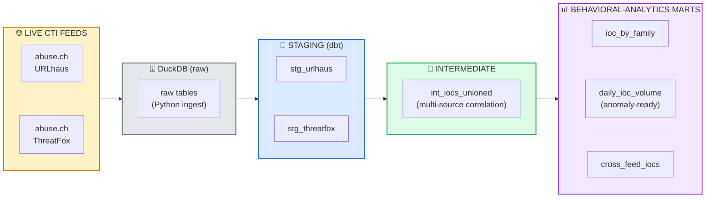

# dbt CTI Pipeline

!!! success "For Hiring Managers — Detection / Threat-Intel / Data Engineering"
    **TL;DR:** I built a working data pipeline that ingests live cyber threat intelligence feeds and transforms them into behavioral-analytics tables using **dbt Core + DuckDB**. Staging to intermediate to mart models, **6 models with 14 passing tests**, documentation, and a full lineage DAG.

    **What I bring:**

    - dbt Core modeling (staging to mart layering, tests, docs, DAG)
    - SQL transformation and data modeling over messy external feeds
    - Multi-source correlation (unioning independent CTI feeds)
    - Anomaly-ready time-series (daily volume vs. trailing baseline)
    - Python ingestion of live no-auth threat feeds into an analytical store

    **Why this matters:** this is threat-intel data modeling in miniature — the same ingest, transform, test, and analyze pattern a CTI enrichment pipeline uses, built end-to-end and reproducible from a single command.

[:material-github: GitHub Repo](https://github.com/Pharns/dbt-cti-pipeline){target=_blank} | [Contact](../contact.md){ .md-button }

---

## What it does

**6 dbt Models**
Staging to intermediate to behavioral-analytics marts, layered and modular

**14 Passing Tests**
`not_null`, `unique`, and `accepted_values` tests across staging and marts

**2 Live CTI Feeds**
abuse.ch URLhaus + ThreatFox, ingested no-auth into a local analytical store

**Full Lineage DAG**
Auto-generated docs and dependency graph via `dbt docs`

The pipeline ingests live threat intelligence, normalizes it into a common schema, unions independent feeds for multi-source correlation, and produces analysis-ready tables — IOC volume by threat family, daily volume against a trailing baseline (anomaly-ready), and cross-feed corroborated indicators.

---

## Architecture

The layering follows standard dbt practice: raw data stays 1:1 with the source, staging cleans and types it into a common schema, the intermediate layer unions the feeds, and the marts are the analysis-ready tables.

---

## The behavioral-analytics marts

| Mart | What it answers | Signal |
|------|-----------------|--------|
| **IOC by threat family** | Which malware families are most active, and how long have we seen them? | Volume + time span per family (Cobalt Strike, Remcos, AsyncRAT, Mirai, and more in a live run) |
| **Daily IOC volume** | Is today abnormal versus recent history? | Daily counts against a 7-day trailing baseline — a spike above baseline is a candidate anomaly |
| **Cross-feed IOCs** | Which indicators are corroborated by more than one source? | IOCs independently reported by both feeds — a higher-confidence lead than a single sighting |

The cross-feed mart is the multi-source-correlation payoff: an indicator seen in both URLhaus and ThreatFox is a stronger lead than one seen once.

---

## Engineering notes

- **Stack:** dbt Core (dbt-duckdb adapter) for transformation, testing, docs, and DAG; DuckDB as a local, zero-config analytical database; Python (`requests`) for feed ingestion.
- **Tested, not asserted:** every model carries schema tests — `not_null` and `unique` on indicator keys, `accepted_values` on IOC types and source feeds — so a broken transform fails the build rather than shipping bad data.
- **Reproducible from one command:** ingest the live feeds, then `dbt run` and `dbt test` build and validate the whole pipeline; `dbt docs` generates the lineage graph.
- **Honest data modeling:** the models surface real feed characteristics rather than hiding them — for example, URLhaus reports a coarse threat category where ThreatFox supplies named malware families, and the marts keep that visible rather than filtering it away.

---

## Skills demonstrated

| Category | Skills |
|----------|--------|
| **Data Engineering** | dbt Core modeling, staging-to-mart layering, schema tests, lineage/DAG, DuckDB |
| **Threat Intelligence** | CTI feed ingestion (URLhaus, ThreatFox), IOC normalization, multi-source correlation |
| **SQL** | Transformation models, unions across sources, window functions for baselines |
| **Python** | Live feed ingestion, schema handling, loading into an analytical store |
| **Data Quality** | Test-driven models, honest handling of source-data quirks |

---

## Related projects

- [:material-github: dbt-cti-pipeline](https://github.com/Pharns/dbt-cti-pipeline){target=_blank} — Full repo with models, tests, and lineage DAG
- [Detection Engineering](detection-engineering.md) — Authored Sigma detections and IR workflows
- [GIAP™](giap.md) — Automation platform demonstrating similar pipeline thinking applied to GRC

---

!!! question "Want to discuss threat-intel data engineering?"
    I'm actively seeking roles where I can build and secure the data pipelines behind threat detection and intelligence.

    [:material-github: View Repo on GitHub](https://github.com/Pharns/dbt-cti-pipeline){target=_blank .md-button .md-button--primary } [Contact Me](../contact.md){ .md-button } [View Resume](../resume.md){ .md-button }
