# Detection Engineering

!!! success "For Hiring Managers — Detection Engineer / Security Operations"
    **TL;DR:** I author detection content, tune SIEM alerts, and build IR workflows. My homelab runs Security Onion + TheHive/Cortex with **12 custom Sigma-style rules** across 5 categories. Achieved **~20% false positive reduction** through iterative tuning.

    **What I bring:**

    - Custom detection rule development (Sigma, Suricata, Zeek)
    - Alert tuning and threshold optimization
    - Multi-source log correlation (network + host)
    - MITRE ATT&CK mapping in detection content
    - Evidence enrichment pipelines (VirusTotal, AbuseIPDB, GreyNoise)
    - Playbook-driven incident response

    **Why this matters:** I don't just consume detection content — I create it. If I can build and tune detections in my own lab, I can contribute to your SOC/SIEM platform from day one.

[View Detection Lab Details](#detection-lab) | [See Sigma Rules](#authored-detection-rules) | [Contact](../contact.md){ .md-button }

---

## Detection engineering capabilities

<div class="stat-grid" markdown>
<div class="stat-tile" markdown>
**12 Custom Detections**
Sigma-style rules for DNS tunneling, HTTP beaconing, auth anomalies, lateral movement, and exfiltration
</div>
<div class="stat-tile" markdown>
**~20% FP Reduction**
Achieved through threshold tuning, allowlisting, and baseline analysis over 3-month lab period
</div>
<div class="stat-tile" markdown>
**8 IR Playbooks**
Documented runbooks for malware, phishing, lateral movement, exfil, brute force, ransomware
</div>
<div class="stat-tile" markdown>
**15+ Enrichment Sources**
VirusTotal, AbuseIPDB, Shodan, GreyNoise, MISP feeds integrated via Cortex
</div>
</div>

---

## Authored detection rules

### Sigma-style rules (12 total)

| Category | Rules | Detection Focus | MITRE ATT&CK |
|----------|-------|-----------------|--------------|
| **DNS** | 3 | Tunneling, DGA domains, suspicious TLD queries | T1071.004 |
| **HTTP** | 3 | Beaconing patterns, C2 callbacks, suspicious user-agents | T1071.001 |
| **Authentication** | 2 | Brute force, credential stuffing, anomalous login times | T1110 |
| **Lateral Movement** | 2 | SMB enumeration, PsExec-like behavior, WMI abuse | T1021, T1047 |
| **Exfiltration** | 2 | Large outbound transfers, encrypted channel anomalies | T1048 |

### Example: DNS tunneling detection

```yaml
title: DNS Query Entropy Anomaly
status: experimental
description: Detects high-entropy DNS queries indicative of DNS tunneling
logsource:
  product: zeek
  service: dns
detection:
  selection:
    query|re: '^[a-z0-9]{32,}\.'  # Long random subdomain pattern
  condition: selection
falsepositives:
  - CDN randomized hostnames (allowlisted)
  - Cloud service auto-generated domains
level: medium
tags:
  - attack.command_and_control
  - attack.t1071.004
```

### False positive optimization

| Detection | Initial FP Rate | After Tuning | Tuning Method |
|-----------|-----------------|--------------|---------------|
| DNS tunneling | ~35% | ~12% | Allowlist CDN patterns, entropy threshold adjustment |
| HTTP beaconing | ~40% | ~18% | Time-window correlation, user-agent filtering |
| Auth anomalies | ~25% | ~8% | Baseline normal hours per user group |
| Lateral movement | ~30% | ~15% | Exclude admin workstations, service accounts |

**Average reduction:** ~20% across all detection categories through iterative tuning over 3-month lab period.

---

## Detection lab

### Architecture

```mermaid
%%{init: {"themeVariables": {"fontSize": "18px"}}}%%
flowchart TB
    subgraph TARGETS["🎯 ATTACK TARGETS"]
        direction LR
        T1["Windows 11<br/>Endpoint"] ~~~ T2["Active Directory<br/>Domain"] ~~~ T3["Ubuntu/Docker<br/>Services"] ~~~ T4["Vulnerable Apps<br/>(DVWA, Juice Shop)"]
    end

    subgraph DETECTION["🔍 DETECTION LAYER"]
        direction LR
        D1["Security Onion<br/>SIEM/IDS"] ~~~ D2["Wazuh<br/>Host-Based"] ~~~ D3["Nessus<br/>Vuln Scanning"]
    end

    subgraph IR["🚨 INCIDENT RESPONSE"]
        direction LR
        I3["MISP<br/>Threat Intel"] --> I2["Cortex<br/>Enrichment"] --> I1["TheHive<br/>Case Mgmt"]
    end

    subgraph OUTPUT["📊 OUTPUTS"]
        direction LR
        O1["Cases &<br/>Evidence"] ~~~ O2["IR<br/>Playbooks"] ~~~ O3["Detection<br/>Metrics"]
    end

    TARGETS --> DETECTION
    DETECTION --> IR
    IR --> OUTPUT

    style TARGETS fill:#fef3c7,stroke:#d97706,stroke-width:2px
    style DETECTION fill:#dbeafe,stroke:#2563eb,stroke-width:2px
    style IR fill:#dcfce7,stroke:#16a34a,stroke-width:2px
    style OUTPUT fill:#f3e8ff,stroke:#9333ea,stroke-width:2px
```



### Tool stack

| Component | Role | Purpose |
|-----------|------|---------|
| **Security Onion** | Network IDS/SIEM | Suricata alerts, Zeek logs, Elasticsearch backend |
| **Wazuh** | Host-based detection | Endpoint logs, FIM, rootkit detection |
| **TheHive** | Case management | Alert-to-case workflow, evidence tracking |
| **Cortex** | Enrichment engine | Automated IOC analysis (15+ analyzers) |
| **Nessus** | Vulnerability scanning | Scheduled scans, compliance checks |
| **MISP** | Threat intel feeds | IOC feeds for correlation |

---

## Incident response playbooks

| Playbook | Trigger | Key Steps |
|----------|---------|-----------|
| **Malware Detected** | AV/EDR alert or Sigma match | Isolate → Capture memory → Hash analysis → Lateral check → Remediate |
| **Phishing Reported** | User report or email filter | Header analysis → URL/attachment sandbox → Credential check → Block sender |
| **Lateral Movement** | SMB/WMI/PsExec detection | Source/dest pivot → Timeline → Credential exposure check → Contain |
| **Data Exfiltration** | Large outbound or encrypted tunnel | Traffic capture → Volume analysis → Sensitive data check → Block egress |
| **Brute Force** | Auth threshold exceeded | Source analysis → Account lockout → Geo/IP reputation → Password reset |
| **Ransomware** | File encryption indicators | Network isolate → Backup status → Variant ID → Recovery plan |

---

## Lab drill: attack chain simulation

### Scenario: Malicious document + C2 callback

**Attack chain simulated:**

1. Phishing email with macro-enabled document delivered to Windows endpoint
2. Macro executes PowerShell payload (simulated with safe script)
3. Beacon to external C2 (controlled test server)
4. Attempted lateral movement to DC

**Detection response:**

- Security Onion flagged DNS anomaly + HTTP beaconing pattern
- Wazuh triggered on PowerShell execution with suspicious arguments
- TheHive case created automatically via webhook integration
- Cortex enriched C2 domain (test domain marked malicious in lab MISP)

**Results:**

| Metric | Value |
|--------|-------|
| Time to detect | 4 minutes (automated) |
| Time to triage | 12 minutes (manual analysis + enrichment) |
| Playbook followed | Malware Detected → Lateral Movement check |
| Documentation | Full case timeline with evidence artifacts |

---

## RF/wireless detection engineering

Detection engineering extends beyond network/host telemetry. **TraceLock™** applies the same principles to RF threat detection:

| Domain | Detections | Use Case |
|--------|------------|----------|
| **Wi-Fi** | Rogue AP, deauth attacks, evil twin | Physical security perimeter |
| **Bluetooth/BLE** | Unauthorized trackers, device enumeration | Counter-surveillance |
| **SDR** | Anomalous RF activity, signal classification | Spectrum monitoring |
| **GPS** | Spoofing detection via multi-receiver correlation | Location integrity |
| **ADS-B** | Drone proximity, aircraft tracking | Airspace awareness |

[View TraceLock™ Project →](tracelock.md)

---

## Skills demonstrated

| Category | Skills |
|----------|--------|
| **Detection Engineering** | Sigma rule authoring, Suricata/Zeek tuning, log correlation, MITRE ATT&CK mapping |
| **SIEM/SOAR** | Security Onion deployment, alert pipeline design, webhook automation |
| **Incident Response** | TheHive case management, Cortex enrichment, playbook development |
| **Threat Intelligence** | MISP feeds, IOC correlation, enrichment pipelines |
| **Lab Operations** | Proxmox virtualization, AD domain, vulnerable app deployment |

---

## Growth trajectory

| Enhancement | Status | Target |
|-------------|--------|--------|
| SOAR integration (n8n or Shuffle) | 🔄 Researching | Q1 2026 |
| Purple team automation (Caldera) | 🔄 Installed | Q1 2026 |
| Detection-as-code CI/CD pipeline | ⏳ Planned | Q2 2026 |
| Formal detection efficacy dashboard | ⏳ Planned | Q2 2026 |
| CySA+ certification | 📅 Scheduled | January 2026 |

---

## Related projects

- [Detection & IR Lab](incident-response.md) — Full lab documentation with additional drill scenarios
- [TraceLock™](tracelock.md) — RF/wireless detection engineering across 6 domains
- [GIAP™](giap.md) — Automation platform demonstrating similar pipeline thinking applied to GRC
- [Homelab Infrastructure](homelab-infrastructure.md) — The lab environment where this runs

---

!!! question "Want to discuss detection engineering?"
    I'm actively seeking Detection Engineer roles where I can contribute authored detection content, tune alert pipelines, and build IR workflows.

    [Contact Me](../contact.md){ .md-button .md-button--primary } [View Resume](../resume.md){ .md-button }
