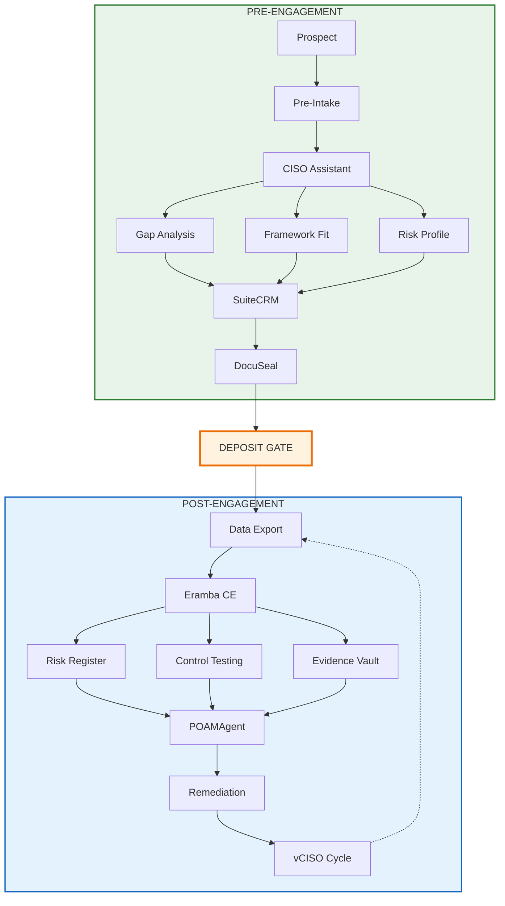
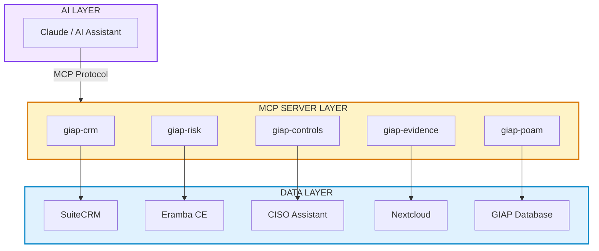
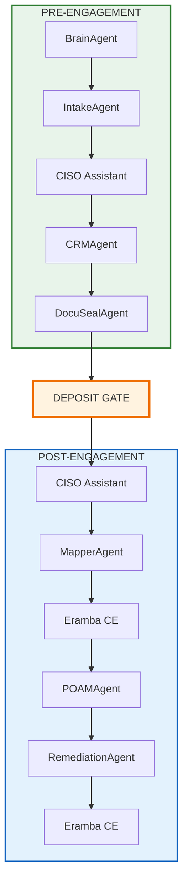

# GIAP™ — Multi-Agent GRC Automation Platform
*Updated: {{ page.meta.git_revision_date_localized or "" }}*

!!! tldr "For recruiters & hiring managers"
    **What:** 7-agent GRC automation platform with AI/LLM integration via Model Context Protocol (MCP). Orchestrates client intake, CRM sync, legal document automation, cross-framework control mapping, POA&M generation, and remediation task creation. Two-phase workflow: CISO Assistant for rapid pre-engagement assessment, Eramba CE for full operational GRC.

    **Why this matters:** Demonstrates senior-level systems architecture, multi-agent orchestration, API-first design, and AI integration — the kind of automation that transforms manual GRC processes into scalable, audit-ready workflows.

    **Impact:** Reduces audit prep time by ~70% through natural language queries; automates end-to-end GRC lifecycle from intake to remediation tracking.

    **Skills:** Multi-Agent Architecture · MCP/LLM Integration · FastAPI · React · Eramba CE · CISO Assistant · GRC Automation · Control Mapping · SOC 2 · NIST CSF · CIS v8 · HIPAA · CPRA · Evidence Pipelines · API Design · RBAC · Audit Logging

---

!!! info "Project Status: Architecture Complete, Implementation Active"
    **Infrastructure:** Deployed — Multi-VM Proxmox stack with Eramba CE, CISO Assistant, Nextcloud, n8n, SuiteCRM, and DocuSeal.

    **Architecture:** Complete — 7-agent pipeline designed, MCP integration specified, API scaffolded.

    **Implementation:** Active — FastAPI backend and React frontend in development; agent integration in progress.

---

## End-to-End Workflow

GIAP™ implements a two-phase workflow with a clear **deposit gate** separating pre-engagement qualification from paid consulting work:



---

## Platform Roles

| Platform | Phase | Role | Why |
|----------|-------|------|-----|
| **CISO Assistant** | Pre-Engagement | Rapid framework assessment, gap identification | Lightweight, fast, YAML-native |
| **SuiteCRM** | Both | Client records, engagement tracking | Single source of truth for sales |
| **DocuSeal** | Pre-Engagement | Legal documents (engagement letter, DPA, BAA) | E-signature automation |
| **Eramba CE** | Post-Engagement | Full GRC operations (risk, audits, policies, incidents) | Enterprise-grade, audit-ready |
| **POAMAgent** | Post-Engagement | Custom POA&M generation | Branded deliverables, multi-format |
| **Nextcloud** | Both | Evidence vault, document storage | Self-hosted, encrypted |

---

## Architecture Overview

GIAP™ is a modular, multi-agent GRC automation platform with MCP integration for AI-assisted queries:



---

## Multi-Agent Pipeline

| Agent | Phase | Function | Output |
|-------|-------|----------|--------|
| **BrainAgent** | Both | Orchestrator — routes work, validates data, maintains state | Job routing decisions |
| **IntakeAgent** | Pre | Normalizes form inputs → structured JSON | Industry, risk profile, frameworks |
| **CRMAgent** | Both | SuiteCRM sync — single source of truth | Account/Contact/Intake records |
| **DocuSealAgent** | Pre | Engagement letter + DPA/BAA automation | Signed PDFs via e-signature |
| **MapperAgent** | Post | Intake → AAM Unified Controls → Eramba | Cross-framework gap analysis |
| **POAMAgent** | Post | Custom POA&M generation from Eramba gaps | MD/CSV/PDF remediation plan |
| **RemediationAgent** | Post | Creates tasks, imports to Eramba for tracking | Eramba tasks, evidence checklists |

### Data Flow



---

## POAMAgent — Custom POA&M Generator

No dedicated open-source POA&M generator exists. For a boutique consulting firm, custom tooling is the right choice:

| Approach | Cost | Integration | Portfolio Value |
|----------|------|-------------|-----------------|
| Commercial (Onspring, etc.) | $5K-50K/year | Generic | None |
| **Custom POAMAgent** | Dev time only | Native GIAP | "Built production compliance tooling" |

### POAMAgent Capabilities

```python
# POAMAgent outputs
poam_agent = {
    "inputs": ["eramba_gaps", "aam_unified_controls", "client_context"],
    "outputs": {
        "executive_summary": "1-page risk overview (PDF)",
        "detailed_poam": "Full remediation plan with milestones (MD/CSV/PDF)",
        "eramba_import": "Task list for remediation tracking (JSON)"
    },
    "templates": "Jinja2 → Markdown → WeasyPrint PDF",
    "branding": "AAM Cyber deliverable format"
}
```

### Implementation Scope

| Component | Complexity | Status |
|-----------|------------|--------|
| Eramba API query | Low | Designed |
| Severity/priority logic | Low | Designed |
| Jinja2 templates | Low | Designed |
| PDF generation | Medium | Planned |
| Eramba task import | Low | Planned |

---

## MCP Integration

GIAP™ integrates with Claude and other AI assistants via **Model Context Protocol (MCP)**, enabling natural language queries against GRC data:

| MCP Server | Data Source | Phase | Example Queries |
|------------|-------------|-------|-----------------|
| `giap-crm` | SuiteCRM | Both | "Show all pending intakes" / "What's the engagement status for Client X?" |
| `giap-controls` | CISO Assistant | Pre | "Run a quick SOC 2 gap check for new prospect" / "What frameworks fit this client?" |
| `giap-risk` | Eramba CE | Post | "Show high-risk items for Client X" / "What's our overall risk posture?" |
| `giap-evidence` | Nextcloud | Post | "Show the signed NDA for Client X" / "What evidence is missing for CC6.1?" |
| `giap-poam` | GIAP Database | Post | "Generate a POA&M for Client X" / "What are the top 5 high-risk items?" |

### Example Conversation

```
User: New prospect came in — healthcare practice, 25 employees, M365 + on-prem EHR.
      Quick assessment before our sales call?

Claude: [Reads giap://controls/frameworks/hipaa/quick-assessment]
        [Reads giap://controls/frameworks/soc2/quick-assessment]

Quick Assessment for Healthcare Practice:

Recommended Frameworks: HIPAA (required), SOC 2 (recommended for vendors)

Likely Gaps (based on profile):
- §164.312(a) Access Control — EHR access reviews needed
- §164.308(a)(1) Risk Analysis — Likely missing formal risk assessment
- CC6.2 Logical Access — M365 MFA status unknown

Suggested Engagement: HIPAA Security Rule assessment + SOC 2 readiness
Estimated Scope: 40-60 hours

Ready to create intake in SuiteCRM?
```

---

## Technology Stack

| Layer | Technology | Purpose |
|-------|------------|---------|
| **Backend** | Python 3.11 + FastAPI | API-first GRC primitives, RBAC, audit logging |
| **Frontend** | React + Vite | Thin UI consuming API (security logic server-side) |
| **Database** | PostgreSQL / SQLite | Intake data, POA&M, audit trails |
| **ORM** | SQLAlchemy + Alembic | Schema management, migrations |
| **Automation** | n8n | Workflow orchestration, notifications |
| **CRM** | SuiteCRM (remote MySQL) | Client records, intake tracking |
| **Signatures** | DocuSeal (self-hosted) | Engagement letters, DPAs, BAAs, NDAs |
| **Files** | Nextcloud | Evidence vault, document storage |
| **Pre-Engagement GRC** | CISO Assistant | Rapid assessments, framework selection, YAML export |
| **Post-Engagement GRC** | Eramba CE | Risk management, compliance ops, audits, remediation |
| **POA&M Generation** | POAMAgent (custom) | Branded deliverables, multi-format output |
| **Proxy** | Nginx Proxy Manager | TLS termination, routing |
| **Infrastructure** | Proxmox LXC/VM | Isolated service VMs |
| **Access** | Tailscale | Admin routes restricted by CGNAT + ACL |
| **CI/CD** | GitHub Actions | Lint, test, build validation |

### Eramba CE — Operational GRC Platform

[Eramba CE](https://www.eramba.org/) is an open-source, enterprise-grade GRC platform for post-engagement work:

| Capability | Description |
|------------|-------------|
| **Risk Management** | Custom risk frameworks, risk registers, risk assessments |
| **Compliance Tracking** | Pre-mapped control libraries (ISO 27001, PCI-DSS, SOC 2, HIPAA) |
| **Policy Management** | Policy lifecycle, reviews, versioning |
| **Internal Controls & Audits** | Control testing, audit workflows, evidence collection |
| **Incident Management** | Incident tracking, response workflows |
| **Remediation Tracking** | Task management, milestone tracking, closure verification |
| **REST APIs & Webhooks** | Full integration with POAMAgent and GIAP pipeline |

### CISO Assistant — Pre-Engagement Assessment

[CISO Assistant](https://github.com/intuitem/ciso-assistant-community) provides lightweight, rapid assessments:

| Capability | Description |
|------------|-------------|
| **Quick Assessments** | Fast framework gap identification |
| **Framework Libraries** | Pre-loaded SOC 2, NIST, HIPAA, etc. |
| **YAML Export** | Clean export format for Eramba import |
| **Low Overhead** | No complex setup for prospect evaluation |

---

## Framework Coverage

| Framework | Status | Pre-Engagement | Post-Engagement |
|-----------|--------|----------------|-----------------|
| **SOC 2** | Full mapping | CISO Assistant | Eramba CE |
| **NIST CSF v2.0** | Full mapping | CISO Assistant | Eramba CE |
| **CIS Controls v8** | Full mapping | CISO Assistant | Eramba CE |
| **HIPAA** | Full mapping | CISO Assistant | Eramba CE |
| **CPRA** | Full mapping | CISO Assistant | Eramba CE |
| **ISO 27001** | Partial | — | Eramba CE |
| **AAM Unified Controls** | Proprietary | — | Cross-framework master |

### HIPAA Coverage

GIAP™ supports HIPAA Security Rule and Privacy Rule compliance for healthcare clients and business associates:

| HIPAA Requirement | Implementation | Eramba Control |
|-------------------|----------------|----------------|
| §164.312(a) Access Control | RBAC, unique user IDs, auto-logoff | AAM.ACCESS-01 |
| §164.312(b) Audit Controls | Append-only logs, activity monitoring | AAM.AUDIT-01 |
| §164.312(c) Integrity | SHA-256 checksums, tamper detection | AAM.INTEG-01 |
| §164.312(d) Authentication | MFA enforcement, credential management | AAM.AUTH-01 |
| §164.312(e) Transmission Security | TLS everywhere, encrypted transit | AAM.TRANS-01 |
| §164.308(a) Security Management | Risk analysis, sanctions, review | Eramba Risk Module |
| §164.310 Physical Safeguards | Facility access, workstation security | Policy Module |

### AAM Unified Controls

Proprietary control framework that normalizes intake responses and maps to all supported frameworks:

```yaml
framework: AAM-Custom-GRC
client: Healthcare Practice A
version: 1.0
controls:
  - id: AAM.ACCESS-01
    status: partial
    notes: Offboarding not documented
    frameworks:
      SOC2: CC6.2
      NIST-CSF: PR.AC-1
      CISv8: 6.2
      HIPAA: §164.312(a)(1)
```

---

## Control Mapping Examples

| Control Area | Implementation | Mapped Frameworks |
|--------------|----------------|-------------------|
| Access Control | RBAC on portal/CRM; least-privilege folders; MFA enforcement | SOC 2 CC6, NIST PR.AC, CIS 5.x/6.x, HIPAA §164.312(a) |
| Data Protection | TLS enforcement; encryption at rest; email security (DKIM/DMARC) | SOC 2 CC6, NIST PR.DS, CIS 3.x, HIPAA §164.312(e) |
| Integrity & Retention | SHA-256 checksums on upload; retention schedule; logged deletion | SOC 2 CC3/CC8, NIST PR.DS, HIPAA §164.312(c) |
| Audit Logging | Append-only logs; immutable audit trail; workflow step logging | SOC 2 CC7, NIST DE.CM, CIS 8.x, HIPAA §164.312(b) |
| Authentication | MFA, unique IDs, credential rotation | SOC 2 CC6, NIST PR.AC, HIPAA §164.312(d) |
| Provisioning | Onboarding/offboarding runbooks; periodic access review | SOC 2 CC6, NIST PR.AC, HIPAA §164.308(a)(3) |
| Risk Management | Risk assessments, risk register, treatment plans | NIST ID.RA, HIPAA §164.308(a)(1) |

---

## Target Metrics

| Metric | Manual Process | GIAP™ Automated | Improvement |
|--------|----------------|-----------------|-------------|
| Pre-engagement assessment | 2-3 hours | 15 minutes | ~90% reduction |
| Intake processing | 2-3 hours | 15 minutes | ~85% reduction |
| POA&M generation | 4+ hours | 10 minutes | ~95% reduction |
| Audit prep | 4+ hours | 30 minutes | ~87% reduction |
| Risk assessment | Full day | 2 hours | ~75% reduction |
| Control mapping | Manual spreadsheet | Auto YAML export | 100% coverage |
| Evidence retrieval | Navigate folders | Natural language query | ~70% time saved |

*Metrics represent design targets based on architecture specifications.*

---

## vCISO Continuous Compliance

GIAP™ supports 90-day recurring assessment cycles for vCISO engagements:

1. **CISO Assistant** → Quick delta assessment questionnaire
2. **Eramba CE** → Risk register updates, control re-testing
3. **MapperAgent** → Updated control status (delta analysis)
4. **POAMAgent** → Updated POA&M (new gaps vs. closed items)
5. **RemediationAgent** → Task updates, evidence requests
6. **CRMAgent** → Timestamped audit trail, billing trigger

**Business Impact:** Enables recurring vCISO engagements with automated quarterly reviews and continuous compliance monitoring.

---

## Implementation Status

| Phase | Status | Notes |
|-------|--------|-------|
| Architecture design | ✅ Complete | 7-agent pipeline, two-phase workflow |
| Infrastructure deployment | ✅ Complete | Proxmox VMs running all services |
| CISO Assistant deployment | ✅ Complete | Pre-engagement assessments active |
| Eramba CE deployment | ✅ Complete | Risk, compliance, audit modules active |
| Framework mapping | ✅ Complete | SOC 2, NIST CSF, CIS v8, HIPAA, CPRA |
| FastAPI backend scaffold | ✅ Complete | giac-api with Poetry, Makefile |
| React frontend scaffold | ✅ Complete | giac-ui with pnpm, Makefile |
| MCP server architecture | ✅ Complete | 5 servers specified |
| Agent implementation | 🔄 In Progress | BrainAgent, IntakeAgent first |
| POAMAgent development | 🔄 In Progress | Templates and Eramba integration |
| System integration | 🔄 In Progress | CISO Assistant → Eramba export flow |
| MCP server implementation | ⏳ Pending | Post-core agent completion |

---

## Security Architecture

| Control | Implementation |
|---------|----------------|
| **Admin Access** | Tailscale CGNAT allowlist (100.64.0.0/10) + ACL tags |
| **RBAC** | Server-side enforcement in FastAPI; UI is presentation-only |
| **Audit Logging** | Append-only, immutable audit trail |
| **PHI/PII Protection** | Masked/truncated in MCP responses; encrypted at rest; never exposed in full |
| **TLS** | Enforced everywhere; HSTS enabled |
| **Secrets** | Environment variables; never in code or logs |
| **BAA Support** | DocuSeal templates for Business Associate Agreements |
| **Deposit Gate** | No full intake work without signed engagement + deposit |

---

## Output Artifacts

### POA&M Example

```json
{
  "poam_id": "AAM-POAM-2025-0042",
  "client": "Healthcare Practice A",
  "generated": "2025-01-15T10:00:00Z",
  "generator": "POAMAgent v1.0",
  "frameworks": ["HIPAA", "SOC2"],
  "summary": {
    "total_items": 12,
    "high": 3,
    "medium": 6,
    "low": 3
  },
  "items": [
    {
      "id": "POAM-001",
      "control": "AAM.ACCESS-01",
      "issue": "No documented offboarding process",
      "severity": "High",
      "recommended_action": "Implement offboarding checklist and admin access revocation SOP",
      "target_date": "2025-02-01",
      "frameworks": ["SOC2_CC6.2", "HIPAA_164.312(a)"],
      "eramba_task_id": "ERM-TASK-4521"
    }
  ]
}
```

### Intake JSON Schema

```json
{
  "intake_id": "GIAP-2025-0042",
  "phase": "post-engagement",
  "client": "Healthcare Practice A",
  "industry": "Healthcare",
  "size": 25,
  "tech_stack": ["M365", "EHR System", "Nextcloud"],
  "risk_profile": "PHI-heavy",
  "frameworks": ["SOC2", "NIST-CSF", "HIPAA"],
  "pre_engagement": {
    "ciso_assistant_assessment_id": "CA-2025-0042",
    "quick_gaps_identified": 5,
    "deposit_received": true,
    "engagement_signed": "2025-01-10T14:30:00Z"
  },
  "post_engagement": {
    "eramba_project_id": "ERM-PRJ-2025-0042",
    "full_gaps_identified": 12,
    "poam_generated": true
  }
}
```

---

## Skills Demonstrated

| Category | Skills |
|----------|--------|
| **Architecture** | Multi-agent orchestration, two-phase workflow design, API-first design, MCP protocol |
| **GRC** | Framework mapping, risk management, control assessment, POA&M generation, evidence pipelines, vCISO delivery |
| **GRC Platforms** | Eramba CE administration, CISO Assistant, multi-platform integration, data migration |
| **Custom Tooling** | POAMAgent development, Jinja2 templating, PDF generation, API integration |
| **Healthcare Compliance** | HIPAA Security Rule, Privacy Rule, BAA management, PHI protection |
| **AI/LLM** | MCP server design, natural language GRC queries, LLM-assisted documentation |
| **Backend** | FastAPI, SQLAlchemy, Alembic migrations, RBAC enforcement, audit logging |
| **Frontend** | React, Vite, API consumption patterns |
| **DevOps** | Proxmox virtualization, Tailscale networking, GitHub Actions CI |
| **Security** | Append-only audit logs, PHI/PII protection, TLS enforcement, least-privilege design |

---

## What This Demonstrates

- **Senior-level systems architecture** — Multi-agent orchestration with clear two-phase workflow
- **Right tool for the job** — CISO Assistant for speed, Eramba CE for depth
- **Custom tooling capability** — POAMAgent built in-house for branded deliverables
- **Enterprise GRC platform experience** — Eramba CE for production risk and compliance management
- **AI/LLM integration expertise** — MCP protocol for natural language GRC queries
- **Healthcare compliance depth** — HIPAA Security/Privacy Rule implementation
- **Production-grade security** — RBAC, audit logging, PHI protection, deposit gate
- **GRC domain depth** — Cross-framework mapping, POA&M generation, evidence pipelines
- **Full-stack capability** — FastAPI + React + infrastructure automation
- **Consulting delivery model** — Productized vCISO service with 90-day cycles

Pairs with [Cloud Control Pack](aws-control-pack.md) for cloud governance and [TraceLock™](tracelock.md) for RF/physical security — demonstrating end-to-end security engineering capability.

---

[Contact](../contact.md){ .md-button .md-button--primary } [LinkedIn](https://www.linkedin.com/in/pharns/){ .md-button }
