# GIAP™ — Multi-Agent GRC Automation Platform
*Updated: {{ page.meta.git_revision_date_localized or "" }}*

**Role:** Sole architect and implementer | 829 lines of portal code | 9 n8n workflows | 8 integrated services

!!! tldr "For recruiters & hiring managers"
    **What:** Production GRC automation platform (**MVP Complete**) with n8n orchestration and 8 self-hosted services. End-to-end intake workflow operational (Portal → HMAC-authenticated webhook → n8n → Nextcloud → SuiteCRM → DocuSeal). Single GRC platform (CISO Assistant) with 100+ frameworks for pre-engagement assessment and post-engagement delivery. Orchestrates client intake, CRM sync, e-signature automation, cross-framework control mapping, and POA&M generation.

    **Why this matters:** Demonstrates senior-level systems architecture, API-first design, and practical automation — reducing operational overhead while maintaining audit-ready workflows. Portal security hardening shows application security discipline (XSS prevention, HMAC webhook authentication, replay attack prevention, WCAG 2.1 AA). Infrastructure hardening (Signal-CLI localhost binding, GPG-encrypted backups) demonstrates defense-in-depth thinking.

    **Impact:** Reduces audit prep time by ~70%; automates end-to-end GRC lifecycle from intake to remediation tracking with a single, API-first GRC platform. Deposit-gated workflow ensures "no free consulting."

    **Skills:** Systems Architecture · n8n Orchestration · Webhook Security (HMAC-SHA256) · API Authentication · Application Security · WCAG 2.1 AA · CISO Assistant · GRC Automation · Control Mapping · SOC 2 · NIST CSF · CIS v8 · HIPAA · CPRA · Evidence Pipelines · API Design · RBAC · Audit Logging · Infrastructure Hardening

---

!!! example "🔗 Live Demo — Try It Now"
    **Experience the production intake portal yourself.** This is the actual client-facing system — security hardened, WCAG 2.1 AA compliant, and processing real engagements.

    <div style="text-align: center; margin: 1em 0;">
    <a href="https://portal.aamcyber.work/" target="_blank" rel="noopener" class="md-button md-button--primary" style="font-size: 1.1em; padding: 0.8em 2em;">
    🚀 Launch Client Portal Demo
    </a>
    </div>

    **What you'll see:**

    - Multi-step intake wizard with real-time validation
    - XSS prevention and input sanitization in action
    - Mobile-responsive design (test on your phone)
    - HMAC-authenticated webhook architecture (form submissions route to production n8n)

    *Note: Demo submissions are flagged and do not create real client records.*

---

!!! success "Project Status: ✅ MVP Complete"
    **Infrastructure:** Deployed — Proxmox stack with CISO Assistant, Nextcloud, n8n, SuiteCRM, DocuSeal (Template ID: 14), and SMTP relay (Postfix) operational. Signal-CLI hardened with localhost binding and GPG-encrypted backups. Cloudflare DNS with DDoS protection.

    **Architecture:** Locked — Streamlined single-GRC-platform design with n8n orchestration.

    **Implementation:** Complete — Portal v2.2 deployed with security hardening (WCAG 2.1 AA); GIAC API deployed (FastAPI + token validation); GIAC UI built (React 18 + Vite 5, 13-section wizard); 9 n8n workflows (all active); Full E2E pipeline verified with 8 test leads.

    **Project Metrics:**

    - Portal: 829 lines (HTML/JS/CSS) + GIAC UI: 67 files (React 18 + Vite 5)
    - GIAC API: FastAPI + SQLAlchemy with token validation
    - n8n Workflows: 9 total (all active)
    - Signal Bot Commands: 11 operational
    - Documentation: 33+ markdown files
    - Services: 8 integrated (Portal, n8n, Nextcloud, SuiteCRM, DocuSeal, CISO Assistant, Signal, Uptime Kuma)
    - E2E Pipeline: Verified — Deposit → Token → GIAC Submission → CISO Folder → Email → Signal

    **Live Domains:**

    - [aamcyber.com](https://aamcyber.com){target=_blank} — Marketing site (Astro + Cloudflare Pages, contact form integrated)
    - [status.aamcyber.com](https://status.aamcyber.com){target=_blank} — Public status page (Uptime Kuma, operational transparency)
    - [**portal.aamcyber.work**](https://portal.aamcyber.work/){target=_blank} — **Client intake wizard (v2.2, security hardened) ← Try the demo!**
    - `flows.aamcyber.work` — n8n workflow automation (9 workflows) *[admin access]*
    - `files.aamcyber.work` — Nextcloud evidence vault *[admin access]*
    - `grc.aamcyber.work` — CISO Assistant GRC platform *[admin access]*
    - `crm.aamcyber.work` — SuiteCRM client management *[admin access]*
    - `docs.aamcyber.work` — DocuSeal signature automation *[admin access]*

---

## End-to-End Workflow

GIAP™ implements a two-phase workflow with a clear **deposit gate** separating pre-engagement qualification from paid consulting work. **CISO Assistant** serves as the single GRC platform for both phases — API-first with 100+ framework mappings.


### Client Engagement Lifecycle (Detailed)

The following diagram expands each phase with technical integration points:

```mermaid
flowchart TB
    subgraph P1["<b>PHASE 1: QUALIFICATION</b>"]
        A[Client Discovery] --> B[Pre-Intake Form<br/>portal.aamcyber.work]
        B --> C{Qualify & Decide}
        C -->|No| D[Decline / Referral]
        C -->|Yes| E[Proceed to Engagement]
    end

    subgraph P2["<b>PHASE 2: ENGAGEMENT</b>"]
        F[DocuSeal: NDA +<br/>Engagement Letter] -->|n8n Flow #2| G[Client Signs]
        G -->|n8n Flow #3| H[Signed PDF → Nextcloud<br/>Update SuiteCRM Case]
    end

    subgraph GATE["DEPOSIT GATE<br/><i>n8n Flow #4 polls status</i>"]
        I{Deposit<br/>Received?}
        I -->|No| J[Hold - Follow Up]
        I -->|Yes| K[Send Full Intake Link]
    end

    subgraph P3["<b>PHASE 3: FULL INTAKE</b>"]
        L[Full Intake Wizard<br/>13 sections, 67 fields] -->|HMAC webhook| M[n8n Flow #1]
        M --> N[JSON log → Nextcloud<br/>Lead/Case → SuiteCRM<br/>Sync → CISO Assistant]
    end

    subgraph P4["<b>PHASE 4: ASSESSMENT</b>"]
        O[CISO Assistant<br/>API import] --> P[Assessment Work<br/>Physical / Remote]
        P --> Q[Findings → CISO Assistant<br/>Risk Register]
    end

    subgraph P5["<b>PHASE 5: OUTPUT</b>"]
        R[CISO Assistant Reports] --> S[Nextcloud Delivery<br/>10-Legal / 20-Intake<br/>30-Assessment / 40-Reports]
        S --> T[Final Invoice<br/>Engagement Closed]
    end

    E --> F
    H --> I
    K --> L
    N --> O
    Q --> R

    style GATE fill:#fff3e0,stroke:#ef6c00,stroke-width:3px
    style P1 fill:#e7f5ff,stroke:#1971c2
    style P2 fill:#fff3bf,stroke:#f59f00
    style P3 fill:#d3f9d8,stroke:#2f9e44
    style P4 fill:#e5dbff,stroke:#7950f2
    style P5 fill:#ffe8cc,stroke:#e8590c
```



| Phase | n8n Workflow | Key Integrations |
|-------|--------------|------------------|
| **Qualification** | — | Portal form, SuiteCRM Lead |
| **Engagement** | Flow #2, #3 | DocuSeal, Nextcloud, SuiteCRM |
| **Deposit Gate** | Flow #4 | SuiteCRM status polling |
| **Full Intake** | Flow #1 | HMAC webhook, Nextcloud, CISO Assistant |
| **Assessment** | Flow #3 | CISO Assistant API sync |
| **Output** | — | CISO Assistant reports, Nextcloud delivery |

---

## Platform Roles

| Platform | Phase | Role | Status |
|----------|-------|------|--------|
| **Portal (Static)** | Pre-Engagement | Client intake wizard (v2.2, WCAG 2.1 AA) | ✅ Deployed |
| **n8n** | Both | Workflow orchestration, notifications | ✅ Running |
| **Nextcloud** | Both | Evidence vault, document storage, WebDAV | ✅ Running |
| **SuiteCRM** | Both | Client records, engagement tracking | ✅ Running |
| **CISO Assistant** | Both | Full GRC platform — assessments, risk, controls, 100+ frameworks | ✅ Running |
| **DocuSeal** | Pre-Engagement | Legal documents (engagement letter, DPA, BAA) | ✅ Deployed |
| **GIAC API (FastAPI)** | Both | RBAC, audit log, API endpoints | ✅ Scaffolded |
| **GIAC UI (React)** | Both | Full-featured portal (replaces static) | ⬜ Future |
| **POAMAgent** | Post-Engagement | Custom POA&M generation | ⬜ Future |

### Why Single GRC Platform?

| Decision | Choice | Rationale |
|----------|--------|-----------|
| GRC Platform | **CISO Assistant only** | API-first, 100+ frameworks, auto-mapping, reduces operational overhead |
| ~~Eramba CE~~ | **Removed** | No API, manual imports only — doesn't fit automation-first architecture |
| File Storage | **Nextcloud** | Separation of concerns, WebDAV API, self-hosted encryption |

---

## Architecture Overview

GIAP™ is a streamlined GRC automation platform with **n8n orchestration** and a **single GRC platform** (CISO Assistant):


---

## n8n Workflow Pipeline

| Workflow | ID | Phase | Function | Status |
|----------|-----|-------|----------|--------|
| **Flow #1 - Intake Ingestion** | bt88Jgh8PHJZzPB2 | Pre | Portal → HMAC webhook → SuiteCRM Lead + Case → Nextcloud JSON | ✅ Active |
| **Flow #2 - DocuSeal Signed** | ej2XIt1c8buQpENj | Pre | Signature webhook → update SuiteCRM Case status → notify | ✅ Active |
| **Flow #3 - CISO Sync** | xSed4DSAjwdIZLUD | Pre | Sync intake data to CISO Assistant | ✅ Active |
| **Flow #4 - Deposit Gate** | Ty9o9C0Bc2IELweX | Pre | Poll for deposit → unlock engagement phase | ✅ Active |
| **Flow #5 - Intake Complete** | 1ROo6OaM7PITA6oV | Pre | Intake finalization → client + admin notifications | ✅ Active |
| **Backup Automation** | xnqCRqYPpek1qFN2 | Ops | Daily n8n + CISO Assistant backups → Nextcloud | ✅ Active |
| **Signal Command Bot v3.5** | adWw9sCyGBplqlnZ | Ops | 11 commands: /status, /test, /uptime, /pending, /leads, /backup, /lastbackup, etc. | ✅ Active |
| **Error Notifications** | g6DcvZN3w5vG5t5S | Ops | n8n Error Trigger → Signal alert + Resend email | ✅ Active |
| **AAM Cyber Contact** | fG7S5oRouxyrr94R | Marketing | [aamcyber.com](https://aamcyber.com) form → SuiteCRM lead | ✅ Active |
| **Evidence Collection** | — | Post | Upload artifacts to Nextcloud folders | ⬜ Build |
| **Gap Analysis** | — | Post | CISO Assistant API → extract gaps | ⬜ Build |
| **POA&M Generation** | — | Post | Gaps → POAMAgent templates | ⬜ Future |


*Flow #1 shows the complete intake pipeline: HMAC-authenticated webhook → JSON conversion → Nextcloud storage → SuiteCRM OAuth2 lead creation → email + Signal notifications.*

### Working Workflow: GIAP Intake Simple

The first n8n workflow is operational and logging intake submissions to Nextcloud:


**Verified:** End-to-end test successful (January 2026). Intake JSON files automatically created in Nextcloud `GIAP-Intakes/` folder. 20+ consecutive successful workflow executions after Signal-CLI hardening.

### Data Flow


---

## POAMAgent — Custom POA&M Generator

No dedicated open-source POA&M generator exists. For a boutique consulting firm, custom tooling is the right choice:

| Approach | Cost | Integration | Portfolio Value |
|----------|------|-------------|-----------------|
| Commercial (Onspring, etc.) | $5K-50K/year | Generic | None |
| **Custom POAMAgent** | Dev time only | Native GIAP | "Built production compliance tooling" |

### POAMAgent Capabilities

```python
# POAMAgent outputs
poam_agent = {
    "inputs": ["ciso_assistant_gaps", "aam_unified_controls", "client_context"],
    "outputs": {
        "executive_summary": "1-page risk overview (PDF)",
        "detailed_poam": "Full remediation plan with milestones (MD/CSV/PDF)",
        "task_export": "Task list for remediation tracking (JSON)"
    },
    "templates": "Jinja2 → Markdown → WeasyPrint PDF",
    "branding": "AAM Cyber deliverable format"
}
```

### Implementation Scope

| Component | Complexity | Status |
|-----------|------------|--------|
| CISO Assistant API query | Low | ⬜ Future |
| Severity/priority logic | Low | ⬜ Future |
| Jinja2 templates | Low | ⬜ Future |
| PDF generation | Medium | ⬜ Future |

---

## Future: MCP Integration

GIAP™ can integrate with Claude and other AI assistants via **Model Context Protocol (MCP)** for natural language queries against GRC data:

| MCP Server | Data Source | Example Queries |
|------------|-------------|-----------------|
| `giap-crm` | SuiteCRM | "Show all pending intakes" / "What's the engagement status for Client X?" |
| `giap-controls` | CISO Assistant | "Run a quick SOC 2 gap check" / "What frameworks fit this client?" |
| `giap-evidence` | Nextcloud | "Show the signed NDA for Client X" / "What evidence is missing for CC6.1?" |
| `giap-poam` | POAMAgent | "Generate a POA&M for Client X" / "What are the top 5 high-risk items?" |

### Example Conversation

```
User: New prospect came in — healthcare practice, 25 employees, M365 + on-prem EHR.
      Quick assessment before our sales call?

Claude: [Reads giap://controls/frameworks/hipaa/quick-assessment]
        [Reads giap://controls/frameworks/soc2/quick-assessment]

Quick Assessment for Healthcare Practice:

Recommended Frameworks: HIPAA (required), SOC 2 (recommended for vendors)

Likely Gaps (based on profile):
- §164.312(a) Access Control — EHR access reviews needed
- §164.308(a)(1) Risk Analysis — Likely missing formal risk assessment
- CC6.2 Logical Access — M365 MFA status unknown

Suggested Engagement: HIPAA Security Rule assessment + SOC 2 readiness
Estimated Scope: 40-60 hours

Ready to create intake in SuiteCRM?
```

---

## Technology Stack

| Layer | Technology | Purpose | Status |
|-------|------------|---------|--------|
| **Frontend** | Static HTML/JS | Pre-intake wizard (v2.2, security hardened) | ✅ Deployed |
| **Frontend** | React 18 + Vite 5 | Full-featured GIAC UI (13 sections, 67 files, demo + real mode) | ✅ Deployed |
| **Backend** | FastAPI + SQLAlchemy | GIAC API with token validation, submissions, templates | ✅ Deployed |
| **Orchestration** | n8n | Workflow automation, notifications | ✅ Running |
| **GRC Platform** | CISO Assistant | Assessments, risk, controls, 100+ frameworks | ✅ Running |
| **Files** | Nextcloud | Evidence vault, document storage | ✅ Running |
| **CRM** | SuiteCRM | Client records, intake tracking | ✅ Running |
| **Signatures** | DocuSeal (self-hosted) | Engagement letters, DPAs, BAAs, NDAs | ✅ Deployed |
| **Email** | Resend | Transactional notifications, status alerts | ✅ Working |
| **Signal** | signal-cli REST API | Encrypted alerts, command bot (11 commands), security hardened | ✅ Hardened |
| **Monitoring** | Uptime Kuma | Public status page, service health, incident tracking | ✅ Running |
| **POA&M** | POAMAgent (custom) | Branded deliverables, multi-format output | ⬜ Future |
| **Proxy** | Nginx Proxy Manager | TLS termination, routing | ✅ Running |
| **DNS** | Cloudflare | DNS management, DDoS protection, WAF | ✅ Running |
| **Infrastructure** | Proxmox LXC/VM | Isolated service VMs | ✅ Running |
| **Access** | Tailscale | Admin routes restricted by CGNAT + ACL | ✅ Running |

### CISO Assistant — Single GRC Platform

[CISO Assistant](https://github.com/intuitem/ciso-assistant-community) serves as the **single GRC platform** for both pre-engagement and post-engagement work:

| Capability | Description |
|------------|-------------|
| **100+ Frameworks** | Pre-loaded SOC 2, NIST CSF, CIS v8, HIPAA, ISO 27001, and more |
| **API-First** | Full REST API for automation and integration |
| **Risk Management** | Risk registers, assessments, treatment plans |
| **Control Mapping** | Auto-mapping across frameworks |
| **Gap Analysis** | Identify compliance gaps with scoring |
| **Evidence Collection** | Link evidence to controls |
| **YAML/JSON Export** | Clean export formats for reporting |

**Why CISO Assistant over Eramba CE?**

| Factor | CISO Assistant | ~~Eramba CE~~ |
|--------|----------------|---------------|
| API | ✅ Full REST API | ❌ No API (manual only) |
| Frameworks | 100+ pre-loaded | Limited |
| Automation | ✅ n8n compatible | ❌ Manual imports |
| Overhead | Low | High |

---

## Framework Coverage

CISO Assistant provides **100+ pre-loaded frameworks** with auto-mapping. Current implementation depth for GIAP™ intake workflows:

| Framework | Implementation | Notes |
|-----------|----------------|-------|
| **CIS Controls v8** | 80% | IG1/IG2 complete, targeted IG3 controls |
| **NIST CSF 2.0** | 80% | All 5 functions, moderate depth |
| **HIPAA** | 80% | Security Rule strong, Privacy Rule partial |
| **SOC 2** | 70% | CC6/CC7 focus, other criteria partial |
| **NIST 800-53** | 60% | Moderate baseline started |
| **CPRA** | Full | California privacy requirements mapped |
| **ISO 27001** | Full | Control mapping via CISO Assistant |
| **PCI-DSS** | Full | Control mapping via CISO Assistant |
| **GDPR** | Full | Control mapping via CISO Assistant |
| **AAM Unified Controls** | Proprietary | Cross-framework normalization layer |

### HIPAA Coverage

GIAP™ supports HIPAA Security Rule and Privacy Rule compliance for healthcare clients and business associates:

| HIPAA Requirement | Implementation | AAM Control |
|-------------------|----------------|-------------|
| §164.312(a) Access Control | RBAC, unique user IDs, auto-logoff | AAM.ACCESS-01 |
| §164.312(b) Audit Controls | Append-only logs, activity monitoring | AAM.AUDIT-01 |
| §164.312(c) Integrity | SHA-256 checksums, tamper detection | AAM.INTEG-01 |
| §164.312(d) Authentication | MFA enforcement, credential management | AAM.AUTH-01 |
| §164.312(e) Transmission Security | TLS everywhere, encrypted transit | AAM.TRANS-01 |
| §164.308(a) Security Management | Risk analysis, sanctions, review | CISO Assistant Risk |
| §164.310 Physical Safeguards | Facility access, workstation security | Policy documentation |

### Industry Profiles

GIAP™ intake schema includes **jurisdiction-aware, industry-specific modules** with auto-detected compliance requirements:

| Industry | Compliance Requirements | GIAP™ Support |
|----------|------------------------|---------------|
| **Law Firms** | CA Bar Rules, ABA Formal Opinion 477R, client confidentiality | Jurisdiction-aware intake (CA/AZ/CONUS), evidence vault isolation |
| **Healthcare** | HIPAA Security/Privacy Rule, HITECH, BAA requirements | Auto-detect PHI flag, BAA templates in DocuSeal |
| **SaaS/Technology** | SOC 2 Type II, vendor security questionnaires | TSC mapping, evidence collection workflows |
| **Financial Services** | GLBA, state regulations, PCI-DSS (if payment) | Multi-framework mapping, audit trail |
| **Government Contractors** | NIST 800-53, CMMC, FedRAMP (if cloud) | Federal baseline controls, CUI handling |
| **HNWI/Public Figures** | Privacy-first, minimal data retention, OPSEC | Data minimization, encrypted storage, access logging |

### PropTech/IoT Compliance (Emerging Use Case)

GIAP™ extends to **PropTech and IoT vendor compliance** — an emerging challenge for regulated workspaces operating in smart buildings or residential environments:

| Challenge | GIAP™ Solution |
|-----------|----------------|
| IoT vendor deploys cloud-managed devices (locks, sensors, thermostats) | Vendor intake workflow captures architecture and capabilities |
| Regulated workspace needs specific controls (admin access, audit logs, telemetry limits) | Control requirements mapped to NIST/CIS/SOC2 criteria |
| Vendor architecture may not support required controls | Gap analysis documents vendor limitations vs compliance requirements |
| Need defensible decision trail | Evidence pipeline captures vendor docs, policies, communication timeline |
| Exception or accommodation needed | Compliance exception workflow with technical justification |

**PropTech Compliance Workflow:**


**Why this matters:** Remote work and regulated home offices are increasing. Smart building technology creates compliance conflicts that traditional GRC tools don't address. GIAP™ provides a structured approach to vendor risk assessment for IoT deployments.

### AAM Unified Controls

Proprietary control framework that normalizes intake responses and maps to all supported frameworks:

```yaml
framework: AAM-Custom-GRC
client: Healthcare Practice A
version: 1.0
controls:
  - id: AAM.ACCESS-01
    status: partial
    notes: Offboarding not documented
    frameworks:
      SOC2: CC6.2
      NIST-CSF: PR.AC-1
      CISv8: 6.2
      HIPAA: §164.312(a)(1)
```

---

## Control Mapping Examples

| Control Area | Implementation | Mapped Frameworks |
|--------------|----------------|-------------------|
| Access Control | RBAC on portal/CRM; least-privilege folders; MFA enforcement | SOC 2 CC6, NIST PR.AC, CIS 5.x/6.x, HIPAA §164.312(a) |
| Data Protection | TLS enforcement; encryption at rest; email security (DKIM/DMARC) | SOC 2 CC6, NIST PR.DS, CIS 3.x, HIPAA §164.312(e) |
| Integrity & Retention | SHA-256 checksums on upload; retention schedule; logged deletion | SOC 2 CC3/CC8, NIST PR.DS, HIPAA §164.312(c) |
| Audit Logging | Append-only logs; immutable audit trail; workflow step logging | SOC 2 CC7, NIST DE.CM, CIS 8.x, HIPAA §164.312(b) |
| Authentication | MFA, unique IDs, credential rotation | SOC 2 CC6, NIST PR.AC, HIPAA §164.312(d) |
| Provisioning | Onboarding/offboarding runbooks; periodic access review | SOC 2 CC6, NIST PR.AC, HIPAA §164.308(a)(3) |
| Risk Management | Risk assessments, risk register, treatment plans | NIST ID.RA, HIPAA §164.308(a)(1) |

---

## Target Metrics

| Metric | Manual Process | GIAP™ Automated | Improvement |
|--------|----------------|-----------------|-------------|
| Pre-engagement assessment | 2-3 hours | 15 minutes | ~90% reduction |
| Intake processing | 2-3 hours | 15 minutes | ~85% reduction |
| POA&M generation | 4+ hours | 10 minutes | ~95% reduction |
| Audit prep | 4+ hours | 30 minutes | ~87% reduction |
| Risk assessment | Full day | 2 hours | ~75% reduction |
| Control mapping | Manual spreadsheet | Auto YAML export | 100% coverage |
| Evidence retrieval | Navigate folders | Natural language query | ~70% time saved |

*Metrics represent design targets based on architecture specifications.*

---

## vCISO Continuous Compliance

GIAP™ supports 90-day recurring assessment cycles for vCISO engagements:

1. **CISO Assistant** → Delta assessment questionnaire, control re-testing
2. **n8n Workflow** → Trigger assessment, collect evidence, update records
3. **Nextcloud** → Evidence vault updates
4. **POAMAgent** → Updated POA&M (new gaps vs. closed items)
5. **SuiteCRM** → Timestamped audit trail, billing trigger

**Business Impact:** Enables recurring vCISO engagements with automated quarterly reviews and continuous compliance monitoring.

---

## Implementation Status

| Component | Status | Notes |
|-----------|--------|-------|
| Architecture design | ✅ Locked | Streamlined single-GRC-platform design |
| Portal (Static) | ✅ Deployed | v2.2 with security hardening, WCAG 2.1 AA |
| n8n Orchestration | ✅ Running | 9 workflows operational |
| Flow #1 - Intake Ingestion | ✅ Active | Portal → HMAC webhook → SuiteCRM + Nextcloud |
| Flow #2 - DocuSeal Signed | ✅ Active | Signature webhook → Case status + notification |
| Flow #3 - CISO Sync | ✅ Active | Intake → CISO Assistant project creation |
| Flow #4 - Deposit Gate | ✅ Active | Polling every 5 min for deposit status |
| Flow #5 - Intake Complete | ✅ Active | Client + admin notifications on completion |
| Backup Automation | ✅ Active | Daily n8n + CISO Assistant backups |
| Signal Command Bot | ✅ Active | 11 commands, 15s polling |
| Nextcloud | ✅ Running | Evidence vault operational, WebDAV API working |
| SuiteCRM | ✅ Running | Lead + Case creation, custom status dropdown |
| CISO Assistant | ✅ Running | Primary GRC platform with 100+ frameworks |
| SMTP Relay | ✅ Deployed | Postfix container on port 587 |
| Email Notifications | ✅ Working | Resend API (SOC 2 compliant) |
| Signal Notifications | ✅ Working | Hybrid model: Signal + Email for all alerts |
| DocuSeal | ✅ Deployed | Template ID: 14 configured, callback workflow active |
| GIAC API (FastAPI) | ✅ Deployed | Token validation, submissions, templates, nginx proxy |
| GIAC UI (React) | ✅ Deployed | 13 sections, 67 files, demo + real mode |
| E2E Pipeline | ✅ Verified | 8 test leads processed: Deposit → Token → Submission → CISO → Email → Signal |
| POAMAgent | ⬜ Future | Custom POA&M generation |
| MCP Integration | ⬜ Future | AI-assisted queries |

---

## Security Architecture

| Control | Implementation |
|---------|----------------|
| **Admin Access** | Tailscale CGNAT allowlist (100.64.0.0/10) + ACL tags |
| **RBAC** | Server-side enforcement in FastAPI; UI is presentation-only |
| **Audit Logging** | Append-only, immutable audit trail |
| **PHI/PII Protection** | Masked/truncated in MCP responses; encrypted at rest; never exposed in full |
| **TLS** | Enforced everywhere; HSTS enabled |
| **Secrets** | Environment variables; never in code or logs |
| **BAA Support** | DocuSeal templates for Business Associate Agreements |
| **Deposit Gate** | No full intake work without signed engagement + deposit |

### Portal Security Hardening (v2.2)

The intake portal underwent comprehensive security hardening with expert panel review:

| Category | Implementations |
|----------|----------------|
| **Input Validation** | XSS prevention (stripHtml sanitization), RFC 5322 email validation |
| **Anti-Abuse** | 5-second rate limiting, honeypot field for bot detection |
| **Accessibility** | WCAG 2.1 AA compliant, skip navigation, ARIA live regions |
| **Mobile UX** | 48px touch targets, 16px font-size (prevents iOS zoom), 375px breakpoint |
| **Compliance** | CCPA/CPRA disclosures, COPPA children's privacy statement |
| **Hardened Endpoint** | Webhook URL hardcoded (eliminates localStorage injection vulnerability) |

**Code Sample — Security Implementation:**

```javascript
// XSS Prevention - strips HTML tags to prevent injection
const stripHtml = (str) => {
  if (typeof str !== "string") return "";
  return str.replace(/<[^>]*>/g, "").trim();
};

// RFC 5322 compliant email validation
const isValidEmail = (email) => {
  const emailRegex = /^[a-zA-Z0-9.!#$%&'*+/=?^_`{|}~-]+@[a-zA-Z0-9](?:[a-zA-Z0-9-]{0,61}[a-zA-Z0-9])?(?:\.[a-zA-Z0-9](?:[a-zA-Z0-9-]{0,61}[a-zA-Z0-9])?)*$/;
  return emailRegex.test(email) && email.length <= 254;
};

// Rate limiting - 5 second throttle prevents form spam
let lastSubmission = 0;
const THROTTLE_MS = 5000;

// Honeypot - fake success for bots filling hidden field
if (error === "HONEYPOT") {
  showAlert("Thank you! Your request has been submitted.", "success");
  return; // Don't actually submit
}
```

### Webhook Authentication (HMAC-SHA256)

Portal-to-n8n webhook communication uses **HMAC-SHA256 signature verification** to ensure request authenticity, payload integrity, and replay prevention:


**Attack Prevention:**

| Attack | How HMAC Stops It |
|--------|-------------------|
| **Unauthorized submissions** | Attacker doesn't know the signing secret |
| **Replay attacks** | Timestamp expires after 5 minutes |
| **Payload tampering** | Any modification invalidates the signature |

**Code Sample — HMAC Signature Generation:**

```javascript
// Generate HMAC-SHA256 signature for webhook authentication
async function generateSignature(payload, secret) {
  const timestamp = Date.now();
  const message = `${timestamp}.${JSON.stringify(payload)}`;

  const encoder = new TextEncoder();
  const key = await crypto.subtle.importKey(
    'raw', encoder.encode(secret),
    { name: 'HMAC', hash: 'SHA-256' }, false, ['sign']
  );

  const signature = await crypto.subtle.sign('HMAC', key, encoder.encode(message));
  const hex = Array.from(new Uint8Array(signature))
    .map(b => b.toString(16).padStart(2, '0')).join('');

  return { timestamp, signature: `sha256=${hex}` };
}
```

!!! warning "Defense-in-Depth Limitation"
    For a public form, the signing secret is visible in browser DevTools (client-side JavaScript). This implementation **raises the bar** for attackers but isn't cryptographically bulletproof — true end-to-end security would require a backend proxy. This is an intentional trade-off: defense-in-depth protection without backend infrastructure overhead.

---

## Signal Integration

GIAP™ implements a **hybrid notification model** using both Signal and email for operational alerts and status monitoring.

### Signal Command Bot

A dedicated Signal bot monitors the GIAP Alerts group and responds to 11 operational commands:

| Command | Function |
|---------|----------|
| `/help` | List all available commands |
| `/ping` | Quick alive check (latency test) |
| `/status` | System status with timestamp |
| `/test` | Consolidated health check of all 6 GIAP services |
| `/uptime` | Service uptime percentages (30-day window) |
| `/pending` | Leads awaiting deposit payment |
| `/today` | Today's activity summary |
| `/leads` | Lead counts by status |
| `/backup` | Backup schedule and automation info |
| `/lastbackup` | Last backup execution time (LIVE from n8n API) |
| `/version` | Bot version and configuration info |

### Notification Events

| Event | Email | Signal |
|-------|-------|--------|
| New intake received | ✅ Admin | ✅ Admin |
| Engagement letter signed | ✅ Admin | ✅ Admin |
| Deposit received | ✅ Admin + Client | ✅ Admin |
| Intake complete | ✅ Admin + Client | ✅ Admin |
| Backup success | ⏸️ Disabled | ✅ Admin |

### Technical Implementation

- **Bot Infrastructure:** `signal-cli-rest-api` container (`bbernhard/signal-cli-rest-api:latest`)
- **Polling Interval:** 15 seconds for command responsiveness
- **API Version:** signal-cli v0.96
- **Group:** GIAP Alerts (base64-encoded group ID)
- **Architecture:** v3.5 with chained Merge nodes (race condition fix)

**v3.5 Architecture Fix (January 2026):** The bot evolved from v3.0 (race condition causing multiple responses) to v3.5 using chained Merge nodes. The root cause was n8n's parallel execution model — Code nodes execute when ANY input arrives rather than waiting for ALL inputs. The solution chains Merge nodes (mode: "append") to synchronize 5 parallel data sources before processing:


**Why this matters:** Demonstrates n8n workflow architecture expertise, debugging complex async patterns, and production-grade operational tooling.

**Security Hardening (January 2026):**

| Control | Implementation | CIS v8 Mapping |
|---------|----------------|----------------|
| **Network Isolation** | Localhost binding (127.0.0.1:8080) — eliminates external attack surface | 12.2 |
| **Persistence** | Systemd service for Docker network persistence after reboots | 4.1 |
| **Encrypted Backups** | GPG-encrypted weekly backups with 5-backup retention | 11.3 |
| **Container Networking** | All 8 workflows migrated to Docker DNS (more resilient than IP) | 12.3 |
| **File Permissions** | chmod 700 on `/opt/signal-cli-data` | 3.3 |

**Why Signal?** End-to-end encryption, no vendor lock-in, mobile-first alerts for time-sensitive GRC operations. The hybrid model ensures redundancy — if email is delayed, Signal provides immediate notification.

---

## Output Artifacts

### POA&M Example

```json
{
  "poam_id": "AAM-POAM-2025-0042",
  "client": "Healthcare Practice A",
  "generated": "2025-01-15T10:00:00Z",
  "generator": "POAMAgent v1.0",
  "frameworks": ["HIPAA", "SOC2"],
  "summary": {
    "total_items": 12,
    "high": 3,
    "medium": 6,
    "low": 3
  },
  "items": [
    {
      "id": "POAM-001",
      "control": "AAM.ACCESS-01",
      "issue": "No documented offboarding process",
      "severity": "High",
      "recommended_action": "Implement offboarding checklist and admin access revocation SOP",
      "target_date": "2025-02-01",
      "frameworks": ["SOC2_CC6.2", "HIPAA_164.312(a)"],
      "ciso_assistant_task_id": "CA-TASK-4521"
    }
  ]
}
```

### Intake JSON Schema

```json
{
  "intake_id": "GIAP-2025-0042",
  "phase": "post-engagement",
  "client": "Healthcare Practice A",
  "industry": "Healthcare",
  "size": 25,
  "tech_stack": ["M365", "EHR System", "Nextcloud"],
  "risk_profile": "PHI-heavy",
  "frameworks": ["SOC2", "NIST-CSF", "HIPAA"],
  "pre_engagement": {
    "ciso_assistant_assessment_id": "CA-2025-0042",
    "quick_gaps_identified": 5,
    "deposit_received": true,
    "engagement_signed": "2025-01-10T14:30:00Z"
  },
  "post_engagement": {
    "ciso_assistant_project_id": "CA-PRJ-2025-0042",
    "full_gaps_identified": 12,
    "poam_generated": true
  }
}
```

---

## Skills Demonstrated

| Category | Skills |
|----------|--------|
| **Architecture** | Multi-agent orchestration, two-phase workflow design, API-first design, MCP protocol |
| **GRC** | Framework mapping, risk management, control assessment, POA&M generation, evidence pipelines, vCISO delivery |
| **GRC Platforms** | CISO Assistant administration, 100+ framework coverage, API-first integration, multi-platform orchestration |
| **Workflow Automation** | n8n workflow design, webhook integration, WebDAV API, JSON data pipelines, Signal bot integration, async race condition resolution |
| **Custom Tooling** | POAMAgent development, Jinja2 templating, PDF generation, API integration |
| **Healthcare Compliance** | HIPAA Security Rule, Privacy Rule, BAA management, PHI protection |
| **AI/LLM** | MCP server design, natural language GRC queries, LLM-assisted documentation |
| **Backend** | FastAPI, SQLAlchemy, Alembic migrations, RBAC enforcement, audit logging |
| **Frontend** | Static HTML/JS (security hardened), React, Vite, API consumption patterns |
| **Application Security** | XSS prevention, input sanitization, rate limiting, honeypot bot detection, WCAG 2.1 AA |
| **API/Webhook Security** | HMAC-SHA256 authentication, replay attack prevention, timestamp validation, cryptographic integrity |
| **DevOps** | Proxmox virtualization, Tailscale networking, GitHub Actions CI, Nginx Proxy Manager, Uptime Kuma monitoring |
| **Security** | Append-only audit logs, PHI/PII protection, TLS enforcement, least-privilege design |

---

## What This Demonstrates

- **Senior-level systems architecture** — Multi-agent orchestration with clear two-phase workflow
- **Operational automation** — End-to-end intake workflow with n8n, webhooks, and WebDAV integration; v3.5 bot architecture resolved complex async race conditions
- **Security engineering discipline** — Comprehensive portal hardening with XSS prevention, rate limiting, and WCAG 2.1 AA compliance
- **API security maturity** — HMAC-SHA256 webhook authentication with replay attack prevention and cryptographic integrity verification
- **Right tool for the job** — CISO Assistant for both speed and depth with 100+ frameworks
- **Custom tooling capability** — POAMAgent built in-house for branded deliverables
- **Enterprise GRC platform experience** — CISO Assistant for production risk, compliance, and control management
- **AI/LLM integration expertise** — MCP protocol for natural language GRC queries
- **Healthcare compliance depth** — HIPAA Security/Privacy Rule implementation
- **Production-grade security** — RBAC, audit logging, PHI protection, deposit gate
- **Operational transparency** — Public status page ([status.aamcyber.com](https://status.aamcyber.com/status/giap)) demonstrates "practice what we preach" approach to availability monitoring
- **Emerging vertical expertise** — PropTech/IoT compliance for regulated workspaces
- **GRC domain depth** — Cross-framework mapping, POA&M generation, evidence pipelines
- **Full-stack capability** — Static portal + n8n workflows + infrastructure automation
- **Consulting delivery model** — Productized vCISO service with 90-day cycles

Pairs with [Cloud Control Pack](aws-control-pack.md) for cloud governance and [TraceLock™](tracelock.md) for RF/physical security — demonstrating end-to-end security engineering capability.

!!! tip "See It In Action"
    Don't just read about it — **experience the production system yourself.**

    [🚀 Launch Client Portal Demo](https://portal.aamcyber.work/){ .md-button .md-button--primary target=_blank } [📊 View Live Status](https://status.aamcyber.com){ .md-button target=_blank }

---

[Contact](../contact.md){ .md-button .md-button--primary } [LinkedIn](https://www.linkedin.com/in/pharns/){ .md-button }

<br>
---
<div style="display: flex; justify-content: space-between; align-items: center;">
    <a href="../pci-dss/" class="btn-ghost" style="text-align: left;">
        &larr; Previous Project<br>
        <span style="font-weight: bold; font-size: 1.1em;">PCI-DSS Compliance</span>
    </a>
    <a href="../intake-portal/" class="btn-ghost" style="text-align: right;">
        Next Project &rarr;<br>
        <span style="font-weight: bold; font-size: 1.1em;">Secure Intake Portal</span>
    </a>
</div>
