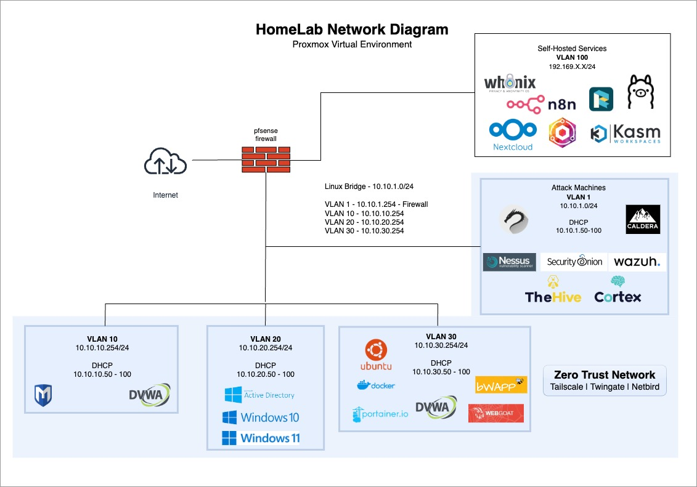

# 🏠 **Homelab Infrastructure**

This page showcases my Proxmox-based homelab — a hands-on platform for building, testing, and securing enterprise-like systems. It highlights the infrastructure I designed, the tools I deployed, and the professional applications of this work.  

---

## 💡 **Core Features**
- Virtualization with **Proxmox VE** for agile deployment of VMs  
- **SOC Tools** → Security Onion, Wazuh, Nessus, TheHive + Cortex  
- **Red Team Tools** → Kali Linux, Metasploit, DVWA, Caldera  
- **Network Segmentation** → pfSense firewall with VLANs  
- **Zero Trust Pilot** → testing Tailscale, Twingate, Netbird  
- **Self-Hosted Services** → Nextcloud, n8n, Kasm Workspaces  

---

## 🌐 **Lab Topology**
  

---

## 🛠️ **Infrastructure & Tools**
- **Firewall:** pfSense with VLAN segmentation  
- **Targets:** Windows AD lab, Ubuntu/Docker services, web apps (bWAPP, DVWA)  
- **SOC Stack:** Security Onion, Wazuh, Nessus, TheHive + Cortex  
- **Red Team Stack:** Kali Linux, Metasploit, DVWA, Caldera  
- **Zero Trust:** Tailscale, Twingate, Netbird pilots  

---

## 🧠 **Key Learning Outcomes**
- **Infrastructure Management** → secure VM admin, system hardening, resource optimization  
- **Security Implementation** → SOC deployment, vuln scanning, incident response  
- **Professional Development** → problem-solving, documentation, project management  

---

## 💼 **Professional Applications**
This homelab demonstrates practical experience in:  
- Designing and securing **enterprise-grade infrastructures**
- Implementing **SOC and vulnerability management workflows**
- Managing **segmented networks** for safe red/blue team testing
- Deploying **Zero Trust access models** in a controlled environment  

---

## 📌 **Key Takeaway**
My homelab showcases the ability to design, deploy, and secure enterprise-like environments using industry-standard tools. It demonstrates practical skills in **defensive security, incident response, vulnerability management, and Zero Trust architectures** — skills that go beyond certifications and reflect real-world capability.  
