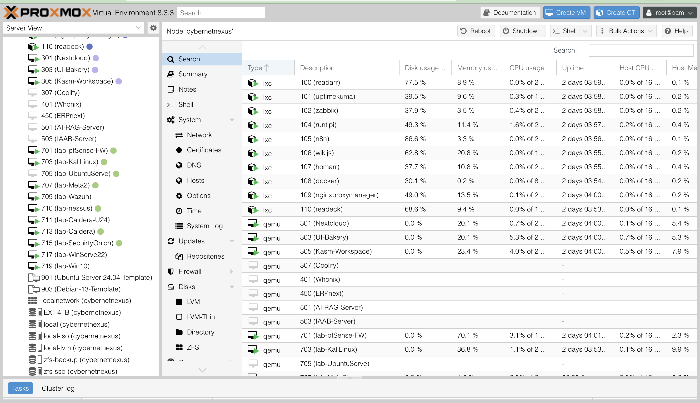

# 🏠 **HomeLab Setup**

This page showcases my **Proxmox-based homelab** — a hands-on environment where I research, test, and refine cybersecurity tools and techniques. It demonstrates both my technical skills and ability to design enterprise-like infrastructures on a personal scale.  

---

## 💡 **Key Features**
- **Advanced Virtualization with Proxmox VE** → Efficient deployment and management of diverse virtual machines for simulations, research, and daily-use services.  
- **Diverse Security Tools** → Includes Security Onion, Kali Linux, Nessus, TheHive, Cortex, and Wazuh to mimic real-world SOC and blue-team workflows.  
- **Robust Network Segmentation** → VLANs isolate traffic for safe penetration testing and secure experimentation.  
- **Zero Trust Networking** → Integrated Tailscale, Twingate, and Netbird to explore secure access models.  
- **Topology Visualization** → Documented architecture diagram showing segmentation strategies and defense-in-depth practices.  

---

## 🌐 **Homelab Topology**
The diagram below illustrates my lab’s architecture, highlighting network segmentation and secure interconnections.  

  

---

## 🛠️ **Infrastructure & Tools**
- **Objective:** Build a virtualized security lab for research, testing, and professional development.  
- **Core Setup:**
  - **Firewall:** pfSense with VLAN segmentation  
  - **SOC Tools:** Security Onion, Wazuh, Nessus, TheHive + Cortex  
  - **Red Team Tools:** Kali Linux, Metasploit, DVWA, Caldera for adversary emulation  
  - **Self-Hosted Services:** Nextcloud, n8n, Kasm Workspaces (VLAN 100)  
- **Network Segmentation:**
  - VLAN 10 → Pen Testing (Metasploit, DVWA)  
  - VLAN 20 → Windows AD environment  
  - VLAN 30 → Ubuntu w/ Docker, Portainer, bWAPP  
  - VLAN 100 → Self-hosted services  
- **Zero Trust Pilot:** Testing access control with Tailscale, Twingate, and Netbird  

---

## 💻 **Proxmox Virtual Environment**
Screenshot of the Proxmox interface showing multiple VMs running across segmented VLANs.  

  

---

## ⚙️ **Hardware**
- **Host:** Beelink SER5 Mini PC  
  - AMD Ryzen 7 5700U (8C/16T, up to 4.37GHz)  
  - 64GB Corsair Vengeance DDR4 RAM  
  - NVMe 500GB (system) + 2TB SSD + 4TB HDD (storage)  
  - WiFi 6, Bluetooth 5.2, USB 3.2  
- Supports **AMD-V virtualization** and 4K display  

---

## 🚀 **Project Journey**

### 🎯 Why This Matters
This lab provides a safe, isolated environment to:  
- Experiment with security tools  
- Practice incident response and SOC workflows  
- Test exploits and remediation strategies  
- Build and secure enterprise-style infrastructure  

### 🔄 The Setup Process
- **Planning** → Hardware research, checklist creation, network/security-first design  
- **Implementation** → Proxmox installation, secure BIOS configuration, VLAN/firewall setup  
- **Deployment** → Installed enterprise-grade SOC and red team tools  
- **Security Hardening** → Strong authentication, patch management, automated backups  

---

## 📈 **Impact & Growth**

### 🧠 Key Learning Outcomes
- **Infrastructure Management:** VM lifecycle, system hardening, backup strategies  
- **Security Implementation:** SOC workflows, adversary emulation, Zero Trust networking  
- **Professional Development:** Problem-solving, documentation, lab-to-real-world translation  

### ⭐ Ongoing Improvements
- Adding new SIEM/EDR integrations  
- Automating deployments with Ansible  
- Expanding into container orchestration (Kubernetes test cluster)  
- Enhanced logging and monitoring  

---

## 💼 **Professional Relevance**
This homelab demonstrates my ability to:  
- Build and manage secure, segmented infrastructure  
- Deploy enterprise-grade SOC and red-team tools  
- Apply Zero Trust concepts in real-world practice  
- Translate hands-on experimentation into actionable skills for cybersecurity roles  

---

<i>“My homelab bridges theory with practice — turning learning into real-world cybersecurity experience.”</i>

