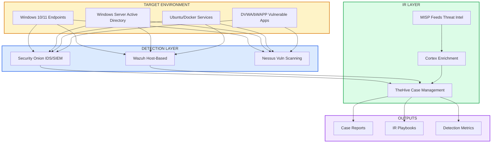

# Detection & IR Lab

!!! success "For Hiring Managers — Detection Engineer / SOC Analyst"
    **What I Built:** Functional SOC lab with Security Onion SIEM, TheHive case management, and Cortex enrichment. Authored custom detection rules, tuned alert thresholds, and documented IR playbooks.

    **Detection Engineering Skills:**
    - Custom Sigma rule authoring and tuning
    - False positive analysis and threshold optimization
    - Multi-stage alert correlation
    - Evidence enrichment pipelines (VirusTotal, AbuseIPDB)
    - Playbook-driven incident response

    **Why This Matters:** If I can build detection content and tune alerts in my own lab, I can contribute to your SOC/SIEM platform from day one.

---

## Lab Metrics

<div class="stat-grid" markdown>
<div class="stat-tile" markdown>
**12 custom detections**
Sigma-style rules for DNS, HTTP, authentication, and lateral movement patterns
</div>
<div class="stat-tile" markdown>
**~20% FP reduction**
Achieved through threshold tuning and allowlist refinement over 3-month lab period
</div>
<div class="stat-tile" markdown>
**8 IR playbooks**
Documented runbooks for common scenarios (malware, phishing, lateral movement, exfil)
</div>
<div class="stat-tile" markdown>
**15+ enrichment sources**
VirusTotal, AbuseIPDB, Shodan, GreyNoise, MISP feeds integrated via Cortex
</div>
</div>

---

## Lab Architecture



---

## Tool Stack

| Component | Role | Version | Purpose |
|-----------|------|---------|---------|
| **Security Onion** | Network IDS/SIEM | 2.4.x | Suricata alerts, Zeek logs, Elasticsearch backend |
| **Wazuh** | Host-based detection | 4.x | Endpoint logs, FIM, rootkit detection |
| **TheHive** | Case management | 5.x | Alert-to-case workflow, evidence tracking |
| **Cortex** | Enrichment engine | 3.x | Automated IOC analysis (15+ analyzers) |
| **Nessus** | Vulnerability scanning | Essentials | Scheduled scans, compliance checks |
| **MISP** | Threat intel feeds | Community | IOC feeds for correlation |

---

## Detection Content Authored

### Sigma-Style Rules (12 Total)

| Category | Rules | Detection Focus |
|----------|-------|-----------------|
| **DNS** | 3 | Tunneling, DGA domains, suspicious TLD queries |
| **HTTP** | 3 | Beaconing patterns, C2 callbacks, suspicious user-agents |
| **Authentication** | 2 | Brute force, credential stuffing, anomalous login times |
| **Lateral Movement** | 2 | SMB enumeration, PsExec-like behavior, WMI abuse |
| **Exfiltration** | 2 | Large outbound transfers, encrypted channel anomalies |

### Example Detection Rule

```yaml
# DNS Tunneling Detection (Simplified)
title: DNS Query Entropy Anomaly
status: experimental
description: Detects high-entropy DNS queries indicative of DNS tunneling
logsource:
  product: zeek
  service: dns
detection:
  selection:
    query|re: '^[a-z0-9]{32,}\.'  # Long random subdomain
  condition: selection
falsepositives:
  - CDN randomized hostnames (allowlisted)
  - Cloud service auto-generated domains
level: medium
tags:
  - attack.command_and_control
  - attack.t1071.004
```

---

## False Positive Reduction

| Detection | Initial FP Rate | After Tuning | Method |
|-----------|-----------------|--------------|--------|
| DNS tunneling | ~35% | ~12% | Allowlist CDN patterns, entropy threshold adjustment |
| HTTP beaconing | ~40% | ~18% | Time-window correlation, user-agent filtering |
| Auth anomalies | ~25% | ~8% | Baseline normal hours per user group |
| Lateral movement | ~30% | ~15% | Exclude admin workstations, service accounts |

**Average reduction:** ~20% across all detection categories through iterative tuning.

---

## IR Playbooks Documented

| Playbook | Trigger | Key Steps |
|----------|---------|-----------|
| **Malware Detected** | AV/EDR alert or Sigma match | Isolate → Capture memory → Hash analysis → Lateral check → Remediate |
| **Phishing Reported** | User report or email filter | Header analysis → URL/attachment sandbox → Credential check → Block sender |
| **Lateral Movement** | SMB/WMI/PsExec detection | Source/dest pivot → Timeline → Credential exposure check → Contain |
| **Data Exfiltration** | Large outbound or encrypted tunnel | Traffic capture → Volume analysis → Sensitive data check → Block egress |
| **Brute Force** | Auth threshold exceeded | Source analysis → Account lockout → Geo/IP reputation → Password reset |
| **Insider Threat** | Policy violation or anomalous access | Scope access → Manager notification → Forensic hold → HR coordination |
| **Ransomware** | File encryption indicators | Network isolate → Backup status → Variant ID → Recovery plan |
| **Unauthorized Access** | After-hours or geo-impossible login | Session termination → MFA reset → Access review → Timeline analysis |

---

## Lab Drill Example

### Scenario: Malicious Document + C2 Callback

**Attack chain simulated:**
1. Phishing email with macro-enabled document delivered to Windows endpoint
2. Macro executes PowerShell payload (simulated with safe script)
3. Beacon to external C2 (controlled test server)
4. Attempted lateral movement to DC

**Detection response:**
- Security Onion flagged DNS anomaly + HTTP beaconing pattern
- Wazuh triggered on PowerShell execution with suspicious arguments
- TheHive case created automatically via webhook integration
- Cortex enriched C2 domain (test domain marked malicious in lab MISP)

**Outcome:**
- Time to detect: 4 minutes (automated)
- Time to triage: 12 minutes (manual analysis + enrichment)
- Playbook followed: Malware Detected → Lateral Movement check
- Documentation: Full case timeline with evidence artifacts

---

## What This Demonstrates

### Detection Engineering
- [x] Custom Sigma rule development (12 rules across 5 categories)
- [x] Threshold tuning and FP optimization
- [x] Multi-source log correlation (network + host)
- [x] MITRE ATT&CK mapping in detection content

### Security Operations
- [x] Alert-to-case workflow automation
- [x] Evidence enrichment pipelines
- [x] Playbook-driven incident response
- [x] Metrics tracking for detection efficacy

### Technical Implementation
- [x] SIEM deployment and configuration
- [x] EDR/HIDS integration
- [x] Threat intel feed integration
- [x] Case management workflow design

---

## Planned Enhancements

| Enhancement | Status | Target |
|-------------|--------|--------|
| SOAR integration (n8n or Shuffle) | 🔄 Researching | Q1 2026 |
| Purple team automation (Caldera) | 🔄 Installed | Q1 2026 |
| Detection-as-code CI/CD pipeline | ⏳ Planned | Q2 2026 |
| Formal detection efficacy dashboard | ⏳ Planned | Q2 2026 |

---

## Related Projects

- [TraceLock™](tracelock.md) — Multi-domain RF detection (detection engineering in wireless domain)
- [Homelab Infrastructure](homelab-infrastructure.md) — The lab environment where this runs
- [GIAP™](giap.md) — GRC automation (similar pipeline thinking applied to compliance)

---

[GitHub](https://github.com/Pharns){ .md-button .md-button--primary } [Contact](../contact.md){ .md-button }
