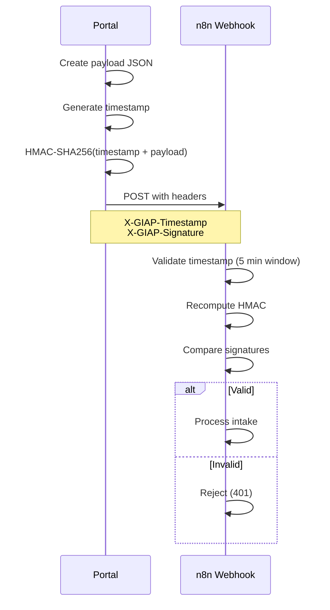

# Security-Hardened Intake Portal
*Updated: {{ page.meta.git_revision_date_localized or "" }}*

**Role:** Sole implementer | 829 lines (HTML/JS/CSS) | 38 findings identified and remediated

!!! tldr "For recruiters & hiring managers"
    **What:** Production security hardening project — identified and remediated 1 CRITICAL vulnerability plus 37 additional findings across security, accessibility, and compliance domains. Implemented XSS prevention, HMAC-SHA256 webhook authentication, RFC-compliant email validation, rate limiting, honeypot bot protection, and WCAG 2.1 AA accessibility compliance. Added CCPA/CPRA privacy disclosures with California-specific rights language.

    **Why this matters:** Demonstrates application security discipline and compliance engineering depth — systematically identifying and remediating vulnerabilities across security, accessibility, privacy, and UX dimensions.

    **Impact:** Eliminated CRITICAL localStorage injection vulnerability, achieved WCAG 2.1 AA compliance, implemented defense-in-depth security controls, and future-proofed privacy compliance for California market.

    **Skills:** Application Security · Input Validation · XSS Prevention · HMAC Authentication · WCAG 2.1 AA · CCPA/CPRA · Rate Limiting · Bot Protection · Security Architecture · Compliance Engineering

---

!!! info "Relationship to GIAP"
    This page documents the **security engineering deep dive** for the intake portal component of [GIAP — Governance Intake Automation Platform](giap.md). While GIAP covers the full platform architecture, this page focuses specifically on the portal security hardening methodology and implementation details.

---

## Overview

The intake portal serves as the public-facing entry point for client engagement. A comprehensive security review identified 38 findings across security, accessibility, privacy, and UX domains, including a **CRITICAL severity** localStorage injection vulnerability. This case study documents the technical remediation.

### Portal Specifications

| Attribute | Value |
|-----------|-------|
| **Version** | 2.2 (Production) |
| **Live URL** | portal.aamcyber.work |
| **Codebase** | 829 lines (HTML/JS/CSS) |
| **Security** | HMAC-SHA256 webhook auth, XSS sanitization, rate limiting, honeypot |
| **Compliance** | WCAG 2.1 AA, GDPR, CCPA/CPRA, COPPA statement |
| **Mobile** | Responsive, 48px touch targets, iOS zoom prevention |

### Review Summary

- **Total Findings:** 38 across all domains
- **Critical Severity:** 1 (localStorage injection)
- **High Severity:** 7 (XSS risk, missing sanitization, accessibility gaps)
- **Medium/Low:** 30 (UX improvements, compliance enhancements)
- **Remediation Rate:** 100%

---

## Security Findings

### Finding SEC-01: localStorage Injection (CRITICAL)

The most significant vulnerability discovered was in the webhook endpoint configuration.

**Before (Vulnerable):**

```javascript
// CRITICAL: Client-controlled URL injection
const webhookEndpoint = localStorage.getItem('webhookEndpoint')
  || 'https://n8n.aamcyber.com/webhook/giap-intake';
```

**Vulnerability:** An attacker could set `localStorage.webhookEndpoint` to any URL, causing the portal to exfiltrate form data to attacker-controlled servers.

**After (Hardened):**

```javascript
// Hardcoded endpoint - no client-side override possible
const webhookEndpoint = 'https://n8n.aamcyber.com/webhook/giap-intake';
```

**Rationale:** The portal is single-purpose (one organization, one n8n instance). There's no legitimate use case for client-side endpoint configuration. Hardcoding eliminates the attack vector entirely.

---

### Finding SEC-02: Missing Input Sanitization (HIGH)

**Before:** Raw form input passed directly to webhook payload, creating XSS risk if data is displayed elsewhere.

**After:**

```javascript
function stripHtml(input) {
    return input.replace(/<[^>]*>/g, '')
               .replace(/[<>]/g, '');
}

// Applied to all text inputs before payload construction
const sanitizedName = stripHtml(formData.name);
const sanitizedOrg = stripHtml(formData.organization);
```

---

### Finding SEC-03: Weak Email Validation (MEDIUM)

**Before:** Basic regex that allowed invalid email formats.

**After (RFC 5322 Compliant):**

```javascript
function isValidEmail(email) {
    // RFC 5322 compliant pattern
    const pattern = /^[a-zA-Z0-9.!#$%&'*+/=?^_`{|}~-]+@[a-zA-Z0-9](?:[a-zA-Z0-9-]{0,61}[a-zA-Z0-9])?(?:\.[a-zA-Z0-9](?:[a-zA-Z0-9-]{0,61}[a-zA-Z0-9])?)*$/;
    return pattern.test(email);
}
```

---

### Finding SEC-04: No Rate Limiting (MEDIUM)

**Implemented:**

```javascript
let lastSubmitTime = 0;
const SUBMIT_COOLDOWN = 5000; // 5 seconds

const now = Date.now();
if (now - lastSubmitTime < SUBMIT_COOLDOWN) {
    alert('Please wait a moment before submitting again.');
    return;
}
lastSubmitTime = now;
```

**Note:** Client-side rate limiting is defense-in-depth. Server-side rate limiting planned for GIAC API phase.

---

### Finding SEC-05: No Bot Protection (MEDIUM)

**Implemented (Honeypot Pattern):**

```html
<!-- Hidden from humans, visible to bots -->
<input type="text"
       name="website"
       id="honeypot"
       style="position:absolute;left:-9999px"
       tabindex="-1"
       autocomplete="off">
```

**Server-side validation:** If `website` field is populated, the submission is silently rejected (bots fill all visible fields).

**Why honeypot over CAPTCHA:**

- No third-party dependencies (privacy-first)
- Better UX (no user interaction required)
- Effective against low-sophistication bots
- Aligns with privacy-first brand positioning

---

## HMAC Webhook Authentication

Beyond input validation, the portal implements cryptographic authentication for webhook requests.

### Architecture



### Implementation

**Portal (Client-side):**

```javascript
async function signPayload(payload) {
    const timestamp = Date.now().toString();
    const message = timestamp + JSON.stringify(payload);

    const encoder = new TextEncoder();
    const key = await crypto.subtle.importKey(
        'raw',
        encoder.encode(HMAC_SECRET),
        { name: 'HMAC', hash: 'SHA-256' },
        false,
        ['sign']
    );

    const signature = await crypto.subtle.sign(
        'HMAC',
        key,
        encoder.encode(message)
    );

    return {
        timestamp,
        signature: 'sha256=' + bufferToHex(signature)
    };
}
```

**n8n (Server-side Validation):**

```javascript
// Code node in n8n workflow
const timestamp = $input.first().headers['x-giap-timestamp'];
const signature = $input.first().headers['x-giap-signature'];
const payload = JSON.stringify($input.first().json);

// Validate timestamp (5 minute window)
const now = Date.now();
if (Math.abs(now - parseInt(timestamp)) > 300000) {
    throw new Error('Request expired');
}

// Recompute and compare
const expectedSig = crypto
    .createHmac('sha256', $env.WEBHOOK_HMAC_SECRET)
    .update(timestamp + payload)
    .digest('hex');

if (signature !== 'sha256=' + expectedSig) {
    throw new Error('Invalid signature');
}
```

### Security Properties

| Property | Implementation |
|----------|----------------|
| **Authenticity** | HMAC proves request originated from portal with shared secret |
| **Integrity** | Payload tampering invalidates signature |
| **Replay Prevention** | 5-minute timestamp window prevents replay attacks |
| **Secret Rotation** | Secret stored in `.env.local`, rotatable without code changes |

---

## Accessibility Compliance (WCAG 2.1 AA)

### Findings and Remediation

| Finding | Remediation |
|---------|-------------|
| Missing skip navigation | Added `<a href="#main-content" class="skip-link">Skip to main content</a>` |
| Checkbox touch targets too small | Increased to 1.5em on mobile (48px minimum) |
| Required fields unclear | Added legend: "Contact Information (all fields required)" |
| Missing autocomplete attributes | Added `autocomplete="name"` and `autocomplete="email"` |
| SVG missing aria-hidden | Added `aria-hidden="true"` to decorative SVG |
| External link warning | Added `<span class="sr-only">(opens in new tab)</span>` |
| Alert not exposed to screen readers | Added `role="alert" aria-live="assertive"` |

### Mobile Responsiveness

```css
/* Touch targets - 48px minimum (WCAG 2.5.5) */
input[type="text"],
input[type="email"],
select,
textarea {
    min-height: 48px;
    font-size: 16px; /* Prevents iOS zoom */
}

/* Checkbox touch targets */
@media (max-width: 768px) {
    input[type="checkbox"] {
        width: 1.5em;
        height: 1.5em;
    }
}

/* Extra small devices (iPhone SE) */
@media (max-width: 375px) {
    .brand-mark { font-size: 1.8em; }
    h1 { font-size: 1.5em; }
}
```

---

## Privacy Compliance (CCPA/CPRA)

### Decision: Proactive CCPA Compliance

Although the business is Arizona-based (CCPA doesn't technically apply), we implemented California-specific disclosures:

**Rationale:**

- Future-proofing for California clients (large market)
- Demonstrates compliance maturity to HNWI clients
- Minimal implementation cost
- Aligns with privacy-first brand positioning

### Implemented Disclosures

**California Consumer Privacy Rights:**

- Right to Know (categories of personal information)
- Right to Delete (request deletion within 45 days)
- Right to Opt-Out (no sale of personal information)
- Right to Correct (inaccurate information)
- Right to Limit Use of Sensitive Personal Information
- Right to Non-Discrimination

**Additional Compliance:**

- COPPA statement (children's privacy)
- Automated decision-making disclosure
- Policy change notification process
- Supervisory authority contact (EDPB, ICO)
- International data transfer mechanisms (Standard Contractual Clauses)
- Specific retention periods (2 years for inactive prospects)
- Response timelines (7 days acknowledgment, 1 month response)

---

## Brand Alignment

The review identified casual language that undermined the HNWI market positioning.

### Copy Refinements

| Original | Revised | Rationale |
|----------|---------|-----------|
| "We don't share a damned thing" | "Your information stays with us. Period." | Professional confidence without casualness |
| "security checkups" | "security posture assessments" | Industry-appropriate terminology |
| "Request Consultation" | "Begin Conversation" | Relationship-focused, not transactional |
| "We typically respond..." | "Expect a personal response within 24 hours" | Confident commitment |

### Trust Signals Added

- "Confidential. No sales teams. No handoffs."
- Explicit response time commitment
- Privacy-first positioning throughout

---

## Technical Decisions

### Honeypot vs CAPTCHA

| Factor | Honeypot | reCAPTCHA |
|--------|----------|-----------|
| Privacy | No third-party data sharing | Google tracking |
| UX | Invisible to users | Requires interaction |
| Effectiveness | Good for low-sophistication bots | Better for advanced bots |
| Dependencies | None | Google CDN dependency |
| **Decision** | ✅ **Selected** | Not aligned with privacy-first brand |

### Client-Side vs Server-Side Validation

**Current:** Client-side validation with HMAC signing.

**Rationale:**

- Portal is pre-qualification only (not sensitive data)
- n8n webhook validates payload structure
- HMAC provides authenticity guarantee
- Reduces infrastructure complexity during MVP

**Future:** Server-side validation mandatory when GIAC API is deployed.

---

## What This Demonstrates

### Security Engineering

- **Vulnerability identification** — Systematic review across security domains
- **Defense-in-depth** — Multiple layers (sanitization, rate limiting, HMAC, honeypot)
- **Secure defaults** — Hardcoded endpoints, no localStorage dependencies
- **Cryptographic authentication** — HMAC-SHA256 with replay prevention

### Compliance Engineering

- **Accessibility** — WCAG 2.1 AA with specific technical implementations
- **Privacy** — CCPA/CPRA proactive compliance, COPPA statement
- **Data protection** — GDPR consent mechanisms, retention policies

### Application Security

- **Input validation** — XSS prevention, RFC-compliant email validation
- **Bot protection** — Privacy-respecting honeypot pattern
- **Rate limiting** — Client-side throttling (defense-in-depth)

---

## Evidence Artifacts

| Artifact | Description | Status |
|----------|-------------|--------|
| Security review log | Findings and remediation documentation | ✅ Documented |
| HMAC implementation guide | Setup and validation procedures | ✅ Complete |
| WCAG compliance checklist | Accessibility validation record | ✅ Complete |
| Privacy policy (CCPA) | California-specific disclosures | ✅ Deployed |
| Security controls matrix | SOC 2 / NIST mapping | ✅ Documented |

---

## Related Pages

- [GIAP — Full Platform Overview](giap.md) — Complete GRC automation platform
- [Homelab Infrastructure](homelab-infrastructure.md) — Proxmox hosting environment

---

[Contact](../contact.md){ .btn-primary } [LinkedIn](https://www.linkedin.com/in/pharns/){ .btn-ghost }
