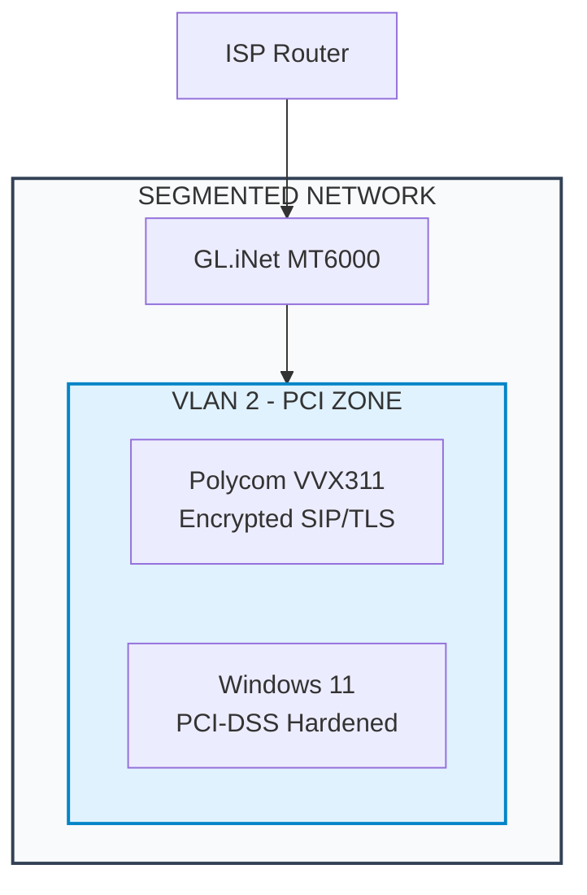

# 🧱 System Architecture — Windows 11 PCI DSS Hardening

This architecture defines the **secure foundation** of a Windows 11 workstation hardened to meet **PCI DSS v4.0** requirements for protecting sensitive financial and cardholder data.  

Unlike traditional multi-server environments, this design demonstrates **endpoint-centric compliance** — ensuring a single workstation can be PCI-aligned when configured and monitored correctly.

---

## 🖥️ High-Level Overview

The workstation environment is structured around **five key security layers**:

| Layer | Component | Purpose |
|--------|------------|----------|
| **1️⃣ Hardware & Firmware** | TPM 2.0, Secure Boot, BIOS password | Ensures trusted hardware and prevents firmware tampering. |
| **2️⃣ Operating System** | Windows 11 Pro / Home (hardened) | Base layer configured with Group Policy, firewall, and encryption. |
| **3️⃣ Security Controls** | BitLocker, Defender, Malwarebytes | Full-disk encryption and dual-layer malware protection. |
| **4️⃣ Update & Patch Management** | Patch My PC, Windows Update | Maintains current patch levels and closes vulnerabilities. |
| **5️⃣ Monitoring & Logging** | GlassWire, Event Viewer, PowerShell transcripts | Provides visibility and traceability of all activities. |

---

## 🌐 Network Path & Segmentation

The system operates within a **segmented home/office lab environment** that emulates PCI DSS network separation.  
All connections are routed through an encrypted and monitored VLAN.

Each VLAN enforces:
- **Strict inbound/outbound rules**
- **No peer-to-peer workstation visibility**
- **TLS-only traffic** for remote updates and VoIP control channels

---

## 🧩 Core Components

| Component | Role | PCI DSS Alignment |
|------------|------|-------------------|
| **BitLocker** | Encrypts all drives with TPM key storage | Req. 3 – Protect Stored Data |
| **Windows Defender** | Provides anti-malware protection and behavior-based analysis | Req. 5 – Anti-Virus Software |
| **Malwarebytes** | Adds heuristic and web-threat defense | Req. 5 – Layered Protection |
| **Patch My PC** | Automates Windows and third-party updates | Req. 6 – Security Patching |
| **Macrium Reflect** | Validates recoverability via full-disk imaging | Req. 10 – Log & Audit Integrity |
| **GlassWire** | Monitors network traffic, alerts on anomalies | Req. 11 – Regular Testing |
| **Firewall (All Profiles)** | Blocks unsolicited inbound connections | Req. 1 – Network Protection |
| **Event Viewer & PowerShell Logs** | Captures full audit trails | Req. 10 – Logging and Monitoring |

---

## 🧠 Logical Architecture Diagram

*Figure: Logical PCI-DSS endpoint architecture — encryption, monitoring, and audit layers.*

---

## 🔐 Security Control Summary

| Security Area | Implementation |
|----------------|----------------|
| **Disk Encryption** | BitLocker (AES-XTS 256-bit, TPM-sealed) |
| **User Separation** | AdminLocal for maintenance, StandardUser for daily use |
| **Network Firewall** | Domain, Private, and Public all active |
| **Update Management** | Automated via Patch My PC |
| **Malware Defense** | Real-time protection + weekly deep scans |
| **Backups** | Full-image backups stored offline, verified monthly |
| **Logging** | Event logs archived with timestamp validation |
| **Monitoring** | GlassWire continuous outbound alerting |

---

## ⚙️ Implementation Highlights

1. **TPM Verification**
   - Confirmed TPM 2.0 active and owned by the OS.  
   - BitLocker configured for hardware binding and PIN unlock (optional).

2. **Secure Boot Enforcement**
   - Verified UEFI Secure Boot enabled and integrity checked.

3. **Firmware Protection**
   - BIOS password applied, boot order locked.

4. **User Account Policy**
   - AdminLocal for administrative tasks only.  
   - StandardUser for all operational use.

5. **Audit Log Retention**
   - Minimum retention: 90 days local, 365 days backup images.

---

## 🧩 Alignment with PCI DSS v4.0 Objectives

| PCI Objective | Implementation Example |
|----------------|------------------------|
| **Build and Maintain a Secure Network** | Windows Firewall + VLAN segmentation |
| **Protect Cardholder Data** | Full disk encryption and TLS enforcement |
| **Maintain a Vulnerability Management Program** | Patch My PC + Defender updates |
| **Implement Strong Access Control** | User separation, password policy, 2FA readiness |
| **Regularly Monitor and Test Networks** | GlassWire, event log review |
| **Maintain an Information Security Policy** | Documented local security policy and backup SOP |

---

## 🧾 Summary

This design illustrates that **PCI DSS compliance can extend to individual endpoints** when proper configuration, segmentation, and monitoring are applied.  
The system demonstrates **zero cloud dependency**, full offline recoverability, and persistent audit traceability — all essential to PCI DSS assurance.

> *Validated on Windows 11 23H2 (Build 22631.2715) — all screenshots captured from live hardened deployment.*
