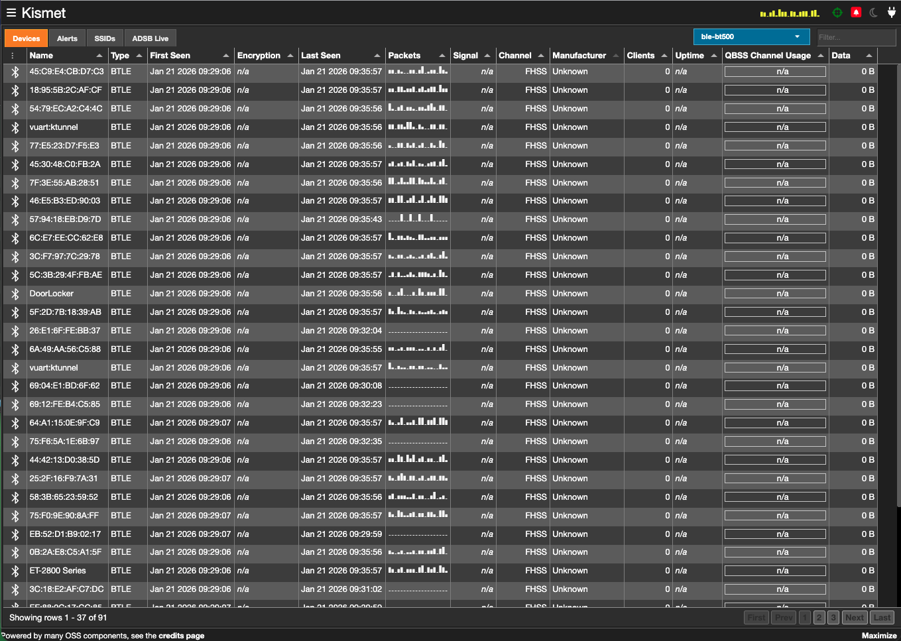
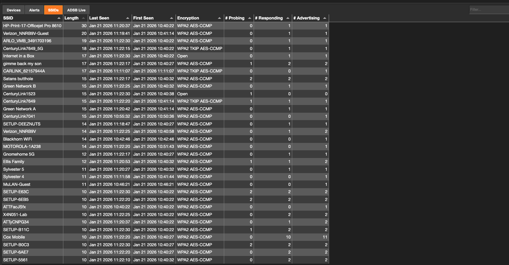
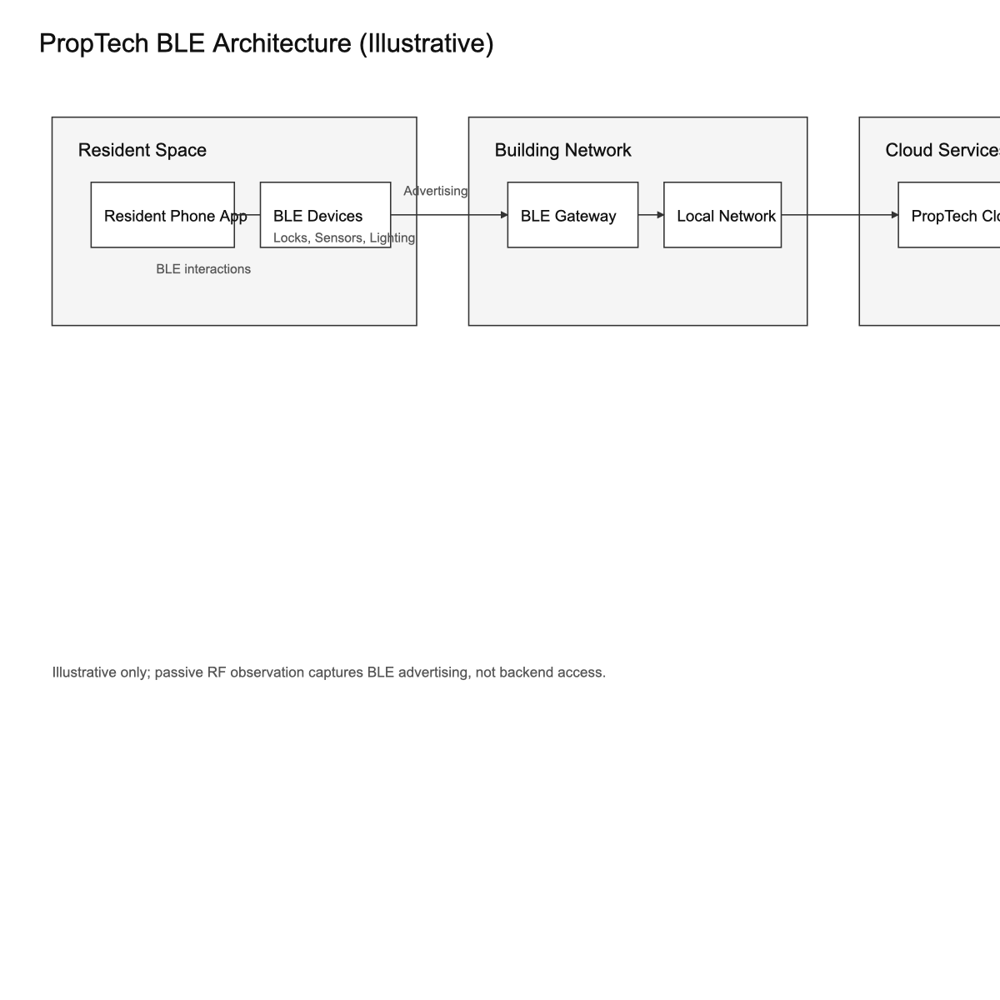
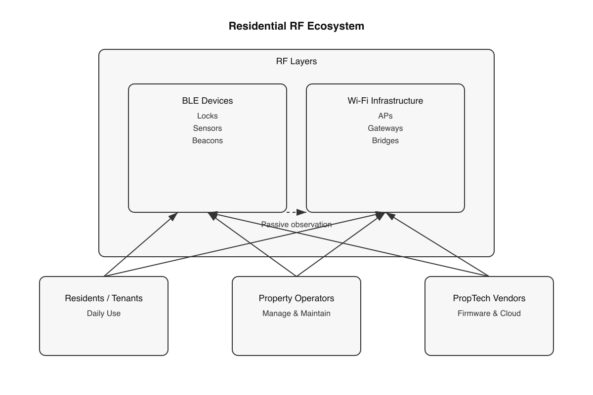

# PropTech RF governance and scope control

!!! abstract "TL;DR"
    Passive BLE/RF survey of a smart-building PropTech deployment. No device interaction or exploitation. Findings align with vendor privacy disclosures; meaningful risk concentrates in app and backend controls, not BLE advertising. Includes scope-control decision record and GRC-aligned guidance for regulated professionals.

This governance case study demonstrates evidence-based risk classification and scope discipline applied to IoT and PropTech RF environments, with a focus on protecting regulated work-from-home posture.

!!! info "What is PropTech?"
    **PropTech** (Property Technology) refers to digital technology applied to real estate and building management — smart locks, occupancy sensors, BLE beacons, building automation, and IoT infrastructure. As smart buildings become standard, security and privacy assessment of these systems is increasingly relevant for GRC practitioners.

**Framework alignment:**  
NIST CSF: ID.RA, PR.DS, DE.CM  
SOC 2: CC3.2, CC4.1  
ISO 27001: A.6.1.2, A.8.1, A.12.1

---

## Context

Modern apartment complexes increasingly deploy PropTech platforms using Bluetooth Low Energy (BLE) for access control, sensors, lighting, and automation. This case study evaluates how those deployments affect resident privacy, security posture, and regulated professionals working from home.

## Objective

- Understand the BLE environment created by PropTech infrastructure
- Classify devices using behavioral fingerprints
- Evaluate resident privacy and security impact
- Align observed behavior with vendor privacy disclosures
- Provide role-based guidance for regulated and security-sensitive professionals

## Method (passive RF only)

- TraceLock (Kismet-based) passive capture
- Advertising-only observation (no pairing, no connections)
- Behavioral fingerprinting: name patterns, UUIDs, RSSI stability, persistence

## Evidence snapshots (redacted)

*Redacted screenshot: device identifiers and environment details removed.*

*Redacted screenshot: network identifiers and environment details removed.*

## Scope and ethical constraints

This project is intentionally limited to passive observation of RF metadata. No attempts were made to authenticate to networks, pair with devices, decrypt traffic, or interfere with normal operation. Wi-Fi observations are documented only to acknowledge supporting infrastructure and governance complexity, not to identify vulnerabilities.

---

## Architecture (high level)

Illustrative only; passive RF observation captures BLE advertising, not backend access.

Figure: Conceptual RF ecosystem showing coexistence of BLE and Wi-Fi layers with resident, operator, and vendor stakeholders.

---

## Key findings

- **High RF density is expected** in modern smart-building deployments
- **Unknown manufacturer BLE devices are common and benign** within scope
- **Observed devices align with smart locks, sensors, lighting, and gateway nodes**
- **No evidence of covert tracking beacons or surveillance behavior**
- **Risk is driven by apps and backend systems**, not BLE advertising

## Governance decision record: scope control

During RF monitoring, an isolated consumer Wi-Fi access point was observed. Evidence indicated it was resident-owned (non-managed configuration, non-repeating SSID, consumer security profile). It was explicitly excluded from PropTech scope to prevent false positives and preserve risk clarity. Mature GRC practice is defined by what is intentionally excluded as much as by what is flagged.

## Risk and privacy implications

For general residents, risk from passive BLE advertising is low. The meaningful privacy inflection point is optional app installation and backend logging, not RF presence.

For regulated and security-sensitive professionals, the environment is best treated as semi-trusted. Controls should focus on endpoints, permissions, identity, and segmentation rather than RF countermeasures.

---

## Artifacts (redacted)

- [Kismet BLE overview (redacted)](../assets/screenshots/proptech-ble-kismet-overview.png)
- [Wi-Fi infrastructure capture (redacted)](../assets/screenshots/proptech-wifi-infrastructure-capture.png)
- [RF ecosystem diagram](../assets/diagrams/proptech-rf-ecosystem.png)
- [PropTech BLE architecture diagram](../assets/images/proptech-ble-architecture-diagram.png)

## What this demonstrates

- Evidence-based risk assessment (not assumption-driven)
- Scope discipline and false-positive control
- Privacy policy to technical behavior correlation
- GRC as an engineering discipline, not a checklist
- Risk communication without alarmism

---

## Related work

- [TraceLock RF threat detection](tracelock.md)
- [GRC overview](../grc/index.md)
- [Contact](../contact.md)

---

*Disclaimer: This project is a defensive, passive analysis intended for education, governance evaluation, and portfolio documentation. It does not include exploitation or device interaction.*
