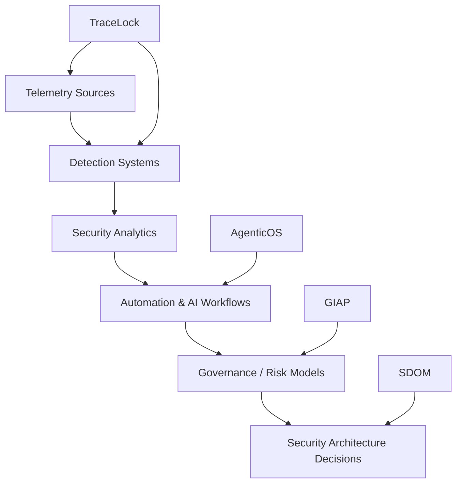

# Security Telemetry → Governance → Decision Architecture

## Executive overview

This capstone architecture artifact shows how telemetry, detection, analytics, automation, governance, and decision architecture connect into one security system model across the portfolio.

## Why this architecture matters

Security programs become fragmented when telemetry, detection, governance, and decision workflows evolve independently. This system map makes those relationships explicit so architecture decisions remain coherent, reviewable, and defensible.

## System architecture overview

The model below maps the portfolio's integration path from signal collection to decision architecture outcomes. It emphasizes architecture flow rather than implementation detail.

## Unified security architecture diagram

*Unified security architecture map : telemetry flows through detection, analytics, automation, and governance into structured security architecture decisions.*

## System components

### TraceLock

TraceLock provides telemetry fusion and detection pipelines across heterogeneous wireless and RF signal domains.

### GIAP

GIAP provides governance automation patterns for intake, control mapping, and risk-oriented workflow execution.

### AgenticOS

AgenticOS provides governed orchestration patterns for repeatable, auditable AI-assisted workflow execution.

### SDOM

SDOM represents the decision architecture layer where telemetry, detection, and governance outputs become structured security decisions.

## Portfolio capability signals

- Security telemetry fusion
- Detection engineering
- Governance automation
- Security decision architecture
- AI-augmented security workflows

## Related architecture artifacts

- [TraceLock™ — Security Telemetry Architecture](trace-lock-diagram.md)
- [TraceLock™ — Telemetry-to-Decision Model](trace-lock-telemetry-to-decision.md)
- [Detection Engineering](detection-engineering.md)
- [Architecture Decisions](../architecture/architecture-decisions.md)
- [GIAP™ — GRC Integrated Automation Platform](giap.md)
- [Governed Security Architecture (SDOM context)](../architecture/governed-security-architecture.md)
