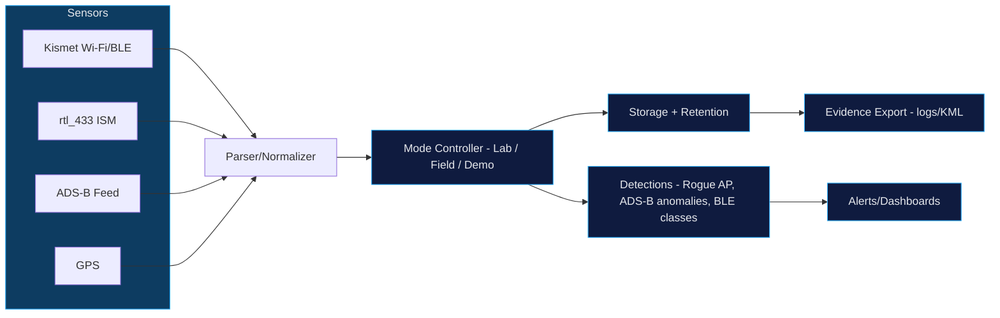

# TraceLock™ Diagram (Placeholder)

```mermaid
flowchart LR
    subgraph Sensors["Sensors"]
      A["Kismet Wi-Fi/BLE"]
      B["rtl_433 ISM"]
      C["ADS-B Feed"]
      D["GPS"]
    end
    A --> E["Parser/Normalizer"]
    B --> E
    C --> E
    D --> E
    E --> F["Mode Controller - Lab / Field / Demo"]
    F --> G["Storage + Retention"]
    F --> H["Detections - Rogue AP, ADS-B anomalies, BLE classes"]
    H --> I["Alerts/Dashboards"]
    G --> J["Evidence Export - logs/KML"]
    style Sensors fill:#0d3c61,stroke:#2cb1ff,stroke-width:1px,color:#e5e7eb
    style F fill:#0f1b3f,stroke:#2cb1ff,stroke-width:1px,color:#e5e7eb
    style G fill:#0f1b3f,stroke:#2cb1ff,stroke-width:1px,color:#e5e7eb
    style H fill:#0f1b3f,stroke:#2cb1ff,stroke-width:1px,color:#e5e7eb
    style I fill:#0f1b3f,stroke:#2cb1ff,stroke-width:1px,color:#e5e7eb
    style J fill:#0f1b3f,stroke:#2cb1ff,stroke-width:1px,color:#e5e7eb
```

Use this placeholder diagram for public-safe visuals. Replace with sanitized PNG/SVG if preferred.
