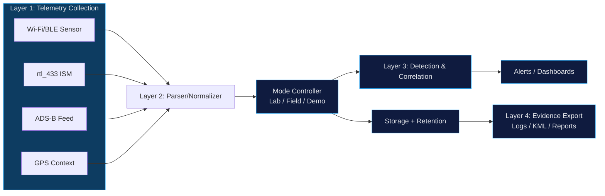

---
description: "TraceLock security telemetry architecture diagram — multi-source RF ingestion, signal normalization, detection correlation, and evidence generation pipelines."
---

# TraceLock™ — Security Telemetry Architecture

TraceLock™ is a security telemetry architecture designed to integrate heterogeneous wireless and RF signal sources into detection, evidence, and security decision pipelines.

## Architecture domains

- Security telemetry fusion
- Detection engineering
- Evidence engineering
- Security architecture

## System capabilities

TraceLock™ demonstrates several architectural capabilities:

- Multi-source telemetry ingestion
- Heterogeneous signal normalization
- Detection correlation pipelines
- Evidence generation for investigation

## Technologies

Wi-Fi/BLE sensor framework • rtl_433 • ADS-B telemetry • GPS context • Python telemetry parsing

## Why it matters

Traditional security monitoring underutilizes nontraditional telemetry sources such as Wi-Fi, BLE, ISM, ADS-B, and GPS context. That creates blind spots where adversarial activity can exist outside standard endpoint and network-only controls.

## Architecture overview

TraceLock™ is modeled as a layered architecture that moves from collection to defensible outputs. The design emphasis is reproducible telemetry handling, controlled detection behavior, and public-safe evidence generation.

## Four-layer model

### Layer 1: Telemetry collection

Collect multi-domain telemetry across wireless and RF sources, including Wi-Fi/BLE, ISM, ADS-B, and GPS context.

### Layer 2: Normalization and control

Normalize heterogeneous sensor streams into structured events, then apply mode controls (Lab, Field, Demo) to keep execution bounded and repeatable.

### Layer 3: Detection and correlation

Run detection logic against normalized telemetry with correlation across domains to improve signal quality and reduce isolated-tool blind spots.

### Layer 4: Evidence, visualization, and reporting

Produce architecture-safe outputs for investigation and communication: logs, dashboards, and exportable evidence artifacts.

## Updated public-safe architecture diagram

*TraceLock™ telemetry architecture : multi-domain telemetry is normalized, controlled, correlated, and exported as defensible security evidence.*

## Architecture context

This telemetry architecture supports detection engineering by making cross-domain signal handling explicit and reviewable. It also supports defensible security decisions by separating collection, control, detection, and evidence concerns in a way that can be audited and improved over time.

## Hiring and capability signal

- **Security telemetry fusion:** Integrates heterogeneous wireless and RF data into one processing model.
- **Detection engineering:** Applies normalized-event detection and multi-source correlation.
- **Evidence engineering:** Produces exportable, reviewable outputs for triage, reporting, and architecture review.
- **Security architecture:** Uses layered design and governed execution boundaries instead of ad hoc tool chaining.

## Related pages

- [TraceLock™ — RF Security](tracelock.md)
- [TraceLock™ — Telemetry-to-Decision Model](trace-lock-telemetry-to-decision.md)
- [Security Telemetry → Governance → Decision Architecture](security-architecture-system-map.md)
- [Detection Engineering](detection-engineering.md)
- [Architecture Decisions](../architecture/architecture-decisions.md)
- [GIAP™ — Governed Intake and Analysis Platform](giap.md)
- [AgenticOS — Deterministic AI Agent Orchestration](../innovation/agenticos.md)
