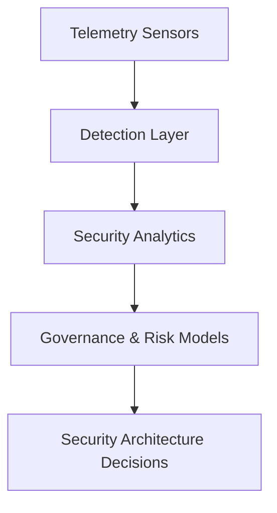

# TraceLock™ — Telemetry-to-Decision Model

This page shows a public-safe architecture pattern for connecting telemetry from TraceLock™ to higher-level security decision systems. It is designed to communicate system thinking across detection, governance, and architecture decision workflows.

## Current capability vs. integration pattern

- **Current demonstrated capability:** Multi-domain telemetry collection, normalization, detection logic, and evidence export within TraceLock™ artifacts.
- **Architecture pattern (future-facing integration):** Routing validated telemetry outputs into analytics, governance/risk models, and architecture decision loops.

## Telemetry-to-decision flow

*Telemetry-to-decision model : telemetry becomes detection signal, then analytics input, then governance and architecture decision support.*

## Why this model matters

Security telemetry has limited strategic value if it remains isolated in dashboards. This model frames telemetry as an input to risk-informed governance and architecture decisions, not only as an alerting function.

## Governance and architecture relevance

- Telemetry trends can inform control assurance and risk prioritization.
- Detection outputs can support governance evidence narratives without exposing sensitive implementation detail.
- Architecture decisions become better grounded when detection and evidence data are integrated into review cycles.

## AI-augmented workflow potential

As a roadmap direction, structured telemetry outputs can be consumed by governed automation workflows for triage support, evidence packaging, and decision context preparation. This is presented as an architecture pattern, not a claim of full autonomous decision-making in production.

## Related pages

- [TraceLock™ — Security Telemetry Architecture](trace-lock-diagram.md)
- [TraceLock™ — RF Security](tracelock.md)
- [Detection Engineering](detection-engineering.md)
- [Architecture Decisions](../architecture/architecture-decisions.md)
- [GIAP™ — Governed Intake and Analysis Platform](giap.md)
