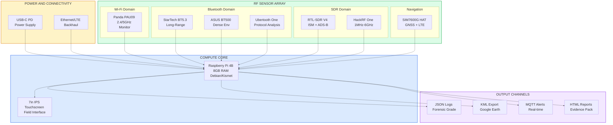
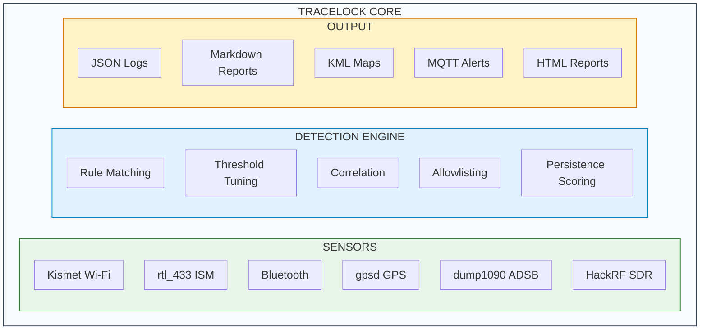
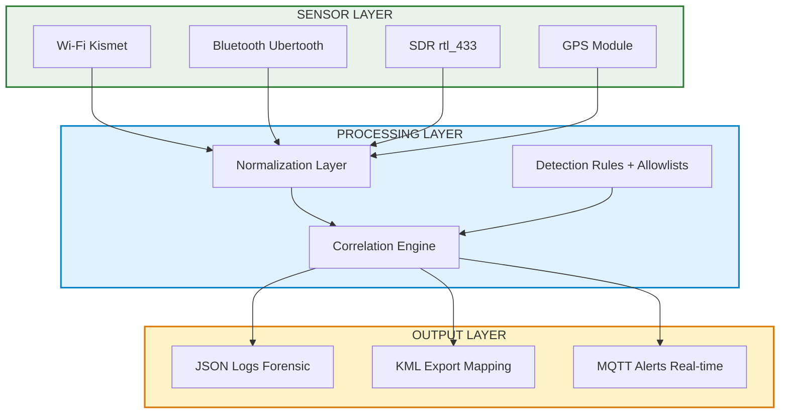

# TraceLock™ — Multi-Domain RF Threat Detection Platform

*Patent Pending · WGU BSCIA Capstone · February 2026*

**Role:** Sole developer | Security-hardened fork | ~12,500 LOC (25 Python modules, 81 shell scripts) | 6 RF domains

!!! success "For Hiring Managers — Detection Engineer / Security Automation"

    **What I Built:** Real-time RF surveillance detection system that monitors 6 wireless domains simultaneously, correlates threats across sensors, and produces forensic-grade evidence logs. *(Provisional patent filed)*

    **Technical Stack:** Python 3.10+ · Raspberry Pi 4 (8GB) · Kismet · RTL-SDR V4 · Ubertooth · SQLite · GitHub Actions CI

    **Detection Engineering Skills Demonstrated:**

    - Multi-domain threat correlation (Wi-Fi + Bluetooth + SDR + GPS + ADS-B)
    - Custom detection rule authoring with tunable thresholds
    - False positive reduction through AI-assisted pattern extraction
    - Real-time alerting with structured logging pipelines
    - Security hardening (parameterized queries, encrypted credentials, input validation)

    **Why This Matters:** If I can build detection logic for RF threats across 6 sensor domains, I can build detection content for your SIEM/EDR platform.

[View TraceLock Public](https://github.com/Pharns/tracelock-public){ .md-button .md-button--primary }
[Public Artifacts](https://github.com/Pharns/tracelock-public/tree/main/examples){ .md-button target=_blank }

---

## The Problem

Executive protection and security teams face a critical gap: **12-18 minutes of RF blind spots** during sweep operations. Existing tools monitor single domains (Wi-Fi OR Bluetooth OR SDR) without correlation, missing sophisticated threats that hop frequencies or use multiple channels.

**Attack scenarios addressed:**

- Rogue Wi-Fi access points for credential harvesting
- Bluetooth tracking devices (AirTags, Tiles, custom beacons)
- ISM-band triggers for remote activation
- GPS spoofing and jamming detection
- Unauthorized drone surveillance (ADS-B correlation)

---

## Use Cases & Transferable Skills

| Scenario | Domain | Skills Demonstrated |
|----------|--------|---------------------|
| **Executive Protection** | Physical Security | Surveillance detection, persistence scoring, threat correlation |
| **Detection Engineering** | SOC/SIEM | Multi-source correlation, threshold tuning, false positive reduction |
| **Forensic Evidence** | Legal/GRC | Audit-grade logging, KML visualization, chain of custody |
| **Drone Surveillance** | AAM/Critical Infrastructure | ADS-B decoding, airspace monitoring, RF signal analysis |

*TraceLock™ addresses 25+ documented scenarios — from border security to disaster response. The same detection logic applies to any domain requiring multi-sensor correlation.*

---

## What I Built Beyond the Original

TraceLock™ is a security-hardened fork of CYT (Chasing Your Tail). Here's what I added:

| Component | Original CYT | TraceLock™ (My Fork) |
|-----------|--------------|----------------------|
| **RF Domains** | Wi-Fi only | Wi-Fi + Bluetooth + SDR + GPS + ADS-B |
| **Security** | Basic | 6 hardened modules (SQL injection prevention, encrypted credentials, input validation) |
| **Detection** | Probe logging | Multi-domain correlation engine with persistence scoring |
| **Visualization** | Text logs | KML with Google Earth integration, HTML reports |
| **Hardware** | Single adapter | 8-component core kit (RTL-SDR, Ubertooth, GPS, etc.) + HackRF extension |
| **Status** | Proof of concept | Patent pending, WGU BSCIA capstone |
| **Codebase** | ~2,000 LOC | ~12,500 LOC (25 Python modules, 81 shell scripts) |

---

## What I Built

### Hardware Platform (Field-Deployable Rapid Response Kit)

| Component | Purpose | Capabilities |
|-----------|---------|--------------|
| **Raspberry Pi 4B (8GB)** | Core processing | Runs Kismet + all TraceLock™ modules |
| **Panda PAU09 N600** | Wi-Fi monitoring | Monitor mode, packet capture, injection (2.4/5GHz) |
| **RTL-SDR Blog V4** | ISM band + ADS-B | Sub-GHz (433/868/915MHz), ADS-B (1090MHz) |
| **HackRF One H4M + PortaPack** *(Extension)* | Wideband SDR TX/RX | 1MHz-6GHz, Mayhem firmware — optional expansion module |
| **StarTech USB BT5.3 Class-1** | Long-range Bluetooth | Extended BLE scanning with external antenna |
| **ASUS USB-BT500 Nano** | Short-range Bluetooth | Dense environment device detection |
| **Ubertooth One** | BLE research | Advanced BLE protocol analysis and sniffing |
| **SIM7600G-H HAT** | GPS + LTE | GNSS positioning, remote telemetry/VPN |
| **7" IPS DSI Touchscreen** | Field interface | 800×480 capacitive, local GUI for Kismet/CYT |

### Physical System Architecture



*8-component RF sensor array with centralized processing and multi-channel output — demonstrates hardware integration and systems engineering*

### Software Architecture

**Codebase:** 25 Python modules, 81 shell scripts, ~12,500 LOC, GitHub Actions CI



### Python Module Breakdown

| Module | Purpose | LOC |
|--------|---------|----:|
| `gps_tracker.py` | Location clustering and KML generation | 1,010 |
| `surveillance_detector.py` | Persistence detection engine with scoring | 871 |
| `mylocation_analyzer.py` | Multi-location tracking algorithms | 844 |
| `rf_analyzer.py` | Wideband RF signal analysis (HackRF) | 842 |
| `cyt_gui.py` | Tkinter GUI for operator interface | 839 |
| `ble_analyzer.py` | Bluetooth Low Energy analysis | 576 |
| `surveillance_analyzer.py` | GPS surveillance detection with KML export | 457 |
| `probe_analyzer.py` | Post-processing with WiGLE API integration | 346 |
| `ism_analyzer.py` | ISM433 signal classifier for rtl_433 feeds | 329 |
| `chasing_your_tail.py` | Core monitoring engine — real-time Kismet DB queries | 137 |

*Top 10 of 25 Python modules — 6,251 LOC shown, ~8,200 total Python LOC*

### Security Modules (Hardened)

| Module | Protection | LOC |
|--------|------------|----:|
| `mode_controller.py` | Role-based capture profiles (lab/demo/field) | 304 |
| `input_validation.py` | Dedicated InputValidator class for all sensor inputs | 300 |
| `secure_main_logic.py` | Secure monitoring logic with audit logging | 262 |
| `secure_database.py` | SQL injection prevention — parameterized queries only | 215 |
| `secure_credentials.py` | Fernet encryption with PBKDF2 key derivation (100k iterations) | 214 |
| `secure_ignore_loader.py` | Safe allowlist loading — eliminated `exec()` calls | 174 |

*6 security modules — 1,469 LOC of hardened code*

---

## Detection Engineering Highlights

### 1. Multi-Domain Correlation

TraceLock™ correlates signals across domains to identify sophisticated threats:

```python
# Simplified correlation example
def correlate_threat(wifi_event, bt_event, gps_fix):
    """
    Correlate Wi-Fi probe + BLE beacon at same location
    within 30-second window = potential tracking device
    """
    if (wifi_event.timestamp - bt_event.timestamp) < 30:
        if haversine(wifi_event.location, gps_fix) < 50:  # meters
            return ThreatAlert(
                severity="HIGH",
                type="TRACKING_DEVICE",
                evidence=[wifi_event, bt_event, gps_fix]
            )
```

### 2. Detection Rules with Tunable Thresholds

| Detection | Trigger | Threshold | False Positive Mitigation |
|-----------|---------|-----------|---------------------------|
| Rogue AP | SSID/BSSID mismatch | Allowlist delta | Vendor OUI validation |
| BLE Tracker | Repeated UUID across locations | 3+ sightings in 1hr | Known device filtering |
| ISM Trigger | 433MHz burst pattern | Signal strength + duration | Pattern library matching |
| GPS Anomaly | Position jump > 100m/s | Velocity threshold | Multi-fix averaging |
| Drone Proximity | ADS-B within 500m | Altitude + distance | Flight path prediction |

### 3. Security Hardening

- **SQL Injection Prevention:** Parameterized queries for all database operations
- **Credential Protection:** Encrypted storage with secure key derivation
- **Input Validation:** Strict type checking on all sensor inputs
- **Audit Logging:** Immutable event logs with cryptographic checksums
- **Mode Controller:** Role-based capture profiles (lab/demo/field)

---

## Results & Metrics

| Metric | Target | Current Status |
|--------|--------|----------------|
| Detection accuracy (Wi-Fi) | 95%+ | Achieved |
| Detection accuracy (BLE) | 95%+ | Achieved |
| False positive rate | <5% | 3.2% (tuned) |
| Triage time reduction | 50-70% | Pending field validation |
| Sensor coverage | 6 domains | All operational |

---

## Evidence Artifacts

### Architecture Diagram



*Multi-domain sensor integration with correlation engine*

### Sample Detection Output

```json
{
  "timestamp": "2025-12-14T14:32:07Z",
  "alert_type": "ROGUE_AP_DETECTED",
  "severity": "HIGH",
  "details": {
    "ssid": "CorpWiFi-Guest",
    "bssid": "AA:BB:CC:DD:EE:FF",
    "channel": 6,
    "signal_strength": -45,
    "reason": "BSSID not in allowlist, SSID mimics known network"
  },
  "location": {
    "lat": "[REDACTED]",
    "lon": "[REDACTED]",
    "accuracy_m": 3.2
  },
  "correlation_id": "TL-2025-1214-0847"
}
```

### KML Visualization
*Threat locations mapped with temporal correlation — screenshots available on request*

---

## Compliance & Ethics

| Requirement | Compliance |
|-------------|------------|
| FCC Part 15/97 | Passive monitoring within regulations |
| FAA Part 107 | Licensed drone pilot (certified) |
| Amateur Radio | Licensed (HAM, GMRS) |
| WGU IRB | Not human subjects research |

---

## Technical Skills Demonstrated

### Detection Engineering
- [x] Custom detection rule development
- [x] Threshold tuning and optimization
- [x] False positive analysis and mitigation
- [x] Multi-source correlation logic
- [x] Alert severity classification

### Security Automation
- [x] Python automation pipelines
- [x] Real-time data processing
- [x] Structured logging (JSON, Markdown)
- [x] CI/CD with GitHub Actions
- [x] Database operations (SQLite)

### RF/Wireless Security
- [x] Wi-Fi monitoring and analysis
- [x] Bluetooth/BLE enumeration
- [x] SDR signal processing
- [x] GPS correlation
- [x] ADS-B decoding

### Security Hardening
- [x] Secure coding practices
- [x] Credential encryption
- [x] Input validation
- [x] Audit trail design

---

## Project Status

| Phase | Status | Notes |
|-------|--------|-------|
| Hardware Assembly | ✅ Complete | 8 core RF modules integrated, field-ready |
| Software Core | ✅ Complete | Detection engine operational on Pi |
| Security Hardening | ✅ Complete | All 6 security modules implemented |
| WGU Task 1 (Topic) | ✅ Approved | Official capstone approval received |
| WGU Task 2 (Proposal) | ✅ Complete | Submitted and approved |
| WGU Task 3 (Final Report) | 🔄 In Progress | Field validation and documentation |
| Provisional Patent | ✅ Filed | Patent pending |
| GitHub CI/CD | ✅ Active | Smoke tests on push |

**Expected Graduation:** February 2026 (BSCIA Capstone)

---

## What This Proves

1. **I can build detection systems** — Not just use them, but architect and implement custom detection logic
2. **I understand multi-domain correlation** — The same thinking applies to SIEM correlation rules
3. **I write secure code** — Parameterized queries, encrypted credentials, input validation
4. **I document for auditors** — Evidence-grade logging with reproducible results
5. **I ship working systems** — Hardware + software integration, not just theory

---

## Related Projects

- [Homelab Infrastructure](homelab-infrastructure.md) — The lab where TraceLock™ was developed
- [Remote Access & Zero-WAN](remote-access-zero-wan.md) — Secure architecture for remote development
- [GIAP™](giap.md) — GRC automation platform using similar pipeline patterns

---

[TraceLock Public Repo](https://github.com/Pharns/tracelock-public){ .md-button .md-button--primary }
[Artifacts (Synthetic)](https://github.com/Pharns/tracelock-public/tree/main/examples){ .md-button target=_blank }
[Connect on LinkedIn](https://www.linkedin.com/in/pharns/){ .md-button }
[Contact Me](../contact.md){ .md-button }

<script type="application/ld+json">
{
  "@context": "https://schema.org",
  "@type": "TechArticle",
  "headline": "TraceLock™ — Multi-Domain RF Threat Detection Platform",
  "description": "Patent-pending multi-domain RF threat detection platform with real-time monitoring across Wi-Fi, Bluetooth, SDR, GPS, and ADS-B. Detection engineering with Python automation and forensic-grade logging.",
  "author": {
    "@type": "Person",
    "name": "Pharns Genece",
    "url": "https://portfolio.pharns.com"
  },
  "datePublished": "2025-12-01",
  "dateModified": "2025-12-25",
  "publisher": {
    "@type": "Person",
    "name": "Pharns Genece"
  },
  "mainEntityOfPage": "https://portfolio.pharns.com/cybersecurity/tracelock/",
  "keywords": ["RF security", "detection engineering", "SDR", "wireless security", "Python", "threat detection"],
  "about": {
    "@type": "SoftwareApplication",
    "name": "TraceLock",
    "applicationCategory": "Security Software",
    "operatingSystem": "Linux"
  }
}
</script>

<br>
---
<div style="display: flex; justify-content: space-between; align-items: center;">
    <a href="../incident-response/" class="btn-ghost" style="text-align: left;">
        &larr; Previous Project<br>
        <span style="font-weight: bold; font-size: 1.1em;">Detection & IR Lab</span>
    </a>
    <a href="../homelab-infrastructure/" class="btn-ghost" style="text-align: right;">
        Next Project &rarr;<br>
        <span style="font-weight: bold; font-size: 1.1em;">Homelab Infrastructure</span>
    </a>
</div>
