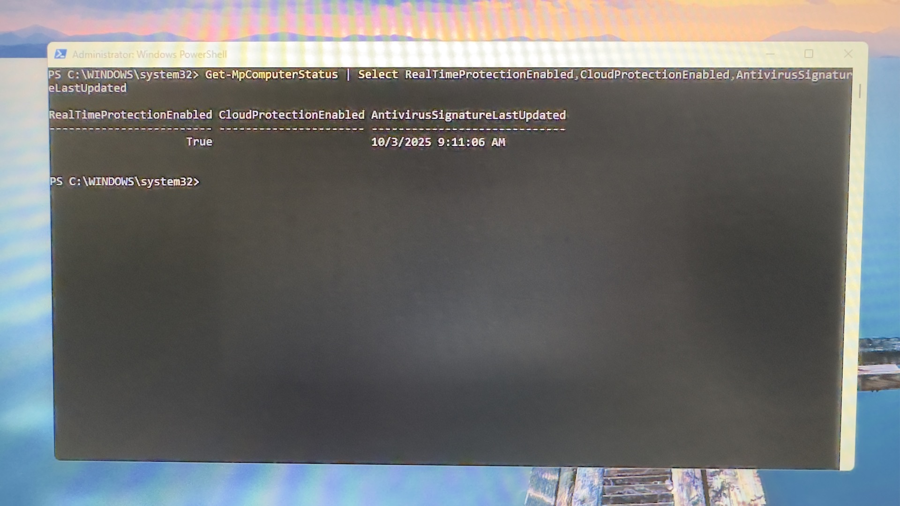

# 🛡️ Windows 11 PCI-DSS Hardening

**TL;DR:** Rapid (<48h) Windows 11 lockdown for a mortgage workstation: encryption, EDR, patch automation, outbound monitoring, and evidence pack for PCI-DSS. Demonstrates compliance-ready endpoint hardening and auditability.

*“Hardening endpoints to meet compliance isn’t optional — it’s foundational.”*

This project documents a complete Windows 11 system lockdown to achieve PCI DSS alignment after discovering a **production mortgage workstation** left unsecured with **previous-user credentials and unencrypted client data**.  
The hardening process demonstrates practical application of compliance principles for **endpoint protection, access control, malware defense, and audit traceability**.

---

## ⚙️ 1. Baseline Configuration

- Installed **Windows 11 Home 64-bit** on a clean SSD.  
- Verified **Secure Boot**, **TPM 2.0**, and **UEFI mode** enabled.  
- Created local admin (`AdminLocal`) with unique credentials.  
- Removed all bloatware and unnecessary startup apps.  
- Installed **Macrium Reflect Free** to create an encrypted baseline image.

> *Figure: Verified partition and UEFI configuration ensuring hardware root-of-trust.*

---

## 🔒 2. Endpoint Protection Layers

| Layer | Tool | Purpose |
|:------|:-----|:---------|
| Primary AV | **Microsoft Defender** | Real-time monitoring, ransomware protection, SmartScreen |
| Secondary AV | **Malwarebytes Free** | Rootkit, archive, and heuristic AI detection |
| Patch Mgmt | **Patch My PC** | Application update automation |
| Network Monitor | **GlassWire Free** | Behavioral network analytics and connection logging |

A full Malwarebytes scan quarantined **2048 PUPs** from legacy profiles — all isolated and removed before imaging.

> *Figure: Threat-removal confirmation prior to reboot and verification.*

---

## 🧱 3. Windows Security Controls

- All **firewall profiles (Domain/Private/Public)** enabled  
- **Smart App Control** active; **Defender intelligence** up-to-date  
- **Ransomware Protection** configured via OneDrive fallback  
- **Quick Scan** validated system integrity post-cleanup

> *Figure: Windows Security dashboard showing no current threats and synchronized intelligence feed.*

---

## 🧩 4. Logging & Audit Configuration

- Created custom **Event Viewer → PCI Audit View** for:  
  - Logons (4624 / 4634 / 4672 / 4688)  
  - Security state changes (4616)  
  - Defender operations (1000 – 1118)  
- Expanded log size → 51 MB, manual clear policy  
- Enabled both **Audit Success** and **Audit Failure**

> *Figure: XML filter configuration for PCI Audit View in Event Viewer.*

---

## 🌐 5. Network & Patch Management

- **GlassWire** deployed for traffic visibility  
- Validated DNS, HTTPS, and update telemetry only — no rogue connections  
- **Patch My PC** verified all third-party software current  
- **Windows Update** automated via Broad Channel

> *Figure: GlassWire traffic analyzer confirming secure outbound telemetry.*

---

## 📦 6. System Imaging & Recovery

- Performed clean image capture via **Macrium Reflect Free**  
- Verified partitions and backup integrity before release  
- Image stored on encrypted USB SSD with checksum log

> *Figure: Macrium Reflect image validation showing UEFI and data volumes.*

---

## 🔍 7. Verification & Validation

| Test | Result |
|:-----|:-------|
| Defender scan | ✅ 0 threats |
| Malwarebytes rescan | ✅ Clean |
| Firewall check | ✅ All profiles active |
| Event Viewer audit | ✅ Operational |
| Patch My PC | ✅ All apps current |

---

## 🖼️ Evidence Gallery

Below is a verified visual audit of each configuration stage.

---

*Figure: Grid gallery showing the complete PCI-DSS workstation hardening sequence — from baseline imaging through audit verification.*

