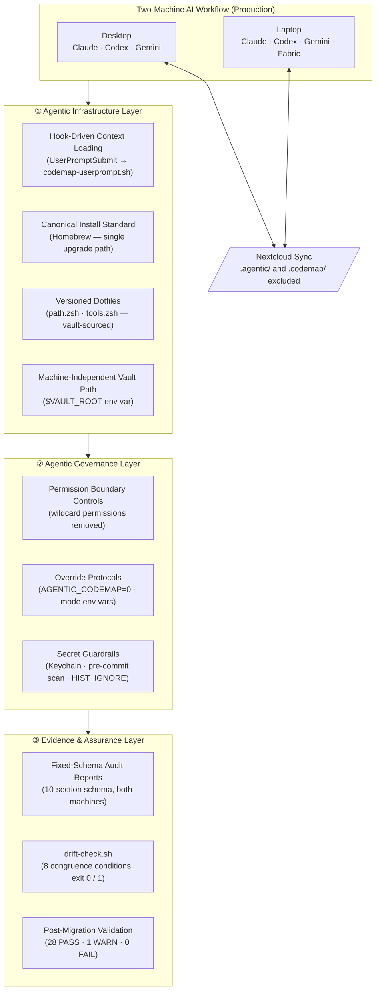

# Agentic Infrastructure — Multi-Machine AI Governance Audit

*Governed Agentic Security Stack · Agentic Infrastructure Layer · February 2026*

!!! success "For Hiring Managers — Detection Engineering / Platform Security / GRC"

    **What I Built:** A governance audit of AI agent infrastructure across two machines — identifying silent drift vectors, defining a canonical architecture standard with ADRs, deploying automated drift detection, and remediating critical gaps.

    **Architectural Risk Reduced:** Silent context drift across AI agent sessions — the condition where machines running identical workflows produce non-reproducible outputs because underlying infrastructure has diverged without detection.

    **Stack Layer:** Agentic Infrastructure + Agentic Governance | [Governed Agentic Security Stack](#governed-agentic-security-stack-context)

    **Skills Demonstrated:** Threat modeling · Infrastructure auditing · Canonical standard design · Drift detection · Least-privilege hardening · Audit-grade documentation

    **Why This Matters:** The discipline applied here — fixed-schema auditing, ADR-based decisions, automated congruence validation — is the same methodology used to govern production security infrastructure.

---

AI workflows are increasingly embedded across security operations, governance automation, and detection engineering. Yet the infrastructure running those workflows is rarely governed with the same rigor as production security systems. When AI agents operate across multiple machines without canonical standards, silent context drift becomes an architectural risk — undermining reproducibility, auditability, and defensibility.

This project operationalizes governance controls at the infrastructure layer to eliminate that risk.

---

## The problem

Two production machines running daily AI workflows (Claude Code, Codex CLI, Gemini CLI) had silently diverged across six categories without any detection mechanism:

| Drift Category | Desktop | Laptop | Impact |
|----------------|---------|--------|--------|
| Tool versions | Gemini at baseline | Gemini 5 minor versions behind | Non-reproducible agent behavior |
| Install methods | Homebrew | Homebrew + nvm/npm | Divergent upgrade paths, hidden breakage risk |
| Context loading | Hook-driven (automatic) | Manual shell function | Inconsistent agent experience per session |
| Shell config | 7 lines (minimal) | 147 lines (organic growth) | 6+ PATH duplicates, 4 redundant declarations |
| Security posture | Scoped permissions | Wildcard `sudo rm:*` and `dd:*` allowed | Privilege escalation risk in AI tool execution |
| Vault path | External drive path | Local Nextcloud path | Fragile references; breaks on drive absence |

**Root cause:** No canonical standard. No audit process. No drift detection.

---

## Governed Agentic Security Stack context

This project occupies two layers of the Governed Agentic Security Stack simultaneously:

**AI is not a tool used within operations — it is an operational layer that must itself be governed, monitored, and defended.**

```
Governed Agentic Security Stack
├── Agentic Infrastructure    ← THIS PROJECT (primary)
│   Hook architecture · Dotfiles standard · Install canonical · Vault path
├── Agentic GRC               ← GIAP™ (related)
│   Intake schemas · Policy enforcement · Accountability structures
├── Agentic Detection         ← TraceLock™ (related)
│   Real-time monitoring · RF signal anomaly · Behavioral signals
├── Agentic Governance        ← THIS PROJECT (secondary)
│   Permission controls · Override protocols · Context boundary enforcement
├── Adversarial Validation    (emerging)
└── Evidence & Assurance      ← THIS PROJECT (cross-layer)
    Fixed-schema audit reports · drift-check.sh · Validation log
```

### Relationship to GIAP™ and TraceLock™

**→ GIAP™ (Agentic GRC):** GIAP governs compliance intake workflows. This project governs the agents running those intake workflows. Without infrastructure congruence, GIAP's audit trails are unreliable — a session on the desktop and a session on the laptop may produce structurally different outputs from the same prompt. This project makes GIAP's agent sessions reproducible.

**→ TraceLock™ (Agentic Detection):** Both projects use the same core methodology: fixed-schema outputs, automated validation scripts with binary pass/fail, and structured evidence logs. TraceLock detects external signals in the RF environment. This project detects internal infrastructure drift in the AI agent environment. Same discipline, different detection surface.

---

## Architecture

### Applied instance of the Governed Agentic Security Stack



*Figure: The Governed Agentic Security Stack applied to multi-machine AI infrastructure. Three layers — Agentic Infrastructure, Agentic Governance, Evidence & Assurance — govern two production machines synchronized via Nextcloud. Machine-local AI context artifacts (.agentic/, .codemap/) are excluded from sync by design.*

---

## Methodology

Six phases, mirroring how platform security engineers handle production drift:

| Phase | Action | Output |
|-------|--------|--------|
| **Audit** | Both machines assessed using identical 10-section schema | Comparable, structured reports |
| **Diff** | Cross-machine comparison with severity ranking | 8 critical deltas identified and prioritized |
| **Design** | Canonical standard with Architectural Decision Record table | 8 ADRs with rationale, 10 binding sections |
| **Plan** | Phase-by-phase migration with backups and rollback steps | 10 phases, ~4 hours, 100% reversible |
| **Validate** | Congruence definition and automated check | 8 conditions, `drift-check.sh`, binary exit code |
| **Document** | Portfolio-safe writeup and architecture artifacts | Public-safe, no PII, no credentials |

---

## What I built

### Canonical standard — 8 Architectural Decisions

| ADR | Decision | Rationale |
|-----|----------|-----------|
| D1 | Vault path via `$VAULT_ROOT` env var | Eliminates hardcoded paths that break across machines |
| D2 | All AI tools installed via Homebrew | Single upgrade path; removes nvm dependency; macOS-native |
| D3 | Single codemap baseline at `.codemap/baseline.txt` | Native convention; eliminates competing baseline files |
| D4 | Context loading via `UserPromptSubmit` hook | Automatic and consistent — no session-by-session manual step |
| D5 | `.agentic/` excluded from Nextcloud sync | Machine-local artifacts are meaningless on another machine |
| D6 | Minimal `.zshrc` (~17 lines) + sourced config modules | Versioned, comparable, diffable across machines |
| D7–D8 | Fabric AI and LM Studio laptop-only (optional tier) | Capability difference is acceptable; optional ≠ drift |

### Hook-driven context loading

```
User types .map prompt in Claude Code
    ↓
UserPromptSubmit hook fires (skippable: AGENTIC_CODEMAP=0)
    ↓
Three codemap commands: --diff · --depth · --deps
    ↓
Outputs → .agentic/context/{codemap.diff.txt, codemap.tree.txt, codemap.deps.txt}
    ↓
Agent receives fresh structural context automatically
```

Three operating modes via `AGENTIC_CODEMAP_MODE`:

| Mode | Trigger | Use Case |
|------|---------|----------|
| `prefix` (default) | Prompts starting with `.map` | Low token cost, standard sessions |
| `always` | Every prompt | Deep-work sessions requiring full context |
| `disabled` | `AGENTIC_CODEMAP=0` | Speed-sensitive or non-code tasks |

### Security hardening applied

- **Pre-commit secret scanning** — `rg --pcre2` pattern hook on agent repos
- **Global gitignore** — `.agentic/`, `.env`, `.venv/`, `.claude/.codemap_baseline` excluded globally
- **Shell history filtering** — `HISTORY_IGNORE` pattern; space-prefix skips history logging
- **API key storage** — macOS Keychain only; no `.env` files in synced directories
- **Wildcard permission removal** — Claude `settings.local.json` pruned of `sudo rm:*` and `dd:*` wildcards
- **Sync isolation** — `.agentic/` and `.codemap/` excluded from Nextcloud; 25 → 0 directories syncing

### Drift detection — 8 congruence conditions

Two machines are **congruent** when all eight pass:

1. Tool versions within one patch version between machines
2. `$VAULT_ROOT` resolves to a valid directory on both
3. Claude hook (`~/.claude/hooks/codemap-userprompt.sh`) present and executable on both
4. `tools.zsh` present and defines `agent_ctx_here` function on both
5. Global gitignore contains all standard exclusion patterns on both
6. No `.agentic/` or `.codemap/` files present in Nextcloud sync queue
7. Zero Nextcloud conflict files (`*conflicted*`) in vault
8. `settings.local.json` contains no deleted-volume path references

**Automated:** `drift-check.sh` (29 lines) verifies all eight conditions. Exit 0 = congruent. Exit 1 = drift detected. Designed to run weekly.

---

## Results

| Metric | Before | After |
|--------|--------|-------|
| `.zshrc` lines | 147 | 17 |
| PATH duplicates | 6+ | 0 |
| `AGENTIC_CODEMAP_MODE` declarations | 4 (redundant) | 1 |
| AI CLI install methods | 2 (Homebrew + nvm) | 1 (Homebrew) |
| Codemap baseline conventions | 2 (competing) | 1 (`.codemap/baseline.txt`) |
| Context loading mechanism | Manual function (inconsistent) | Automatic hook (every session) |
| `.agentic/` dirs syncing via Nextcloud | 25 | 0 (excluded) |
| Non-standard files in `.codemap/` | 31 | 0 |
| **Post-migration drift check** | N/A | **28 PASS · 1 WARN · 0 FAIL** |

The methodology scales horizontally to team-level AI environments and vertically to CI/CD-integrated agent workflows, where infrastructure congruence becomes a prerequisite for defensible automation.

---

## What this demonstrates

| Security Engineer | Detection Engineer | GRC / Governance |
|-------------------|-------------------|------------------|
| Threat modeling across 6 risk categories | Drift detection design (binary exit codes, 8-condition schema) | Policy definition with rationale (ADR table) |
| Least-privilege enforcement (permission pruning) | Automated congruence validation | Control design mapped to specific risks |
| Secrets hygiene (Keychain, pre-commit scan) | Fixed-schema audit reports for machine comparison | Change management (phased migration with rollbacks) |
| Sync isolation (attack surface reduction) | Alert suppression logic (WARN vs FAIL distinction) | Audit trail (validation log, git commit history) |
| Supply chain awareness (install method standardization) | Infrastructure-as-code (versioned shell modules) | Standard lifecycle (DoD, archive, maintenance cadence) |

---

## Artifacts

Nine deliverables produced, all archived:

| Artifact | Purpose |
|----------|---------|
| `machine-audit__MacMini.md` | 10-section audit report — desktop |
| `machine-audit__MacBookAir.md` | 10-section audit report — laptop |
| `cross-machine-diff.md` | Severity-ranked delta analysis |
| `canonical-standard.md` | 10-section binding standard with ADR table |
| `migration-plan.md` | 10-phase migration with rollback steps |
| `validation-checklist.md` | Weekly / monthly / quarterly checks |
| `drift-check.sh` | 29-line automated congruence script |
| `drift-check-results__MacBookAir.md` | First post-migration validation log |
| `portfolio-writeup.md` | Public-safe case study (this page's source) |

---

## Related projects

- [GIAP™ — GRC Intake Automation](../cybersecurity/giap.md) — Agentic GRC layer. This project ensures the agents running GIAP workflows produce reproducible, audit-ready outputs across machines.
- [TraceLock™ — RF Threat Detection](../cybersecurity/tracelock.md) — Agentic Detection layer. Shares the same fixed-schema evidence methodology applied to a different detection surface.
- [AgenticOS — AI Orchestration](agenticos.md) — Agentic Infrastructure layer. Provides the multi-provider execution layer that this audit governs at the infrastructure level.

---

[Contact Me](../contact.md){ .md-button .md-button--primary }
[Innovation Overview](index.md){ .md-button }

<script type="application/ld+json">
{
  "@context": "https://schema.org",
  "@type": "TechArticle",
  "headline": "Agentic Infrastructure — Multi-Machine AI Governance Audit",
  "description": "Production-grade governance audit of AI agent infrastructure across two Apple Silicon machines. Identifies drift vectors, defines canonical architecture standard with ADRs, deploys automated drift detection, and remediates security gaps.",
  "author": {
    "@type": "Person",
    "name": "Pharns Genece",
    "url": "https://portfolio.pharns.com"
  },
  "datePublished": "2026-02-20",
  "dateModified": "2026-02-20",
  "publisher": {
    "@type": "Person",
    "name": "Pharns Genece"
  },
  "mainEntityOfPage": "https://portfolio.pharns.com/innovation/agentic-infrastructure-audit/",
  "keywords": ["AI governance", "agentic infrastructure", "drift detection", "infrastructure audit", "security hardening", "canonical standard", "AI agent security"]
}
</script>
