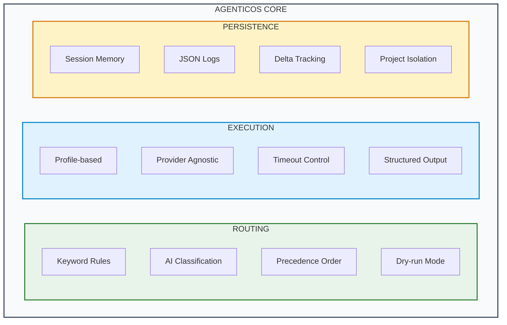

# AgenticOS — Deterministic AI Agent Orchestration

*Open Source · Security Automation Framework · December 2025*

!!! success "For Hiring Managers — Security Automation / DevSecOps"

    **What I Built:** A deterministic, auditable AI agent operating layer that orchestrates multiple AI providers (Claude, Codex, Gemini) with explainable routing, persistent memory, and forensic-grade logging.

    **Technical Stack:** Python 3.10+ · Claude API · OpenAI Codex · Google Gemini · YAML Configuration · JSON Logging · Shell Scripting

    **Security Engineering Skills Demonstrated:**

    - Deterministic routing with keyword and AI-based classification
    - Audit-grade structured logging for every execution
    - Multi-provider orchestration with unified CLI
    - Memory persistence and session continuity
    - Project isolation for multi-tenant workflows

    **Why This Matters:** If I can build a secure, auditable orchestration layer for AI agents, I can build automation pipelines for your security operations.

[View on GitHub](https://github.com/Pharns/AgenticOS){ .md-button .md-button--primary }

---

## The Problem

AI coding assistants are powerful but unpredictable. Security teams need:

- **Determinism:** Same inputs produce same behavior
- **Auditability:** Every decision logged and explainable
- **Control:** No hidden behaviors or silent mutations
- **Multi-provider support:** Use the right AI for each task

Existing tools lack the governance layer needed for regulated environments and security workflows.

---

## What I Built

### Unified CLI (`aos`)

A single command interface that wraps all AgenticOS functionality:

```bash
aos                              # List profiles & workflows
aos q "What is XSS?"             # Quick question (clean output)
aos d "Fix the auth bug"         # Development task
aos auto "Write a security policy"  # Auto-route to best profile
aos -p myproject d "Add logging"    # Work on specific project
```

### Core Architecture



*Figure: AgenticOS core architecture with three subsystems. Routing (green) handles keyword rules, AI classification, precedence order, and dry-run mode. Execution (blue) manages profile-based routing, provider-agnostic calls, timeout control, and structured output. Persistence (orange) maintains session memory, JSON logs, delta tracking, and project isolation.*

### Script Breakdown

| Script | Lines | Purpose |
|--------|-------|---------|
| `scripts/agent` | 2,721 | Core execution engine with output normalization |
| `scripts/router` | 1,332 | Routing with auto, keyword, and AI classification |
| `scripts/doctor` | 1,046 | 72 health checks with auto-fix capability |
| `scripts/aos` | 948 | Unified CLI wrapper with project management |
| `scripts/memory` | 314 | Memory management and session continuity |

### Provider Integration

| Provider | Profiles | Use Case |
|----------|----------|----------|
| **Claude** | grc, research | Compliance writing, deep analysis |
| **Codex** | dev, ops | Code generation, debugging |
| **Gemini** | quick | Fast questions, brainstorming |
| **Cursor-Agent** | refactor | Multi-file refactoring, complex edits |

---

## Key Features

### 1. Deterministic Auto-Routing

Route prompts to the optimal profile using keyword rules or AI classification:

```bash
# Keyword-based (instant)
aos auto "Fix the SQL injection vulnerability"
# → Routes to 'dev' profile (matches: fix, vulnerability)

# AI-powered (smarter)
aos auto --smart "Help me understand NIST 800-53 controls"
# → Routes to 'grc' profile (AI classification)
```

### 2. Explainable Decisions

Every routing decision is logged with full reasoning:

```json
{
  "timestamp": "2025-12-23T14:32:07Z",
  "action": "auto_route",
  "query": "Fix the authentication bug",
  "tokens": ["fix", "the", "authentication", "bug"],
  "matched_rule": "dev_fix",
  "target": {"type": "profile", "name": "dev"},
  "reason": "Rule matched: fix + bug keywords"
}
```

### 3. Project Isolation

Manage multiple projects with isolated configurations:

```bash
aos projects                     # List registered projects
aos -p portfolio d "Add page"    # Work on portfolio project
aos -p giap auto "Fix auth"      # Work on GIAP project
```

### 4. Health Validation

72 automated checks with self-repair capability:

```bash
aos doctor              # Run all checks
aos doctor --fix        # Auto-repair common issues
aos doctor --strict     # Treat warnings as failures
```

Checks include:
- YAML syntax validation
- Provider CLI availability
- Directory permissions
- Log schema conformance
- Memory file integrity

### 5. Structured Output Modes

Control output format for different use cases:

| Mode | Output |
|------|--------|
| `--print clean` | Just the answer, no headers |
| `--print summary` | 3-bullet executive summary |
| `--print norm` | Structured sections (Plan, Code, etc.) |
| `--print raw` | Raw provider output |

---

## Security Engineering Highlights

### Audit-Grade Logging

Every execution produces machine-readable JSON logs:

```json
{
  "run_id": "7c956f40-ada8-456c-8fbb-54c22de65b55",
  "profile": "dev",
  "provider": "codex",
  "timestamp_start": "2025-12-23T14:32:07Z",
  "timestamp_end": "2025-12-23T14:32:45Z",
  "exit_code": 0,
  "tags": ["profile:dev", "provider:codex", "memory:on"],
  "sections": {
    "plan": ["..."],
    "code_changes": ["..."],
    "verification": ["..."]
  }
}
```

### No Hidden Behaviors

AgenticOS principles:

- **No inference:** Routing is explicit via rules or flags
- **No magic:** Every decision has a traceable reason
- **No silent mutations:** Prompts are never modified without logging
- **No autonomous actions:** Human triggers all executions

### Memory Persistence

Session state persists across invocations:

```
.agents/memory/
├── profiles/          # Per-profile memory files
├── sessions/          # Daily session logs
├── summary.md         # Rolling summary
└── last-session.md    # Quick resume reference
```

---

## Results & Metrics

| Metric | Value |
|--------|-------|
| Total Python LOC | 6,361 |
| Health checks | 72 |
| Supported providers | 4 (Claude, Codex, Gemini, Cursor-Agent) |
| Profiles | 6 (dev, grc, research, ops, quick, refactor) |
| Output modes | 7 |
| Auto-routing rules | 8 default + custom |
| Logged executions | 180+ |

---

## Configuration Example

### Profile Definition (agents.yaml)

```yaml
profiles:
  dev:
    provider: codex
    description: Development assistant for coding tasks
    prompt_file: prompts/dev.md
    timeout: 120

  grc:
    provider: claude
    description: GRC and compliance writing
    prompt_file: prompts/grc.md
    timeout: 300
```

### Auto-Routing Rules (router_auto_rules.json)

```json
{
  "rules": [
    {
      "id": "security_policy",
      "match_any": ["policy", "compliance", "audit", "nist"],
      "route": {"type": "profile", "target": "grc"}
    },
    {
      "id": "code_fix",
      "match_any": ["fix", "bug", "error", "implement"],
      "route": {"type": "profile", "target": "dev"}
    }
  ]
}
```

---

## Technical Skills Demonstrated

### Security Automation
- [x] Deterministic workflow orchestration
- [x] Audit-grade logging pipelines
- [x] Multi-provider API integration
- [x] Session persistence and replay

### Python Engineering
- [x] CLI framework design (argparse)
- [x] YAML/JSON configuration management
- [x] Subprocess orchestration with timeout handling
- [x] Regex-based output normalization

### DevSecOps
- [x] Self-healing health checks
- [x] Project isolation patterns
- [x] Provider-agnostic abstractions
- [x] CI/CD-ready command structure

---

## Use Cases

### GRC Workflows
```bash
aos auto --smart "Draft a password policy for SOC 2"
aos -p giap g "Review control implementation evidence"
```

### Security Development
```bash
aos d "Add input validation to prevent XSS"
aos auto "Fix the SQL injection in user_query()"
```

### Quick Research
```bash
aos q "What are the OWASP Top 10 for 2025?"
aos q "Explain the difference between SAST and DAST"
```

---

## Project Status

| Component | Status | Notes |
|-----------|--------|-------|
| Core CLI (`aos`) | ✅ Complete | Unified interface operational |
| Execution Engine (`agent`) | ✅ Complete | 2,721 lines, all providers working |
| Routing Engine (`router`) | ✅ Complete | 8 auto-routing rules active |
| Health Validation (`doctor`) | ✅ Complete | 72 checks with auto-fix |
| Memory Persistence | ✅ Complete | Session continuity working |
| Documentation | ✅ Complete | User guide + 13 reference docs |
| GitHub Release | ✅ Published | MIT License |
| Install Script | ✅ Complete | One-command setup |

**Status:** Production-ready for personal/team use. Active development for additional workflows.

---

## What This Proves

1. **I can build secure automation** — Not just use AI tools, but orchestrate them safely
2. **I understand audit requirements** — Every decision logged, every action traceable
3. **I design for governance** — Deterministic, explainable, no hidden behaviors
4. **I build production-ready tools** — 72 health checks, self-repair, multi-project support
5. **I integrate multiple systems** — Four AI providers, unified interface, 6 specialized profiles

---

## Related Projects

- [TraceLock™](../cybersecurity/tracelock.md) — Multi-domain RF threat detection (uses similar logging patterns)
- [GIAP™](../cybersecurity/giap.md) — GRC automation platform (powered by AgenticOS)
- [Homelab Infrastructure](../cybersecurity/homelab-infrastructure.md) — Development environment

---

[GitHub Repository](https://github.com/Pharns/AgenticOS){ .md-button .md-button--primary }
[Connect on LinkedIn](https://www.linkedin.com/in/pharns/){ .md-button }
[Contact Me](../contact.md){ .md-button }

<script type="application/ld+json">
{
  "@context": "https://schema.org",
  "@type": "TechArticle",
  "headline": "AgenticOS — Deterministic AI Agent Orchestration",
  "description": "Deterministic AI agent orchestration framework with explainable routing, structured logging, and audit-grade execution for security workflows. Python-based CLI for multi-provider AI automation.",
  "author": {
    "@type": "Person",
    "name": "Pharns Genece",
    "url": "https://portfolio.pharns.com"
  },
  "datePublished": "2025-12-01",
  "dateModified": "2025-12-25",
  "publisher": {
    "@type": "Person",
    "name": "Pharns Genece"
  },
  "mainEntityOfPage": "https://portfolio.pharns.com/innovation/agenticos/",
  "keywords": ["AI orchestration", "security automation", "Python", "audit logging", "multi-agent", "DevSecOps"],
  "about": {
    "@type": "SoftwareApplication",
    "name": "AgenticOS",
    "applicationCategory": "Developer Tools",
    "operatingSystem": "Cross-platform"
  }
}
</script>
