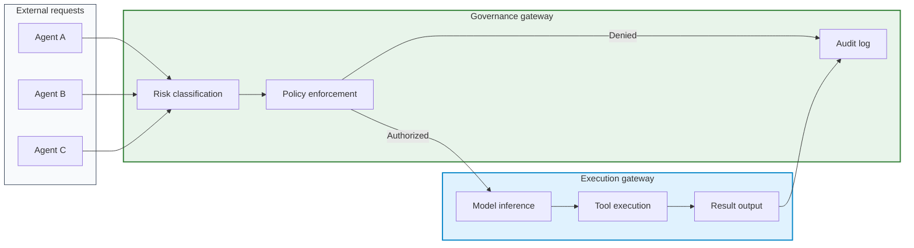

# OpenClaw — Governed AI agent orchestration

*Patent-Pending · Federated Agent Governance · 2025–2026*

!!! success "For hiring managers — security architecture / AI governance"

    **What I built:** A federated AI agent orchestration platform that enforces governance at the dispatch boundary — separating policy decisions from model execution at the network level.

    **Technical stack:** Python 3.10+ · SQLite · MQTT · HMAC-SHA256 Module Signing · MCP Protocol · Multi-Provider Inference (Ollama, Claude, Gemini)

    **Security engineering skills demonstrated:**

    - Dual-gateway federation isolating governance from execution
    - Risk-classified dispatch with three severity tiers
    - Cryptographically signed module loading with hot-swap capability
    - 86 passing tests with zero ungoverned tool executions
    - Model-agnostic governance across multiple inference providers

    **Why this matters:** If I can architect a system where no AI agent touches a task without passing a governance gate first, I can design security controls for any autonomous system your organization deploys.

---

## The problem no one is solving

The AI agent ecosystem has a governance vacuum. Every major framework — LangChain, CrewAI, AutoGPT, Microsoft Semantic Kernel — shares the same structural flaw: the model decides what it can do. The agent self-selects tools, self-escalates privileges, and self-reports what happened. The "safety" layer is a system prompt that says "please don't do anything dangerous."

That is not governance. That is hope.

In regulated industries — healthcare, defense, financial services, critical infrastructure — hope is not a compliance strategy. When an AI agent processes patient data, executes a financial transaction, or interfaces with operational technology, the question is not whether the model intended to follow policy. The question is whether the infrastructure made it impossible not to.

This is what I built OpenClaw to answer.

---

## Dual-gateway federation

OpenClaw separates governance from execution at the network level. Not at the prompt level. Not at the application layer. At the infrastructure boundary where it cannot be bypassed by a sufficiently creative model.

### Governance gateway

The governance gateway is the single point of policy enforcement. Every task request — regardless of which agent, model, or provider initiates it — must pass through this gateway before anything executes. The governance gateway handles:

- **Risk classification** — Every inbound request is classified into one of three risk tiers (R1/R2/R3) before dispatch. The classification determines what resources the task can access, which models are eligible to process it, and what audit requirements apply.
- **Policy evaluation** — Seven policy enforcement points evaluate each request against the current rule set. Requests that fail policy are rejected with a structured denial record, not silently dropped.
- **Audit capture** — Every decision — approvals, denials, escalations, classification outcomes — is logged at the infrastructure layer. The model never self-reports. The gateway captures what actually happened.
- **Module authentication** — Every tool module loaded into the system carries an HMAC-SHA256 signature. Unsigned or tampered modules are rejected at load time. No exceptions.

### Execution gateway

The execution gateway handles model inference and tool execution. It has no policy authority. It cannot classify risk, approve its own actions, or modify governance rules. It does exactly what the governance gateway authorized — nothing more.

- **Model inference** across a multi-node fleet supporting multiple providers and model sizes
- **Tool execution** within the boundaries set by the governance gateway's authorization
- **Result capture** with structured output that feeds back to the governance layer for audit

### The separation principle

No agent can reach the execution layer without first passing governance. This is not a software convention — it is a network-level enforcement. The execution gateway does not accept requests that did not originate from the governance gateway. A compromised model, a jailbroken agent, or a malicious prompt cannot bypass this boundary because the boundary exists below the application layer.

*Figure: Dual-gateway federation. All requests enter through governance (green). Only authorized requests reach execution (blue). Denied requests and all outcomes are captured in audit.*

---

## Operational capabilities

OpenClaw is not a whitepaper or a design document. It is running infrastructure with measurable operational metrics.

### Governed tool server

The platform runs a 53-tool governed MCP (Model Context Protocol) server organized into six functional modules. Each module is independently signed with HMAC-SHA256 and can be hot-swapped without system downtime. The module categories span memory operations, threat detection, edge AI coordination, compliance mapping, threat hunting, and open-source intelligence.

!!! note "Module signing"

    Every module carries a cryptographic signature verified at load time. This prevents supply-chain attacks where a modified tool module could bypass governance. If a signature fails verification, the module is rejected and the event is logged. Hot-swap reload allows updating individual modules in production without restarting the governance layer.

### Risk-classified dispatch

Every task entering the system is classified into one of three risk tiers:

| Tier | Scope | Model requirements | Audit level |
|------|-------|--------------------|-------------|
| **R1** | Routine operations, low-sensitivity data | Any eligible model | Standard logging |
| **R2** | Sensitive operations, regulated data access | Mid-tier model minimum | Enhanced logging + review flag |
| **R3** | Critical operations, irreversible actions | Highest-capability model required | Full audit trail + human review gate |

The classification is not advisory. An R3 task cannot execute on a lightweight model regardless of queue pressure or availability. An R2 task cannot downgrade itself to R1 to avoid enhanced logging. The governance gateway enforces these floors as hard constraints.

### Multi-provider inference

OpenClaw governs a three-node inference fleet running multiple model providers and sizes. The platform is model-agnostic — it does not care whether the underlying model is Ollama, Claude, Gemini, or any future provider. Governance wraps the model, not the other way around.

Five paired operators work across the fleet, each consisting of a governance-side dispatcher and an execution-side runner. This pairing ensures that every execution has a corresponding governance record.

### Test coverage

The platform maintains 86 passing tests with a specific invariant: zero ungoverned tool executions. Every test validates that tool access requires governance authorization. There is no "admin bypass" or "test mode" that disables policy enforcement. The test suite validates the governance boundary, not just the application logic.

---

## Why infrastructure-level governance matters

Most AI governance approaches fall into one of two categories:

1. **Prompt-level governance** — System prompts that instruct the model to follow rules. The model can ignore, misinterpret, or creatively reinterpret these instructions. This is security by suggestion.

2. **Application-level governance** — Middleware that checks model outputs after execution. By the time the check runs, the action has already happened. This is security by retrospection.

OpenClaw implements a third category: **dispatch-level governance**. The governance decision happens before the model receives the task. The model never sees a task it is not authorized to process. It cannot access tools it is not authorized to use. It cannot escalate its own privileges because privilege assignment happens at a layer the model cannot reach.

!!! warning "The self-reporting problem"

    If your AI governance strategy depends on the model accurately reporting what it did, you do not have governance. You have a system that works exactly as well as the model is honest. OpenClaw captures what happened at the infrastructure layer — the model's self-report is irrelevant to the audit record.

This matters for compliance. Auditors do not accept "the AI said it followed the rules" as evidence. They need infrastructure-level logs showing that policy was enforced, not requested. OpenClaw produces those logs as a byproduct of its architecture, not as an afterthought.

---

## Compliance alignment

The governed dispatch architecture maps to established compliance and AI governance frameworks. The platform currently maintains 95 control mappings across 10 frameworks, including:

- **NIST AI RMF** — Risk management functions mapped to classification and dispatch controls
- **ISO 42001** — AI management system requirements addressed by the governance layer
- **NIST SP 800-53** — Security and privacy controls for information systems
- **EU AI Act** — High-risk AI system requirements (enforcement begins August 2, 2026)
- **SOC 2 Trust Service Criteria** — Processing integrity and monitoring controls

These mappings are not theoretical. Each control reference points to a specific operational capability in the running system.

---

## Applications

### Enterprise AI deployments

Any organization deploying AI agents at scale faces the same question: how do you prove that your agents followed policy? OpenClaw provides the infrastructure-level evidence that prompt-based governance cannot.

### Multi-agent systems

As organizations move from single-model deployments to multi-agent architectures, the attack surface expands. Agent-to-agent communication becomes a vector for privilege escalation and policy bypass. OpenClaw's dispatch boundary ensures that governance applies uniformly regardless of how many agents are in the system.

### Regulated industries

Healthcare, financial services, defense, and critical infrastructure all operate under regulatory frameworks that require demonstrable controls. OpenClaw's audit architecture produces compliance-grade evidence without requiring manual intervention.

### Defense and federal

Federal acquisition increasingly requires AI governance documentation. OpenClaw's architecture aligns with DoD AI ethics principles and NIST frameworks, providing a governance layer that meets the documentation requirements of government contracts.

---

## Patent status

OpenClaw's governed dispatch architecture is part of **U.S. Provisional Patent Application No. 64/029,300**, filed April 4, 2026. The application covers nine patent families with 77 dependent claims. Intellectual property is held by **Obsidian Foundry, LLC**.

Non-provisional filing is in progress under accelerated prosecution.

!!! note "Intellectual property"

    The techniques described on this page are patent-pending. Implementation details beyond what is described here are protected under pre-disclosure policy. For licensing inquiries, please use the contact page.

---

## Technical skills demonstrated

### Security architecture
- [x] Network-level separation of governance and execution
- [x] Cryptographic module authentication (HMAC-SHA256)
- [x] Risk-tiered access control with hard enforcement floors
- [x] Seven-point policy enforcement pipeline

### AI systems engineering
- [x] Multi-provider, model-agnostic orchestration
- [x] MCP protocol implementation with 53 governed tools
- [x] Hot-swap module reload without downtime
- [x] Paired operator architecture across distributed inference

### Compliance engineering
- [x] 95 control mappings across 10 governance frameworks
- [x] Audit-grade logging at the infrastructure layer
- [x] Automated risk classification at dispatch
- [x] Evidence generation for regulatory compliance

---

## Related projects

- [AgenticOS](agenticos.md) — Deterministic AI agent routing framework (predecessor to OpenClaw governance layer)
- [TraceLock](../cybersecurity/tracelock.md) — Multi-domain RF threat detection (governed by OpenClaw dispatch)
- [Governed security architecture](../architecture/governed-security-architecture.md) — System-of-systems view
- [Security telemetry decision architecture](../architecture/security-telemetry-decision-architecture.md) — Telemetry-to-decision pipeline

---

[Connect on LinkedIn](https://www.linkedin.com/in/pharns/){ .md-button .md-button--primary }
[Contact me](../contact.md){ .md-button }

