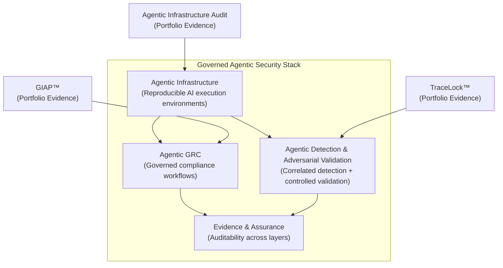

# Governed Agentic Security Stack

The **Governed Agentic Security Stack** is an evolving architecture model for designing AI-enabled security systems that remain **reproducible, auditable, and defensible**. As AI workflows become embedded across security operations, governance automation, and detection engineering, the infrastructure running those workflows must be governed with the same rigor applied to production security systems. This stack represents both an emerging industry pattern and the operational approach I am implementing across my portfolio artifacts. The portfolio is organized as evidence of the stack in practice: each project demonstrates how a specific layer reduces architectural risk (e.g., context drift, non-reproducible outputs, or weak validation).

The stack is intentionally iterative. Layers are interdependent and often overlap; the goal is not rigid categorization but coherent, defensible system design.

---

## Current Visible Layers (with portfolio evidence)

### 1) Agentic Infrastructure

Governed execution environments that prevent silent drift across AI agents and machines, enabling reproducible workflows and audit-ready outputs.

**Evidence:** [Agentic Infrastructure — Multi-Machine AI Governance Audit](../innovation/agentic-infrastructure-audit.md)

### 2) Agentic GRC

AI-governed governance workflows: structured intake, control mapping, risk translation, and POA&M generation designed as a production system.

**Evidence:** [GIAP™ — Governance Intake Automation Platform](../cybersecurity/giap.md)

### 3) Agentic Detection & Adversarial Validation

AI-augmented, multi-source detection across wireless domains with controlled validation logic to produce forensic-grade, defensible evidence.

**Evidence:** [TraceLock™ — Wireless Detection & Adversarial Validation Platform](../cybersecurity/tracelock.md)

---

## Architecture Overview

---

## How to Read This Portfolio

- Start with the **Stack Overview** (this page), then follow links into each layer's evidence.
- Each project is written as an **architecture artifact**, not a standalone experiment.
- Look for the **architectural risk reduced** — drift, reproducibility gaps, weak validation, audit fragility.
- Expect **cross-links**: layers are interdependent and projects may span multiple layers.
- Evidence matters: emphasis is placed on **controls, verification, and defensible outputs**.
- The stack is **evolving** as new layers and validation methods are operationalized.
